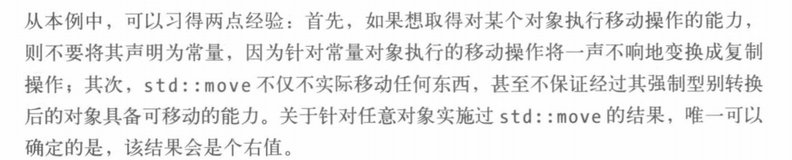

# effective c++阅读

effective几步曲，大多记在这里。我的记录还真是杂乱啊。其实不知道应不应该分开，合并放在一块记录好还是分开好？


## 让自己熟悉C++

C++的编程范式：

* 过程式
* OO
* 函数式编程
* 泛型编程
* 模板元编程


## 设计一个类

类与资源管理，类的拷贝，复制构造与移动构造。


声明与定义：

* 声明：引入名字与类型，不给出存储细节
* 定义：给出存储位置与实现细节


## 类型推导

auto与decltype是如何实现的？基础是模板的类型推导


初看primer就被类型推导规则遇上左右值、顶层底层const弄得苦不堪言。这里做下总结。

* 顶层const与底层const算是primer最恶心的东西了


### 模板的推导规则

**这一块多看几遍：**

* 模板推导过程中，引用类型的实参被当作非引用类型来处理

* 对于万能模板引用形参进行推导时发生引用折叠

* 对按值传递的形参进行推导时，忽略实参类型（忽略的是实参类型不是它指向的类型）的const属性，我们以后不使用顶层与底层来区分

* 模板推导过程中，数组或函数类型的实参退化为相应的指针，除非使用引用，使用引用我们也可以获取数组里面的数量。

  

  

```C++
template<typename T>
void f(ParamType param);

template<typename T>
void f(const T& param);
int x=0;
f(x);
/*
在这里T推断为int，paramtype为const int&；
但是T的推导不仅仅依赖于实参，还与ParamType有关，ParamType分三种讨论
* ParamType指针或则引用，但不是万能引用
* ParamType是万能引用
* 不是指针或引用
*/

template<typename T,std::size_t N>
constexper std::size_t arraySize(T (&)[N])noexcept
{
    return N;
}
```

模板推导不能用于initialization_list（有一些容器的emplace back不能单单用{ }就是这个原因），这个知识看auto，lambda里面参数的auto推导也是转化为模板。

### auto的推导规则

除了一个特例外（用于推导initialization_list)，auto的推导就是模板的推导规则。


在使用auto的过程中aoto扮演的是模板中被推导出的类型T

```C++
template<typename T>
void f(ParamType param);

void f(const T &);
void f(const T &&);
void f(T);
```

所以和模板推导一样

```C++
int x=27;
auto cx=x;	// cx:int
const auto cx=x;
const auto& cx=x;
```


### decltype的推导

decltype就是编译器的化身


## 转向现代C++


### 在创建对象的时候区分{},()

在类的构造函数里面没有提供initialization_list方式的时候，使用{}与（）不需要想{}总是一个好的。


但是一旦类提供了initialization_list的构造的话，使用{}会偏执的使用initialization list。


这个特性困扰模板库的作者，比如make shared，由于有的类型提供了{}与（）不同的方式，那么make_shared

就应该选择一种。

```C++
// test1
template<typename T,typename...Ts>
shared_ptr<T> MyMake(Ts&&...params){
    //也许不好看，就是说这里new的时候这里使用了（）
    shared_ptr<T> ans{new T(std::forword<Ts>(params)...)};
    return ans;
}


auto test1=MyMake<vector<int>>(10,0);
cout<<test1->size(); //10

//test2
template<typename T,typename...Ts>
shared<T> MyMake2(Ts&&...params){
    //也许不好看，就是说这里new的时候这里使用了{}
    return shared_ptr<T>{new T{std::forward<Ts>(params)...} };
}
auto test2=MyMake2(10,2);
cout<<test2->size(); //2
```

智能指针选择了第一种，我们应该告诉使用者自己的设计。


### 使用nullptr

`typedef decltype(nullptr) nullptr_t;`


nullptr解决了什么问题？


### using VS typedef

using:别名声明alias declaration

```C++
typedef void (*FP)(int,const string &);
using FP=void(*)(int,const string &);
// 这个或许看不出来using的优点

// using可以配合模板使用

```


### delete/override

一些关键字：final、delete、override、noexception这些关键字就是方便我们使用的。


**成员函数修饰词，成员函数引用修饰词：**

大师就是大师，终于知道了函数修饰词的作用。成员函数修饰词：const、&&、&，这些修饰词的作用就是针对发起这些函数调用的对象（*this）做一些限制，const成员函数只能const对象调用。这个倒是没有见过很多用的。


## 右值、移动、完美

与右值有关的东西一定记得，形参一定是一个左值。右值引用他一定是一个引用。


### 理解move与forward

条款9讲了一点点type_traits


下面这一段仔细看看，右值不要搭配const，移动构造不要搭配const




move就是无条件的把传入的对象转换为右值的形式；forward则不同，forward是有条件的转化（当且仅当传入的是一个右值引用，我们把它转化为右值的形式），虽然都是转换，forward配合模板的万能转发


## lambda

