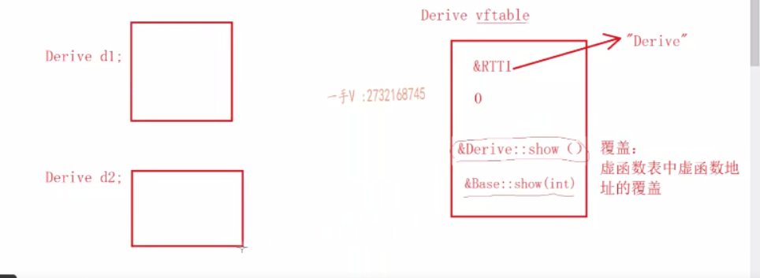
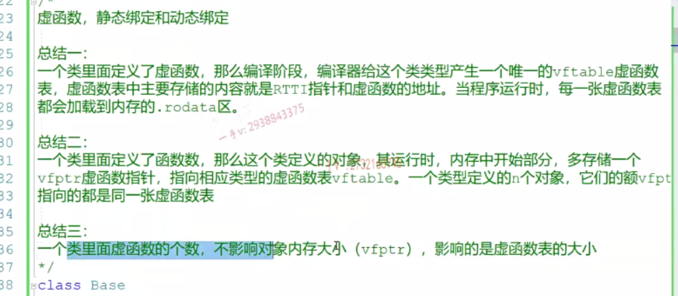
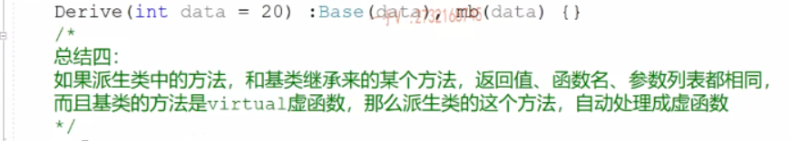

### 继承的本质&原理

记笔记太慢了，看这记吧


*继承发生对子类及用户的访问影响* ,一句话原来基类里面对应的访问权限在子类里面**只可能下降不可能上升。**

| 继承方式  | 基类的访问限定            | 派生类的访问限定          | 外部/用户的访问限定 |
| --------- | ------------------------- | ------------------------- | ------------------- |
| public    | public  protected private | public protected 不可访问 | Y N N               |
| private   | public  protected private | private private 不可      | N  N  N             |
| protected | public  protected private | protected protected 不可  | N N N               |


### 派生类的构造过程

类自己（不管是派生还是继承）负责自己的初始化，子类要使用基类的构造来初始化基类的部分。下图本来通过继承，应该是`&Base::show()`但是发生了覆盖，变为`&Derive::show()`.



### 重载overload，覆盖override，隐藏

覆盖/覆写：虚函数表中虚函数地址的覆盖。

### 多态的原理vfptr和vftable

虚函数运行时绑定，非虚函数编译时确定。       

但是只有使用指针或者引用调用虚函数才会发生动态/运行时绑定         

定义了虚函数的类，它的每个对象都需要一个vfptr？难道不能共享一个？应该是不能的，vfptr位于对象的起始部分。         

**有虚函数就会发生运行时类型鉴定**

```C++
// version1，当没有虚函数时发生的就是静态绑定,在typeid里面也是
class Base;
class Derive: public Base{};
Derive d;
Base* pb=&d;
cout<<typeid(pb).name()<<endl;//class Base*
cout<<typeid(*pb).name()<<endl;//class Base

//version2：当有虚函数的时候发生的就是动态绑定，在typeid里面也是
```








* 如何解释多态/动态绑定？

  多态的底层通过动态绑定，谈一谈 vfptr&vftable。      

  多态的使用：在继承结构中基类的指针/引用指向派生类的对象，通过该指针/引用调用同名的覆盖方法/虚函数，此时发生动态绑定。也就是基类指针指向哪个派生类对象，就会调用哪个派生类对象的同名覆盖方法，称之为多态。         vfptr-> vftable


### 抽象类的设计原理

含有纯虚函数的类就是抽象类。不可实例化，但是可以通过指针/引用。  一般就是作为接口，类似于Java的interface。

### 多重继承&虚继承

看primer吧，基本没用过。  这部分高级主题？  解决菱形继承问题？  不想看了。


### 虚基类，vbptr和vbtable

* 虚基类

  virtual既可以修饰成员方法；也可以修饰继承方式，虚继承。被虚继承的类，称作虚基类。

  ```C++
  class A;
  class B:virtual public A;//B虚继承A，A是一个虚基类
  ```

  

### RTTI：run-time type info


### 四种类型转换cast

可以说只是更加安全了

```C++
static_cast<>();提供编译器认为安全的类型转换
reinterpret_cast<>();类似于C的强制转换，按照转换的目的bitwise解读
const_cast<>();
dynamic_cast<>();主要用在继承体系里面，可以支持RTTI类型识别的上下转换
```

* const_cast<>();

  去除常量属性，但是带有安全检查；const_cast<这里面必须是指针或者引用类型>

  ```C++
  //1、安全检查
  const int a=10;
  double *p1=(double*)&a; //ok in C
  double *p2=const_cast<double*>(&a);//error
  int *p3=(int*)&a;//C语言的去除const方法
  int *p4=const_cast<int*>(&a);//C++去除const属性
  int b=const_cast<int>(a);//error转换后的必须是指针或者引用：const int* -> int*
  ```

* static_cast<type>(expression)，用的最多，编译时期的类型转换

  提供编译器认为安全的eg：int--> char  子类到基类；编译器认为不安全的/无联系的就直接否决了。

  ```C++
  int a=10;
  double *b=static_cast<double*>(&a);//error
  ```

* dynamic_cast<type>(expression)，RTTI的类型转换

  若转换成功就转换，否则返回nullptr,支持RTTI检查的转换，比如基类指针--》子类

  ```C++
  struct Base{
      virtual void func()=0;
  };
  struct Derive:Base{
  	virtual void func(){
          cout<<"Derive::func"<<endl;
      }  
  };
  struct Derive2:Base{
  	virtual void func(){
          cout<<"Derive2::func"<<endl;
      }  
      virtual func2(){
          cout<<"Derive2::func2"<<endl;
      }
  };
  void show(Base* pb){
      //dynamic_cast会运用RTTI检查pb是不是一个Derive2，如果是就转化，不是的话返回nullptr
      Derive2* pd2=dynamic_cast<Derive2*>(pb);
      if(pd2!=nullptr){
          pd2->func2();
      }else{
          pd->func();
      }
  }
  ```

  
