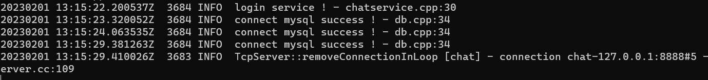

### 环境搭建

redis/mysql这些C/S类型的关键是安装一个客户端开发SDK。比如`libmysqlclient` `hiredis`


muduo的安装很简单，不需要编译test&example。  我们只需要库和头文件。  然后把编译得到的放在Linux下C/C++的默认查找路径即可。     改动cmakefile，来获取最快/小安装。   

muduo库放在了/usr/local/lib   头文件目录放在了/usr/include  自己放的。

一般可以把自己的放在`/usr/local/`这个下面，也是默认的搜索路径。

```bash
# 安装boost库都不会？==》关键是得知道你要安装的包的名字
# 
sudo apt-get update
sudo apt-get install libboost-all-dev

./build.sh
./build.sh install
```

懒得搞了 redis/nginx安装本地，反正都是很小的；还有就是可以把自己的头文件/链接库 放在/usr/local/include   和/usr/local/lib


1--15都是环境搭建&项目准备，数据库表的设计。       

写代码之前得熟练使用muduo网络库，其实也好用；**陈硕：网络编程的本质不是处理socket/IO**，而是处理事件。 关注Tcp连接的建立/断开，消息的到达（也就是connected socket可读）


### 网络模块

* chatserver.cpp网络模块

  负责处理用户连接，读取用户发送的数据。  

课程16，网络模块       

将聊天服务器的网络/业务/数据 模块进行分层的设计。     

网络模块使用muduo库，网络编程的三个半事件即可。 这一块有网络库帮我们做。     

* 连接的建立/断开
* connected socket的可读事件处理/处理用户的数据

这一块得理解muduo，自己的webServer也是使用`one loop per thread + 线程池`写的。        

还是使用的muduo，server关注TcpServer的使用即可。


无关：muduo的acceptor/listing fd由我们的main reactor管理，同时我们的已连接socket由我们的sub reactor管理也就是eventLoop。     TcpServer是入口。         

每个poller管理自己的connected fd

### 业务模块

* chatservice.cpp业务模块

  负责业务功能的实现，网络层读取到用户发来的数据/请求；如何解析数据？ 如何派发合适的处理函数？  

  网络模块负责读取数据，读取到的处理过程必然和具体业务实现相关，如何把这两个模块松耦合？


聊天服务器的业务逻辑      从17开始         

如何把网络模块的代码与服务模块完全解耦？通过回调/bind邦定器        

网络模块的代码chatServer，把chatService模块与网络解耦；不管业务如何改变业务代码不变。      

​      

网络模块关注的onMessage，网络库仅仅帮我们读取用户的数据，如何处理数据自己决定。 

但是如何处理用户数据？处理用户数据的代码放在哪里？   

我们注册的onMessage是设置setMessageCallback，这里的函数可不是在一个线程里面运行，而是各个连接在不同的sub reactor！！！       网络库真是强大，我们仅需处理逻辑，socket的连接/IO/线程池都不需要1管理。    


*回调函数，只管写好&&注册什么时候调用我不管；当然需要chatService/注册代码进行注册*      

回调函数，不知道什么时候会被调用只管编写，然后使用bind来注册；然后有需要的时候进行获取调用。

```c++
    auto msgHandler = ChatService::instance()->getHandler(js["msgid"].get<int>());
    // 回调消息绑定好的事件处理器，来执行相应的业务处理
    // qi：在sub reactor里执行；如果是耗时的工作可以放在线程池里面
    msgHandler(conn, js, time);
//这一块的目的就是网络层获取了数据，如何使用业务代码进行处理；
//如何安排才能减少耦合，让业务层返回 一个处理接口/回调函数
```


**课程19**：    

测试之前写过的代码，login与reg模块与返回事件处理器。     

测试网络模块分发功能/获取消息处理器，测试结束开始业务模块。

写好一个模块记的测试。       


### 数据模块

数据库的操作      为每个表提供相应的类和操作，eg user&&userModel。      类似于ORM，进行对象的操作。


### 遇到的困难？

1、在一次写代码的过程中一直报错，检查之后  CMakeLists文件一个字母没有大写。


* redis的发布订阅bug

  订阅，publish都没有问题，就是在处理接收到的信息时候出现问题，直接down掉。`std::bad_function_call()`，还是gdb使用的不熟练。不会多线程下的调试！

  问题就出在，订阅方接收到消息后的处理。  这尼玛是什么问题，加了调试信息就好了？ 这怎么办？

  还准备把这个当作备选问题呢！  但是不应该会产生那个错误啊，空的函数绑定调用，但是加上日志就没事了？  **应该是昨天晚上修改好了，但是远程没有拉取。就是那个connect没写返回值，导致调用了空的函数对象。**  但是没写返回值也没有报错！  算是一个连环的错误，找到bug后本地没有测试，直接远程pull，自己当时也没看见git报错。
  
* 一次使用muduo的log时候，发现无法输出C++11自带的thread::id

  然后就去看了muduo日志实现的源码，发现网络库的实现并不是采用的iostream，而是自定义的logStream。我又看了标准库的thread：：id发现这不是一个成员变量而是一个类，这个类仅对标准库的operator<<进行重载。这时就有两条方法去修改bug：1、修改网络库的源码  2、使用手段访问private变量，查看了id类的内存布局


### 实现记录

* 课程20，MySQL数据库代码封装，用于操作MySQL

  数据层与业务层解耦？业务逻辑不要和具体的数据库绑定，比如不想用MySQL了；类似于ORM框架？

  这个数据访问/sql如何与业务实现分离？为每个表设计一个对象，让业务层操作对象而不是sql语句。 

  不向业务层暴漏mysql对象，业务层操作表对象&&表的操作。 


* 课程21：Model数据层代码框架设计，涉及了user&userModel

  分离数据层操作与业务层，实现类似于ORM来解耦。  业务层仅需要操作对象，而不进行具体的数据读写/sql语句。     也就是增加一层，不去直接使用MySQL，而是封装一个对象让他去调用。     

  **目前的两次解耦合都是基于增加一层**，为了使网络层与业务层实现逻辑分离我们把业务实现放在chatservice；而业务层伴随着数据库的操作，为了实现业务&数据的分离我们增加了model层，让业务不去操作具体数据库，而是去操作对象。


* 课程22：用户注册代码业务代码讲解&测试

  上一节实现了user/usermodel， 使用它们实现业务模块的注册功能。  经过测试，注册业务全部打通。 

  用户注册也就是向user表里面插入一条数据。      

  实现了user.hpp&&usermodel.hpp的insert操作，进行业务层用户注册reg代码的测试


* 课程23：用户登录业务代码&测试  待实现==》已实现

  写了login方法。      

  待实现功能：用户通过id和password进行登录，     

  登陆业务：服务器进行数据库查询，进行身份/密码 校验，登录成功进行状态修改。这里涉及两条sql一条select，一条update。     

  还有一个可能需要修改网络层代码的地方：用户下线了如何进行数据库的更新？需要修改网络层代码onConnection。      
  
   **待实现：用户下线分两种类型：**1、用户主动发送信息下线msgid=3，调用loginout    2、用户异常退出（此处需要修改网络模块代码）


* 课程24：记录用户的连接信息以及线程安全问题

  加入了_userConnMap和mutex，对需要并发-共享的数据考虑线程安全性其他的没有必要。       

  

  提到了在线用户之间如何互相通信的实现，当然需要知道对方的Tcp连接，来给对方发信息。  
  
  服务器模型还是C/S，用户之间通过服务器通信。


* 课程25：客户端异常退出业务实现&测试

  `ChatService::clientCloseException()`     

  需求：异常退出，服务器负责删除_userConnMap里的在线信息；同时需要更新数据库该用户的state信息。   
  
  可直接作为用户退出业务的代码，不需要区分1、异常退出  2、用户主动退出。（目前来看）        
  
    
  
  测试时候看看施咋测试的，先登录--》退出 查看数据库state字段。  轻微的bug：一个用户用一个连接登录两次，这个不算是bug客户端可控制。

到目前为止，一次登录/退出会查询三次数据库。       

登录： select比对password，成功后update状态为online        

退出：update状态为offline



* 课程26：点对点聊天业务代码和测试。  

  public头文件增加ONE_CGAT_MSG类型，service实现onchat方法；仅实现了在线用户之间的通信。     

* 课程27：离线消息业务代码实现和测试。      

  开始新的表操作了，offlinemessage表，创建相应的model，这个表简单就不需要ORM类了，直接操作即可。         这个表比较简单，只需要查询，插入，删除     

  用户login的时候需要检查自己有没有离线消息；onChat的时候需要对方不在线时需要存储离线消息

* 课程28：服务器异常退出代码和测试

  服务器异常退出后数据库中用户的state信息得不到修改！   服务器退出要reste。  仅仅处理了由于CTRL C结束的。 写了一个信号处理函数，userModel的重置

* 课程29：添加好友业务实现&测试 ==》实现

  其实我们的实现只要知道对方id就能通信。  写这个是因为我们有一个命令行客户端，用户登陆后需要知道自己的好友有哪些。        

  添加一个msgHandler后需要向map里面注册，并添加消息类型字段msgid。新增friendModel。  
  
  再次修改login，增加friends字段，登录时返回自己的好友信息。
  
* 30：组群业务实现--数据层面实现 model    

  群组相关的数据库表：user、groupuser、allgroup：一个用户多个组，一个组多个用户，需要添加一张表allgroup。          

  业务的实现流程已经清楚： 1、ChatService增加处理函数  2、若需要操作数据库，增加相应的类和model
  
  3、对已有业务的修改。  
  
* 31：群组业务实现，业务方面

  组群业务涉及：model层和业务层。 model层的数据库操作，业务层的逻辑。    **服务器方面实现完成**


**客户端方向开发**       

关键是对消息的发送&解析。 服务器要求什么发送什么json内容即可。     

* 1、首界面功能开发：login/reg/exit

  客户端实现逻辑：main线程进行数据（格式化的自定义通信协议）的发送（send），开启子线程进行接收&&调用相应的ack处理函数进行处理（recv）。        两个线程（收发线程）之间需要同步：使用mutex+condition variable 或者使用信号量。  

  根据服务器的功能做出相应的回复。

* 2、添加好友和聊天功能开发。  业务实现！

* 5、客户端开发组群业务

* 6、群组聊天功能验证

客户端实现相对简单，就是对服务器相应服务的调用。客户端两个线程


### 负载均衡实现

通过nginx实现tcp的负载均衡模块实现反向代理。       

* 从源码安装nginx，编译源码时使用--with-stream激活tcp模块
* 进行相应的tcp负载均衡配置，配置nginx监听的端口以及转发的ip:port

直接进行服务器的水平扩展，由一台主机到多台主机。    负载均衡器--反向代理设备。     

反向代理？看维基百科，反向代理用于水平扩展服务器。        带config脚本的开源软件就是三板斧`./config someVar`  `make && make install`     关注被安装在哪即可

```in
#nginx tcp loadbalance config，写在http的上方http是基于http的代理规则
# stream基于tcp的负载均衡，这里直接使用加权轮询的策略
stream{
	#上游服务器
	#max_fails参数：fail_timeout时间内连续请求失败的次数
	upstream MyServer{
		server 127.0.0.1:6000 weight=1 max_fails=3 fail_timeout=30s;
		server 127.0.0.1:6002 weight=1 max_fails=3 fail_timeout=30s;
	}
	server{
		proxy_connect_timeout 1s;
		#proxy_timeout 3s 这个配置我们不需要，配置tcp连接3s后断开，我们的是tcp长连接
		listen 8000;
		proxy_pass MyServer;
		tcp_nodelay on;
	}
}
```

**nginx的负载均衡策略**      

项目中仅仅使用了基于指定权重的hash策略，还知道哪些负载均衡策略？

* 默认轮询
* 指定权重轮询，
* 基于IP的hash，可以确保每个访客固定访问一个后端服务器

第三方的负载均衡插件。

* fair：按后端服务器的响应时间来分配请求，响应时间短的优先分配。

还有很多自己不记得了。


**nginx的安装**          

我们自己安装的源码&&文件大多在/usr/local目录下      读一下makefile即可。     

从nginx的源码安装nginx编译tcp负载均衡模块。

安装nginx的相关依赖参见陶辉的《深入理解nginx》看看Ubuntu下那几个库的名字。        

/usr/local/这个目录挺好用的，放置安装的源文件，头文件，库文件，也好删除。

```ini
  # nginx的相关安装目录
  nginx path prefix: "/usr/local/nginx"
  nginx binary file: "/usr/local/nginx/sbin/nginx"
  nginx modules path: "/usr/local/nginx/modules"
  nginx configuration prefix: "/usr/local/nginx/conf"
  nginx configuration file: "/usr/local/nginx/conf/nginx.conf"
  nginx pid file: "/usr/local/nginx/logs/nginx.pid"
  nginx error log file: "/usr/local/nginx/logs/error.log"
  nginx http access log file: "/usr/local/nginx/logs/access.log"
  nginx http client request body temporary files: "client_body_temp"
  nginx http proxy temporary files: "proxy_temp"
  nginx http fastcgi temporary files: "fastcgi_temp"
  nginx http uwsgi temporary files: "uwsgi_temp"
  nginx http scgi temporary files: "scgi_temp
```

进行了负载均衡，不同的服务器之间如何通信？采用服务器中间件！ 使用消息队列      


使用Makefile组织的代码，如何享受智能提示？这也算是自己摸索出来的。那就是使用bear make生成command.json，学习源码的时候的工欲善其事必先利其器！

**nginx相关命令：**         

在nginx的sbin目录下：

```bash
nginx -s reload
nginx -s stop 
```


### redis-发布订阅-中间件

为什么要引入redis作为服务器中间件？我们的chatServer是一个服务器集群，不同的用户可能登陆在不同的服务器，在需要用户之间通信的时候可能在用户所在的服务器的_connMap里面没有对方的信息，但是从数据库得知对方确实在线，这时如何跨服务器获取对方信息？  也就是说我们需要在集群的情况下知道对方是否在线（先查数据库，这个是一定的），得知在本台服务器找不到但是在其他服务器存在。    **数据库压力太大了！**   是否在线，数据库说了算。 **解决集群环境下不同服务器之间通信的问题**     

​       

redis的发布订阅，不是阻塞队列X，要改说每一个channel就是一个阻塞队列！！！  这样就好了，一个redis-cli可以subscribe多个channel，各个channel不会相互影响。

### 可优化记录

* Model模块里面，每次数据库的操作都是重新建立一条连接，改进为使用连接池。  

  连接池/线程池是如何使用的，如果作为全局的单例来使用？  在哪创建？又放在哪里？应该是只要同一个进程想用就用吧，直接使用instance()-> 调用。  从编译链接的知识来说确实是这样.     还是对单例的使用不熟悉啊，看看连接池那个，单例不是说整个项目只能使用一个对象，而是每次通过instance()获取的都是同一个对象。


* 处理客户异常连接代码，和网络模块的onConnection

  在删除在线用户的连接信息时候，每一次删除都需要进行一次_userConnMap的迭代查询。需要改进！！！

  改进方法增加一个_userConnMapReverse存储 conn-》id。     

  感觉这个可以说项目遇到的问题：在一个业务代码处理用户异常退出的实现。用户异常退出时候只能得到用户的tcp连接信息，一开始使用的是直接循环从在线用户hashMap里面查找，，，， 平时的习惯就是先实现基本功能，之后把需要优化的记录下来。 慢慢的想

  ```C++
  void ChatService::clientCloseException(const TcpConnectionPtr& conn){
      User user;
      {
          lock_guard<mutex> lk(_connMutex);
          // 进行一次迭代，效率比较低；有没有办法直接从conn找到用户id？
          for(auto it=_userConnMap.begin();it!=_userConnMap.end();it++){
              if(it->second==conn){
                  user.setId(it->first);
                  _userConnMap.erase(it);
                  // return;
                  break;
              }
          }
      }
      // 如果的到该用户的在线信息，更新数据库状态
      if(user.getId()!=-1){
          user.setState("offline");
          _userModel.updateState(user);//更新数据库信息为offline
      }
  }
  
  void ChatServer::onConnection(const TcpConnectionPtr &conn) {
      // 处理客户的TCP连接变化 1、建立（不用管） 2、客户断开连接
      // 新增处理用户异常断开连接代码，但是如何判断用户是异常断开？不区分这个业务了
      if(!conn->connected()){
          ChatService* service=ChatService::instance();
          // 不管是不是异常断开都会调用这段代码，可是这个代码并不高效！
          service->clientCloseException(conn);
      }
  }
  ```

  

* 访问MySQL的地方太多了，一个用户就会发起多个数据库连接，可使用MySQL读写分离。

* 可以使用redis来查看在线信息，增加缓存


**项目尽快完成吧！！！** 得开始面试&&找工作了    时间感觉太紧了，什么都还一团乱！ 现在毕设又来了！  

别慌，慢慢来。


### gdb调试运行的进行&多线程调试

ps -u查看运行的进程

```bash
ps -u  # 
gdb attach pid;# gdb调试进程，由pid
info threads;#查看线程的信息
bt;       #查看线程的调用栈
thread 2; #切换到线程2
bt       # 查看线程2的调用堆栈信息
```


### 项目简历输出

  


### 项目面试问题

自我介绍！！！

* **自我介绍：1--3--5分钟**

  1、基本情况。 2、自己对开发该兴趣（学习能力），看了什么书走到了开发上面   3、工作打算，结合面试岗位。这个可放在2的前面，引出自己的学习能力            

    xxx（面试官）您好。我叫祁志赟，就读于郑州大学的物联网工程专业。我平时开发主要是在Linux平台的C++开发，经常看一些技术博客，喜欢动手写代码。自己做过的一些项目主要是基于LinuxC++的服务器开发，比如集群聊天服务器和http服务器。我应聘的岗位是C++工程师/软件工程师，希望能获得此次机会，谢谢。

  

* 项目介绍！！！ 前两项必备，而且难！！！

  逻辑清晰，2--3分钟。不要紧张，吐字清晰。             

  这个项目是一个网络聊天服务器项目，它分为了四个模块。

  首先，第一个介绍网络模块，网络模块这方面我采用的是开源的muduo网络库来进行设计的；这个模块的主要作用就是解耦网络模块与业务模块的代码，使得后面的开发过程中专注业务的开发。

  另外就是业务模块，我采用了一些C++11的技术比如：哈希表，function和bind绑定器实现的回调机制。主要就是实现了这么一个功能，根据用户发送的json消息，解析出消息id（自定义的信息格式）对应的服务，并通过回调相应的业务代码进行处理。           

  然后就是数据存储层模块，我使用的是MySQL数据库进行关键数据的落盘，这一块的代码主要采用类似于ORM的方法避免业务层直接书写sql代码，解耦了业务层与数据层的代码。        

  *单机服务下主要就是这几个模块，但是单机的性能有限。*

  我就通过配置nginx实现了基于tcp的负载均衡，将服务器进行水平拓展实现了服务器的集群。  

  在集群环境下不同的用户可能登录到不同的服务器，这样为了实现不同服务器上用户之间通信的问题（主要就是解决服务器之间的通信因为我们时cs结构服务器推送消息）采用了基于redis的发布订阅机制，实现了跨服务器的通信。      

  看着读也就1--2分钟。对每个项目都需要写一下，避免被问到。 括号里面不说。
  
  >这是一个网络聊天服务器项目，总共由四个模块构成，各个模块功能介绍如下。
  >1、网络模块：网络模块方面采用的是开源的muduo网络库来进行设计的；这个模块的主要作用就是解耦网络模块与业务模块的代码，使得后面的开发过程中专注业务的开发。
  >2、业务模块：采用了一些C++11的技术比如：哈希表，function和bind绑定器实现的回调机制。主要的功能，根据用户发送的json消息，解析出消息id（对应的服务，并通过回调相应的业务代码进行处理。
  >3、数据存储模块：使用的是MySQL数据库进行关键数据的落盘，这一块的代码主要采用类似于ORM的方法避免业务层直接书写sql代码，解耦了业务层与数据层的代码。
  >4、服务器集群通信模块，主要采用了基于redis的发布订阅模式实现的服务器集群间的通信，解耦了各个服务器。
  >
  >由于简历书写


想一想为什么要使用redis，如何想到的？         

### 面试问题汇总

* 数据安全，我们的项目直接使用的明文json传输，存在数据安全问题

  对称加密/非对称加密==》引出话题。

  对称加密，加密方/解密方对等，用的相同的密钥，效率高。eg：AES       

  非对称加密：分为公钥&私钥，eg在配置github的时候放在GitHub的公钥。问题1：可以互相通信吗？==》可以但是不安全。       公钥加密，私钥解开好理解；可是私钥加密，公钥可以解开？==》不可以。     

  就没有纯纯使用非对称加密的情况，都是配合使用。==》复习指路https

* 历史消息存储如何实现？

  存储方法：1、本地（客户端）（sqllite）    2、云端：存储在磁盘数据库，每隔一个月mysqldump一次。

* 客户端消息如何按时间顺序显示（也就是按序接受）还是可以从网络找灵感，tcp的按序！！！

  这个当然是保证同一个好友发的信息才make sense。问题：由于网络原因，晚发送的却早早送到，如何解决？       ？？？TCP不是可以保证吗，消息按序吗？

  为每个消息进行编号，标号自增。

* 如何处理粘包？如何确定发来的是完整的应用层数据？

  巨大bug没有考虑到，还是参考http服务器通信的格式，定义应用层协议。

* 业务层消息的可靠传输？

  应用调用send发送信息，send返回后内核tcp确实会保证消息的可靠传输。但是这个问题是如何确定这个消息真的是发送给了对方比如qq的发送失败感叹号！        

  还是从tcp找灵感，进行每个消息的回复。ack，目前发送有seq，接受有ack。
  
* 除了redis你还知道哪些中间件可以实现类似功能？

  服务器中间件：不能单独起作用，而是作为组件。

  redis主要是缓存数据库nosql。

  使用redis的发布订阅作为mq的缺陷：（看知乎那个）     

  其他的专业消息队列MQ。

* 网络拥塞严重，如何感知用户是否在线？

  这里的严重就是客户端发送的fin报文一直到不了服务器。虽然tcp会重发但是有一定次数，最后在服务器无感知下直接下线。===》使用心跳机制。  基于TCP长连接的一般都需要使用心跳机制。（业务上自己实现）比如每隔几秒发一个探测包。         

  为什么不使用tcp传输层的keepalive功能？两个原因：1、仅仅在传输层拆除tcp连接不行，应用层还需要释放相关的资源。          2、可能用户的应用层（业务）死锁了，若使用tcp的keepalive不能判定。此时传输层说：没问题，应用层却一直得不到消息。       

  传输层的set/get 方法

