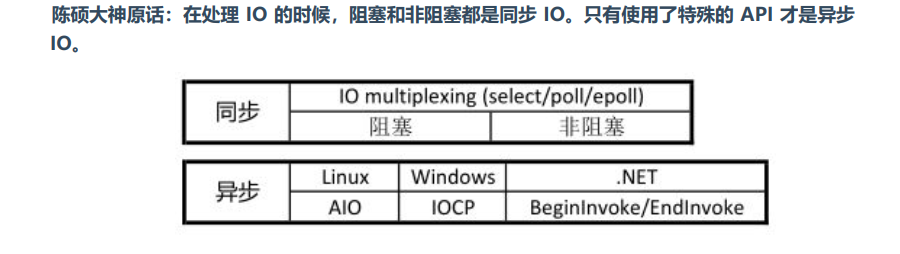
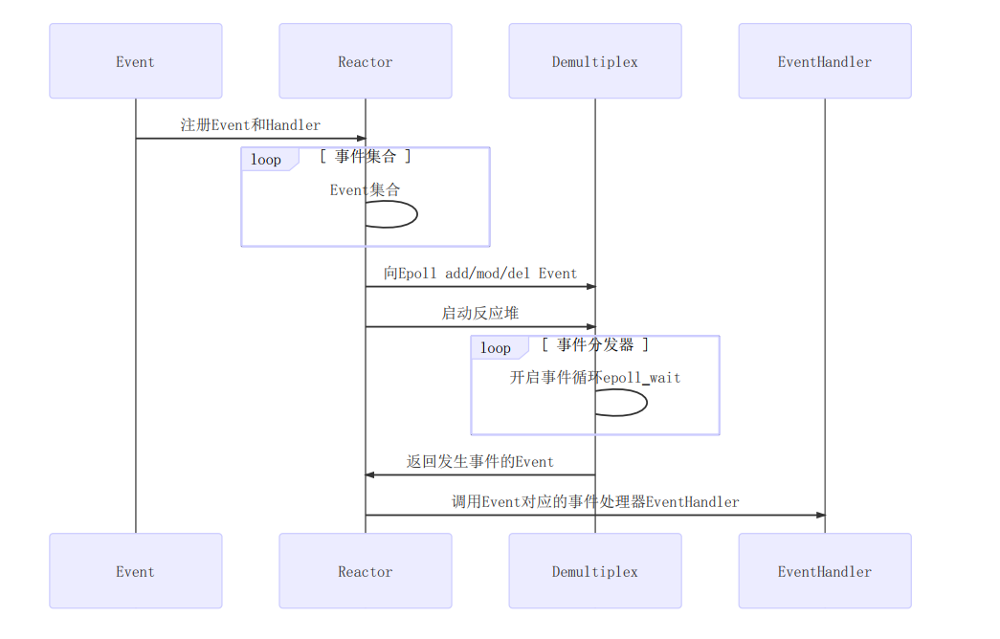

## IO

### 阻塞&非阻塞

> If no messages are available at the socket, the receive calls wait for a message to arrive, unless the  socket  is  nonblocking  (see fcntl(2)), in which case the value -1 is returned and the external variable errno is set  to EAGAIN or EWOULDBLOCK.  The receive calls normally return any data available, up to the  requested  amount, rather than waiting for receipt of the full amount requested.
>
>man 手册写的很详细了man recv

```C++
//非阻塞&阻塞IO的返回值问题
char buf[1024]={0};
ssize_t size=recv(sockfd,(void*)buf,1024,flag);
//无论是阻塞/非阻塞返回值就三种情况 大于，小于，等于0（都表示EOF）
//非阻塞情况下：返回值等于-1&&errno==EAGAIN表示非阻塞返回，没有读到数据。-1情况下非阻塞需要看下errno
//阻塞就比较简单了。 大于0表示正常读取，小于0表示error==》查看errno，等于0读到了EOF
```

阻塞/非阻塞仅仅是数据准备阶段API的表现，真正向内核读写数据时候还是同步IO等待数据从应用缓冲==》内核

### IO的同步与异步

这个同步&异步和我们并发的同步&异步不是一回事。   

IO的同步/异步是操作系统提供的；线程的同步异步这个比较常用，IO的异步没使用过。        


**IO的阻塞与非阻塞这只是API的表现，不管阻塞/非阻塞都是同步IO。**

比如`recv()`使用后就是就地等待OS把fd指向的内核缓冲区数据搬运到用户缓冲区。系统的同步IO就是说recv返回后，等待数据搬运到用户缓冲区；而异步IO说的是你只管调用一下aio_read即可，数据到了&&运输到用户指定的缓冲区了提醒你（通过信号）。

同步`recv(sockfd,buf,len,flag)`自己等待从内核读写数据；异步请OS帮忙写一下，我先忙去了，写好了**通知（信号）**我。




**业务层面的一个逻辑处理**       

这个经常异步处理，也好区分。

常用的：   

* 同步阻塞
* 同步非阻塞：recv，设置fd为nonblock
* 异步非阻塞：node.js
* 异步阻塞：不可能使用

### Linux五种IO模型

从图中也可以看出为什么epoll/poll/select适合于网络编程的IO复用，因为数据准备阶段的时间非常的长。使用epoll通知IO事件的到来/就绪就很方便，剩下了很长时间。

* 阻塞IO
* 非阻塞IO
* IO复用
* aio
* 信号IO

其中最常用的就是non-block IO，非阻塞需要配合IO复用。因为非阻塞IO通过轮询来获取IO事件是非常低效的。

## 网络服务器设计

网络服务器基本都是采用IO复用来处理网络IO事件。

**one loop per thread**，这里的loop指的是eventloop（时间循环epoll）也就是一个线程就是一个reactor模式。

我们提到non-blocking的时候，实际上值的是non-blocking + IO-multiplexing。

## reactor模式的实现

Reactor网络事件处理模型，就是一个基于同步非阻塞IO+IO服务实现的一个高性能的网络事件处理模型。

Reactor模型的关键组成部分：event、eventhandler、reactor、demultiple（事件分发器）。在之前使用单epoll实现的简单服务器（面向过程），也可以称之为reactor；但是基本做不到可修改，可扩展，并且从感觉上就是不可靠。

muduo并发方案采用的是`one loop per thread`并发方案，`one loop per thread`看了源码才能清楚！也就是main reactor+sub reactor，同时把sub reactor当作IO线程池。

**概括reactor模型，有点设计模式里面的单一职责模式。（下面举例main reactor）**

reactor模型有四个关键的组件，分别是event/eventhandler/reactor/demultiplex。   

* event事件

  一个抽象的概念，比如listenfd的可读事件。一个事件要有关联的处理函数，比如listenfd的处理函数就是调用listen函数获取connectedfd，然后加入所属的reactor（IO线程池）。

* reactor反应堆

  **顾名思义，发生反应的地方。**从事件分发器获取到所有的已经发生事件的event，并调用事件event相关的处理函数（eventhandler）。      同时负责epoll_ctl管理事件。 reactor主要就是存储了event和对应的eventhandler（当然是通过map）。

* demultiplex事件分发器

  功能做的单一点，仅仅负责事件的分发（返回响应事件），这里调用epoll_wait获取所有发生注册事件的event，有时会把分发器和reactor画在一块。就是获取IO事件的操作：`epoll_wait poll select`

* eventhandler事件处理器

  事件对应的处理函数，



### 00什么都不做的eventloop

muduo的eventloop完成的功能是reactor（反应堆）组件的部分。

维护了事件的集合，并向事件分发器添加/删除事件（epoll_add/del）。

从事件分发器拿到待响应的IO事件并调用事件对应的处理器，（比如listendfd对应的可读事件对应的处理函数）。

* 面试问题一：

  实现one loop per thread需要保证一个IO线程仅有一个EventLoop对象，如何实现？     

  线程单例！

  *ans：这个问题的关键就是如何感知该线程已经创建过eventloop对象！*==》*使用threadlocal关键字*
  
  具体看看s00，什么都不做的eventloop。

### s01Reactor关键结构

reactor的核心：事件分发机制，即将IO multiplexing拿到的IO事件（event包括：可读，可写，异常）分发给各个文件描述符fd的事件处理函数。

#### channel

从reactor模型上看，channel是关联了每个fd及其对应的事件和事件的处理函数！==》event&&eventHandler        

*每个fd可能对于：可读readable、可写writeable事件，和这些事件的处理函数！*

仅负责IO事件的分发，不拥有socketfd。      

每个channel仅存在于一个IO线程

#### poller

简化poller的职责，仅仅用来做IO multiplexing不用来做事件分发（dispatch）。事件分发是eventloop(反应堆)的职责。