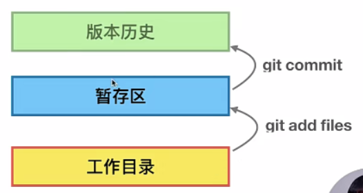
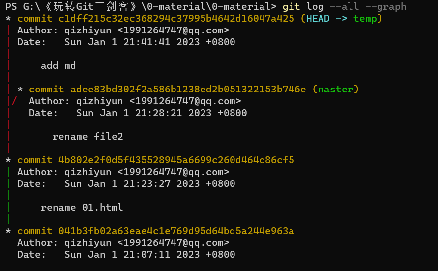

[TOC]

## 使用git

*总是对这些工具不得心应手，加油这次一定！！！*          

~~知道基本的原理，然后每次使用的时候知道去哪查资料就好了，记住常用的，全记得有点不现实。~~

使用不熟悉，只会`add commit push pull`一把梭，看看如何进行分支操作以及具体的流程！


2023/1/1又重新开始准备补一下。  这次看下之前的笔记全部整理到一块。

### 基本配置

```bash
git config --global user.name 'qizhiyun'
git config --global user.email '1991264747@qq.com'
# 这个其实就是为了标识这个仓库是谁做的改动，方便以后的联系

git config --local user.name 'myname`
git config --local user.name 'myemail@qq.com'

# 查看git的配置 local:只对本仓库有效  global：对登录用户的所有仓库  s'y's
git config --list --local
git config --list --global
git config --list --system
```

#### 明确三个基本的概念：         

不要老是想着自己不懂，想想原理还是理解的。git仓库管理的文件的各个版本就这三个地方别瞎想。

git add/rm之后工作区和暂存区保持一致；git commit之后暂存区与版本库一致。

* 工作区
* 暂存区
* 版本库




### git stash

git里面暂存区和工作区都是不同分支之间所共享的，所以在当前分支的工作未提交而需要切换到其他分支工作之前需要先进行stash。

stash相关的命令，将当前没有提交的修改全部保存起来，也就是保持工作区和暂存区的clean。

```bash
git stash 
git stash pop
git stash apply stash@{0}
git stash list
git stash drop stash@{0}
```

要恢复之前保存的一个`stash`，你可以使用`git stash apply`命令。这个命令会将保存的修改应用到你的当前工作区，并保留这个`stash`，以便稍后再次使用。下面是`git stash apply`命令的一些用法：

1. 如果你只保存了一个`stash`，并且想将其应用到当前分支中，可以使用如下命令：

   ```
   git stash apply
   ```

   这个命令会将最近保存的`stash`恢复到你当前的工作区中。

2. 如果你保存了多个`stash`，并且想将其中一个应用到当前分支中，可以在`apply`命令后面指定要应用的`stash`的名称或者索引号，例如：

   ```
   git stash apply stash@{1}
   ```

   这个命令会将索引号为1的`stash`恢复到你当前的工作区中。

3. 如果你在保存`stash`时指定了`--index`选项，也就是将一些修改保存到了暂存区中，可以使用`--index`选项来恢复暂存区中的修改，例如：

   ```
   git stash apply --index
   ```

   这个命令会将最近保存的`stash`恢复到你当前的工作区和暂存区中。

需要注意的是，使用`apply`命令恢复`stash`时，并不会从`stash`中删除该记录。如果你想要删除`stash`记录并从`stash`列表中移除它，可以使用`git stash drop`命令。例如：

```
git stash drop stash@{1}
```

这个命令会删除索引号为1的`stash`记录。如果你想要删除所有的`stash`记录，可以使用`git stash clear`命令。

### git远程操作

* 从本地仓库新建远程：本地已有仓库，关联远程后进行推送。
* 从远程仓库clone到本地：远程已有仓库，通过clone创建本地。

#### git remote add

通过与远程关联后就可以直接push与pull了。

```bash
# git remote 相关的命令
git reomte #
git remote add origin xxxx #添加一个名字为origin的远程分支
git remote -v #
git rename origin originMyRpc

# 简单的推送
git push -u origin master #首次推送
git push origin master
git push origin feature01 #在feature01上面把本分支提交到远程并创建
```

#### git clone

默认clone下来的只能看到master分支（default分支），其他分支可以手动拉取。拉取的方法可以fetch也可以新建后进行pull。

```bash
#拉取远程分支的两种方法，会一个即可

git switch -c branch_name remote_name/branch_name  
# 我们的remote一般默认名字就是origin，创建可远程同名的分支，如果出现不能够创建的话
1： git branch -r列出所有远程分支
2： git fetch 拉取最新的远程分支列表
3： git switch -c branch_name remote_name/branch_name 现在应该可以了


```


当使用Git进行协作开发时，远程操作是必不可少的。以下是一些常用的Git远程操作：

1. `git clone <url>`：从远程仓库克隆代码库到本地。
2. `git remote add <name> <url>`：将远程仓库添加到本地，并分配一个指定的名称。
3. `git fetch <remote>`：从远程仓库下载最新代码，但不会自动合并或应用更改。
4. `git pull <remote> <branch>`：从远程仓库下载最新代码，并合并到当前分支中。
5. `git push <remote> <branch>`：将本地分支推送到远程仓库，如果远程分支不存在则自动创建。
6. `git remote -v`：显示所有远程仓库的名称和URL。
7. `git branch -r`：列出所有远程分支。
8. `git remote show <remote>`：显示远程仓库的详细信息，包括分支和标签。
9. `git remote rename <old> <new>`：重命名远程仓库。
10. `git remote rm <name>`：删除远程仓库。


### 版本回退git reset

~~这个建议是，整个版本的回退，如果仅仅回退某个文件的话可能会有冲突。我们不这样来回退一个版本，工作区与暂存区的修改撤销有专门的。~~


只要知道某个commit id我们就可以回退到相应的版本，但是我们回退后使用git log是无法查看我们回退后的这个commitid之后的，这种情况就需要使用reflog.


HEAD就是当前版本的指针，所以我们

```bash
git reset --hard HEAD^ 
git reset --hard HEAD^^ 
# 以当前commitid为界限，回退一个，两个的便捷操作
git reset --hard HEAD~1 #使用波浪线更好

git reset --hard commit_id
```


### 撤销操作

我们这里所讨论的撤销涉及四个部分分别是：当修改后保存进了磁盘，修改后add进入了stage，修改后commit进了本地版本库，修改push到了remote。

当修改进入了这四个部分分别有哪些撤销的操作呢？

这个算是有印象了，接下来还是得再看看分支操作！

#### 撤销对工作区的修改

当在工作区修改后保存进入了磁盘这时候如何撤销呢？

```bash
git checkout <changed_file>
git restore <changed_file># 新的命令，checkout比较早了
```

使用之后就会丢弃刚刚的修改，保持和stage的一致。

#### 撤销stage的更改

此时已经通过git add添加进了stage，这时候工作区和stage是一致的，这时候可以撤销暂存区的修改。

也就是恢复到和版本库相同，但是修改依然会保存在工作区（这个很好）

简言之：add之后撤销对stage的修改，但是保留对工作区/磁盘的修改。

```bash
git reset HEAD <changed_file> #HEAD就表示版本库的当前版本/
git restore --staged <changed_file>
```

当然也有命令可以直接撤销暂存区和磁盘的修改，但是不推荐！毕竟通过两次命令组合也能完成。

#### 撤销本地版本库修改

当修改已经通过commit提交到了本地版本库，这个其实就是版本回退了。

```bash
git reset --soft HEAD~1 #仅仅撤销commit，但是不会撤销add，也就是成为待commit状态

git reset HEAD~1 #同时撤销commit和add，但是保留磁盘的修改。
```

上面两个算是温和的撤销了，撤销后还能看到之前的变化。

`git reset --hard HEAD~1`这个就比较不推荐了，这个是完全放弃本次的提交，连同磁盘一起恢复到上一个commit的状态。==》可恢复但麻烦，什么hard，force这些参数在使用时候一定要过脑子！！！


这里的`HEAD~1`表示的是当前提交的上一个，2就表示上上一个。

#### git revert

git的设计并不复杂，不要想那些不可能存在的操作。

```bash
#revert与reset都是回退到之前的某个版本，但是reset比较直观。
#revert其实就是在做减法，比如git revert HEAD，在commit之后想要撤销掉这次的commit
#使用revert就是减去（去除）HEAD这次commit对应的修改，同时产生一个新的commit。
```

这个revert有一个更重要的作用就是在公有分支开发的时候，也就是很多人在同时在一个分支上面开发。这个时候我们的commit数量是只能增加不能减少的，不能说我们push到remote之后导致remote分支的commit减少了，这样就乱套了。==》还是不太懂

#### 撤销remote的修改

当通过push后想要撤销对远程仓库/分支的修改。这个也得先进行对本地分支的撤销后同步到remote。

这个就要分情况了，如果是个人分支可以使用reset来减少commit然后通过`push -f`来推送（因为remote会发现本次推送少了必须强制force）；如果是公有的分支，只能使用revert。

还不太懂，没有实战，不知道为啥要撤销对remote的修改！

### git branch

* 分支的创建switch
* 分支的管理
* 分支合并
* 该分支工作未完成/commit去干别的要stash，注意保持当前的工作区与stage

```bash
git switch -c branch-name #创建并切换
git switch -c branch-name commit-id #按照指定的id创建分支
git switch branch-name

git branch # list all
git branch -a # remote and local
git branch -d # delete a branch (commited)
git branch -D # not commited 
git branch -m oldname newname # rename branch


git merge branchname #合并分支到当前分支

# 工作区与暂存区是所有分支公用的，如果当前的工作没有commit来了紧急的工作需要使用
git stash list # 查看所以存储起来的工作现场
git stash apply stash@{0}# 恢复工作现场，但是不删除stash内存，恢复特定的那个
git stash drop stash@{0# 删除stash内容
git stash pop# 恢复并删除
```

### merge与冲突

不是说两个分支齐头并进就一定会出现冲突的，关键是合并的时候修改了相同的文件，没有冲突的merge会直接生成一个commit，有冲突的要手动解决冲突后再自己进行commit。


### gitflow本地工作流


### GitHub工作流

真正工作基本都是clone已有的仓库进行本地的开发。

```bash
git clone xxxx #默认只会clone master分支，但是我们修改的不一定是master，先拉取我们需要修改的分支
git switch -c feature01 origin/feature01 #拉取远程分支，一般同名，origin表示remote name


#我们的工作都是在自己新建的一个分支进行开发，开发完成后合并到指定的分支，比如我们组就是
#要对远程的某个分支进行修改，每个组员都要拉取这个分支，然后在这个分支上创建自己的本地分支，
#然后将my-feature-branch 合并到自己本地feature01，之后进行对远程feature01的push。
git switch -c my-feature-branch 

#接下来我们就可以在my-feature-branch进行修改代码了，
#my-feature-branch完成后就可以合并到本地feature01，这样可以保证公共的分支commit信息足够清晰。
```

这才是GitHub工作流，自己在my-feature-branch工作随便进行commit，然后与本地feature01合并后同步到remote/feature01.

**与远程仓库的合并**  这个还是不太熟悉！

~~现在我们已经将my-feature-branch合并到了本地的feature01，接下来就是将本地feature01与远程进行合并。
但是常见的就是origin/feature01已经进行了新的commit（公共分支别人也提交了，一个特性不可能一个人搞），这个时候我们不能直接合并。~~

现在my-feature-branch已经开发完成，在将my-feature-branch的修改同步到remote之前需要先与本地的feature01进行合并，然后push到remote/feature01。

但是remote/feature01可能已经进行修改过了，这个时候就需要先把remote/feature01的修改pull到本地的feature01下，这样做是为了看看这两次的修改能不能工作。如果没有进行修改那直接push即可。

然后在my-feature-branch分支上面进行`git rebase feature01` 这个就是先把我的commit放到一边，然后把feature01最新的修改拿过来，接着在这个最新的修改之上试着把我的commit试着给弄回去。这个过程可能会出现conflict需要手动解决。

但是rebase之前应该先把自己在my-feature-branch保存一下比如放到remote/my-feature-branch，防止自己的工作不在了。这个看具体情况，是修改后提交my-feature-branch还是与feature01合并后提交。


**练习：在myrpc下wsl与Tencent共同对feature01进行开发**  

* remote：两个分支master与feature01。
* 两个组员（wsl与tencent）共同开发feature01功能。
* 分别在本地pull了feature01，然后创建了wsl-feature tencent-feature


实验表示使用rebase出现了问题，这还不如pull之后手动的合并分支，解决冲突。

确实不太懂！pull是直接拉取并与本地合并。

### pull request

Pull Request 是一种在开源协作和团队开发中常用的工作流程，它允许开发人员将自己的代码变更提交到项目的主干分支（通常是主仓库的分支），并请求项目维护者审核和合并这些变更。（pull request主要是有一个审核的功能，可以让管理者查看哪里变更了）。==》自己肯定是要创建一个自己的分支然后合并进去的，不可能直接合本地推送到远程分支。

当你在一个开源项目的仓库中进行 fork（分叉）操作时，你会创建一个独立于原始仓库的副本，这个副本属于你自己的仓库。你可以在自己的仓库中进行修改、添加新的功能或修复错误等操作。

当你在自己的仓库中进行了修改，并希望将这些修改贡献给原始项目时，你可以创建一个 Pull Request（简称 PR）。PR 会通知原始项目的维护者，告知你的变更，并请求他们审查并将你的变更合并到主分支中。

在创建 PR 时，你可以选择将你的修改与原始项目的特定分支进行比较，通常是将你的分支与主分支进行比较。这样，维护者就可以查看你的修改和主分支之间的差异，并提供反馈或决定是否合并你的变更。

通过创建 PR，你可以与项目维护者和其他开发者进行讨论、进行代码审查、解决问题并最终将你的代码变更合并到主分支中。这种协作方式促进了代码质量和项目的可维护性，并提供了一种透明的方式来管理和合并贡献。

**总结起来，Pull Request 是一种协作机制**，用于在开源项目中向主分支提交自己的代码变更，并请求项目维护者审核和合并。在进行 fork 后的修改会产生 Pull Request，它是你向原始项目提交变更的方式。


**pull request的三种方式：**

进行 Pull Request 时，你有几个选项可以选择合并分支的方式，包括 Merge、Rebase 和 Squash。

1. Merge（合并）：这是默认的合并选项，GitHub 会创建一个新的合并提交，将分支的更改与目标分支合并。这会保留分支的提交历史，并在目标分支上生成一个合并提交。==》也就是分叉的提交历史
2. Rebase（变基）：选择 Rebase 选项时，GitHub 会将分支的提交逐个应用到目标分支的末尾。这会使得提交历史保持线性，而不会引入额外的合并提交。它可以创建一个干净的、按顺序应用的提交序列。==》也就是使用graph看起来没有分叉。
3. Squash（压缩）：选择 Squash 选项时，GitHub 会将分支的所有提交压缩成一个单一的提交，并将其应用到目标分支。这在保持提交历史干净整洁的同时，将分支的所有更改作为单个提交引入目标分支。==》这个就是在提交历史上还是有分叉的，但是压缩了分支的commit作为一个单独的。

你可以在创建 Pull Request 时选择合并方式，并根据你的需求和团队的偏好来决定最适合的合并方式。


## todo-github工作流程是怎样的

首先不可能自己直接推送到远程分支，肯定是自己fork一个分支或者在仓库里面创建一个分支。

然自己将master和自己要开发的分支都clone下来，一般自己不会合并master吧，只是合并进入特新分支。


### 给文件重命名

重命名当然也是对文件的修改，传统的方法1、工作区 2、暂存区 3、版本库？     

直接重命名的话git是两个操作：1、删除文件（工作区） 2、新添加文件（工作区）


git有专门的命令，使用git mv file1 file2 然后commit

+++++++++++++++++++


### 需求1

目前写的项目，突然觉得没有前一版的好，创建分支并回溯到前一个版本。

也就是git reset命令：


* git reset HEAD  --[filename]

* git reset --hard [commit ID]回退到某个版本

  

修改后就可以merge了


### 需求二

合并后的分支可以取消吗？这个应该也是版本回退。


## 重新记录


### 分支管理

#### 冲突的解决



分支冲突的产生，这个是人为的。然而这个并不是冲突，两个分支虽然齐头但是修改的不是同一个文件。  没有冲突的分支合并的时候自动就commit了，但是有冲突的需要手动修改后再次commit。

#### 分支的删除

`git branch -d name`

### 标签管理

这个目前实在是没有常用用到 先不看。


### cookies

* git add/rm

  git rm直接工作区 暂存区都修改了。       添加是git add 删除是git rm


* git log相关
  * git log --oneline
  * git log -n3 --oneline
  * git log --graph
  * git log --all --graph：--all是现实所有分支的信息

## temp
### git删除本地分支所上传的远程分支

```bash
git branch -a #
git switch branch-name
git push origin --delete branch-name #删除远程分支，前提是有权限
```


### git查看本地分支对应的远程分支

```bash
git branch -vv
```


### 公司git-workflow

以IFM-10858需求为例：

**首先管理员在gitlab创建一个feature-IFM-10858分支来开发，开发人员（可能多个）都在这个分支工作（最终提交到这个分支）**

1、开发人员，在本地拉取这个远程分支到本地feature-IFM-10858

```bash
git switch -c feature-IFM-10858 origin/feature-IFM-10858
```

2、在此基础上创建一个dev-qzy-feature-IFM-10858分支在本地开发：

平时自己的开发就在这个dev分支进行，修改后将这个分支提交到远程

```bash
git push -u origin/dev-qzy-feature-IFM-10858 #-u表示首次提交，之后直接git push即可
```

这样提交到远程就只有自己的修改，并且可以将自己的修改都放在这个dev-qzy分支。（等待以后合并）


在将dev-qzy-feature-IFM-10858提交到远程的时候，如果feature-IFM-10858只有一个人开发那直接不用管远程的feature-IFM-10858（因为无人修改），直接push你的dev即可。


如果当前分支是多个人配合完成的，那么dev-qzy-feature-IFM-10858提交的时候会略有不同：

1、提交dev前，先在本地的feature-IFM-10858分支fetch/pull拉取远程最新的修改，并进行合并&&冲突解决。

（因为别人可能已经先修改&&merge进了feature-IFM-10858分支）这个也就是保证本地的feature-IFM-10858是和远程feature-IFM-10858同步的（当然这个分支只有一个人的话没有这个问题），当然如何远程feature-IFM-10858和本地一样没有修改，那也不需要这些步骤。

2、本地的feature-IFM-10858经过上一步的拉去，已经获取了别人的修改（别人已经进行merge request说明没问题了）

然后切换到dev-qzy分支将feature分支与dev合并。

这里就知道为什么本地要拉取feature-IFM-10858后创建一个自己的分支！

3、将feature合并到dev分支后就可以将dev上传了

```bash
git switch dev-qzy-feature-IFM-10858
git merge feature-IFM-10858
```

dev-qzy-IFM-10858是自己的工作分支，你随便提交，每天都将自己的工作提交上去，这样gitlab也好看！

但是不要写什么注释，提交的是简单版本。


