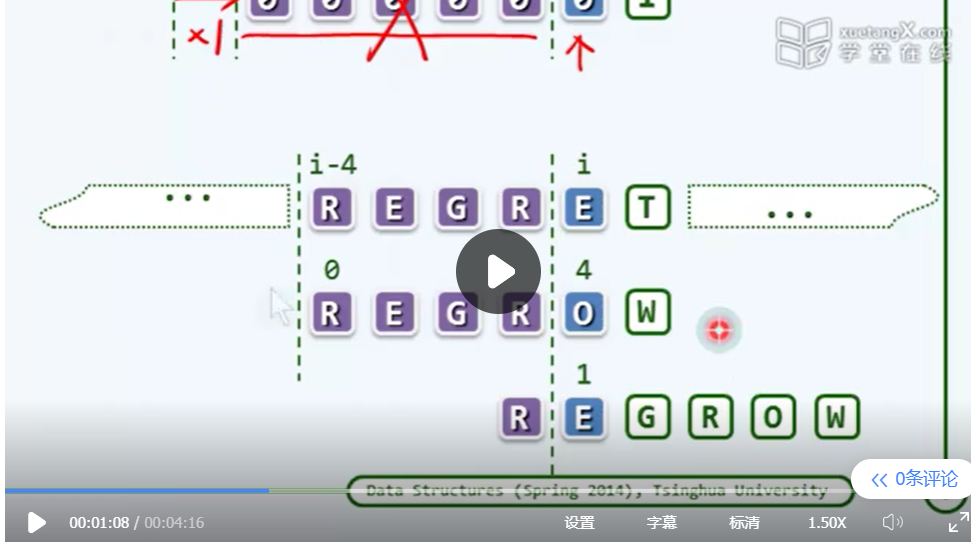

BST

二叉搜索树，

BBST：balanceed bst

AVL：       

左右高度差不大于1的bst

rbtree

### KMP

整个前缀无需比对？这里虽然还是仅仅走了一步，但是不需要重复比对。

一次走好几步！！！不必一步一步了

什么时候j<0？当x表示的字符不存在pattern的时候？**就是与text里面的i匹配的时候，再pattern里面找不到相应的信息** 

一个实例

失配的位置，理解next表！！！失配位置处的前缀与后缀必须有对称

在点j所有的候选情况里面选取的是使pattern位移最小的，也就是说**选取最多的前缀与后缀匹配**。

理解-1

next[i]的语义表面，在pattern的i的前面存在一个长度为next[i]的真前缀与真后缀重合。这个匹配缀取最大值