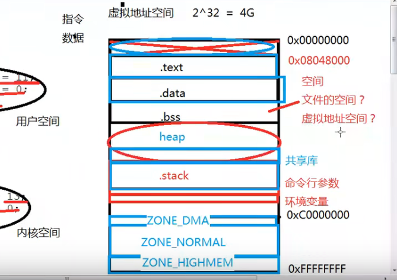

# 程序员的自我修养

这个以前看的大多也忘记了！！！      底层知识一定熟练！！！    csapp看一遍还有组成原理知识


X86-32为例的程序

## 程序的编译链接：static     

重新看的原因完成了，程序分配大数组不会爆栈，这些东西一定是有一个合理的原因。机器是对的。2022/temp下的代码

```C
int t2(){
    int arr[1024*1024*30];
    arr[1024*1024]=1;
    // 可能是汇编我读不懂，但是确实还是开辟了都够大的栈空间
    // 目前疑惑的就是C语言默认的栈空间是8MB
    // 想通了，这没有问题，这个栈空间是在编译期就完全确定好的（所以再大的数据都没事）。
    // 在这例子里面，会开辟足够的栈空间而不是默认的8MB。局部变量是指令
    // 但是我们常说的dfs 爆栈问题是因为，一般的dfs编译为指令也就几条汇编指令，肯定就是默认的
    // 8MB的栈空间，经过一定的调用就会爆栈（一般没有递归爆栈8MB肯定够用）
    // 最后我好像忘记了，函数调用为啥爆栈QAQ 懂了之后就使用好记得模型记好了。
}

```


linuxC语言进程的地址空间分布，RISC v进程的地址空间！！！         


程序无非就是取指令执行，最基础的部分就是指令与数据。          


所以清楚那些是指令那些是数据！！！

vfs？屏蔽IO的差异？     一切都是文件


cpu的位数是数据总线的宽度。


**程序的运行时栈的大小可以变吧？**       


指令在text（所以一个局部变量数组就算很大也就是一个指令，但是在运行时（函数调用的栈呢？需要开辟很大吗？很大的话不如使用堆）），数据在data段


.text  .data  .bss （data与bss都是存放数据的部分分清楚可执行文件的指令与数据，data的初始化了的，bss的未初始化以及为0的数据）            属于数据的部分，静态变量（全局与局部），全局变量。会被编译为符号


C程序的运行当然需要栈


X86的进程地址布局。





ZONE_DMA：使用DMA，ZONE_HIGHMEM：当内核地址空间不够的时候进行映射（当然64位机器不需要了）


