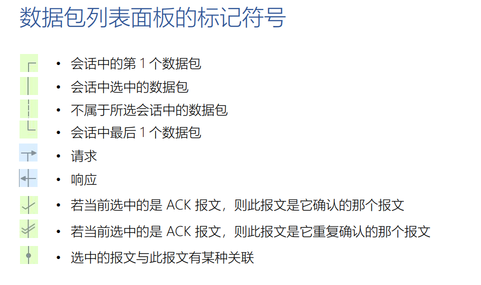

## 计算机网络

### HTTP/1.1

达到会手写http协议的程度，http协议+html他们是一块提出来的，一块学习一下比较好。

#### http协议的描述

使用ABNF语法来描述HTTP消息的格式。口语化的表达经常遇到各种各样的问题（比如几个空格，可以使用换行吗？）         *网络的大多数协议都是使用这个定义的。*           

口语化的表示：         

* start-line
  * 请求
  * 应答
* 首部header-field
* \r\n
* message-body


**使用ABNF描述**                 

空格与table信息都在这里面，有就是必须

```markdown
http-message=start-line *(header-field CRLF) CRLF [message-body]        
* start-line= request-line/ status-line      
    * request-line=method SP request-target SP Http-version CRLF   
    * status-line=Http-version SP status-code SP reason-pgrase CRLF        

* header-line= field-name":"OWS field-value OWS CRLF     
    * OWS=*(SP/HTAB)
    * filed-name=token      
    * filed-value=*(field-content/obs-fold) 

* message-body =*OCTET
```


**ABNF**     

操作符：

* 空白字符：用来分隔定义中的各个元素
  * method SP request-target SP HTTP-version CRLF
* 选择 `/`：表示多个规则都是可供选择的
  * start-line=request-line / status-line
* 值范围%c##-##：（范围里面的一个？）
  * OCTAL = “0” / “1” / “2” / “3” / “4” / “5” / “6” / “7” 与 OCTAL = %x30-37 等价  
* 序列组合（）：把规则组合起来，视为单个元素，类似于我们Python RegEx里面的那个
* 不定量重复m*n：
  * *表示零个或则更多，\*( header-field CRLF )  
  * 1* 元素表示一个或更多元素，2*4 元素表示两个至四个元素  
* 可选序列[]
  * [ message-body ]  


#### http请求行与响应码

emmm，这部分东西太多太细了，不可能记得完，挑些重点吧。


**请求：**       

多种方法，包括管理文档的http

幂等方法：调用一次与调用多次的结果相同。          

`curl www.taohui.com -X OPTIONS `       

使用options方法访问。


**回应**       

http请求的头部带不同的内容会触发不同的相应码。     


正确的1XX、2XX、3XX。失败的4XX、5XX。


#### cookies与session

session：服务器为每一个session维护一个session对象。


cookie是保存在用户端的一个信息，可以是任何东西，在没有session的时候就是一些敏感信息，有了session后就是一个sessionID。


我们通过一个必须通过登录访问的页面来说明一下。

* 一个用户通过get请求来访问我们的资源，但是我们通过解析发现没有cookie头部（为空），然后服务器会发送（refresh）Login.HTML界面来使我们进行登录，客户提交form表单后，我们通过查询服务器来看用户信息。登录成功后返回用户第一次想请求的那个数据（或者我们定制的操作）并携带set cookie头部，登录成功后服务器端会生成一个sessionID，这个ID在这里就是我们的cookie信息（session隐藏了本来要保存在客户端的信息。现在客户就具有这个sessionID（cookies）了
* 现在客户已经登录了，每次请求资源的时候就会通过cookie头部来发送这个sessionID，当携带sessionID（cookie）的http请求到达server的时候，我们通过解析发现具有这个session（cookie）信息。通过这个sessionID我们就知道这个对话的状态了，用户信息这个时候就保存在我们的服务器端的session对象里面，在java servlet里面有专门的session对象很方便就可以获取信息，同时避免了把所有cookie信息保存在客户端了（session隐藏大量的cookie信息，通过一个sessionID作为cookie）。每个session一般是保存在主存里面的，所以这个sessionID一般具有一个过期时间，当server发现过期后就会进行上面说的进行登录。


#### 浏览器同源策略与跨域访问


### 网络抓包工具+过滤规则

使用wireshark为什么无法抓去https报文？https是一种安全的协议http+TLS，每次https会话都需要TLS握手吗？

#### wireshark

* 捕获过滤器：按需抓去报文，使用BPF语法
* 显示过滤器：对已经抓取的进行过滤，控制面板里面，视图--内部里面查看我们需要的规则
* 对话着色
* 流追踪
* 指示规则，哪些代表的是对一个报文的ack



#### BPF过滤规则

太强大，太多了。

```bahs
src or dst portrange 6000-8000 && tcp or ip6
host 192.168.1.1
src host 192.168.1.1
```

由多个原语经过运算组成。       

* 原语：由名称或数字，以及描述它的限定词组成
  * 限定词：Type Dir Proto，`用来指示原语里面数字与名称的类型`
  * Type：设置数字或者名称所指示的类型 host、port、net、portrange
    * host www.google.con
    * port 80
    * portrange 6000-8000，设置端口范围
    * net：设定子网， net 192.168.0.0 mask 255.255.255.0
  * Dir：设置网络出入方向
    * src、dst、src or dst、src and dst
    * src：一个网络包的源地址
    * dst：网络包的目的地址

* 基于协议域的过滤
  * 捕获所有的TCP中的RST报文
    * tcp[13]&4==4
  * 抓去所有的http Get报文
    * 


```bahs
# telnet 连接服务器
telnet www.taohui.pub 80

# 自己输入请求
GET /target HTTP/1.1
```


*过滤器使用的BPF语法？*       

wireshark的使用，在捕获的时候提前输入（过滤）目标（比如IP、port）        

```bas
#过滤规则：wireshark
http.host==website
http.response.code==200
http.request
```


`curl www.taohui.pub -X OPTION -I`     


### WebSocket协议

服务器发生的变化主动的推送给订阅的客户端。


这一部分没有看。


### HTTP/2


### TLS/SSL


### TCP

**面向连接的，可靠的字节流协议。**          

TCP保证每一个字节的可靠传输，序列号为每一个字节编号。

* 面向连接的，三次握手，四次挥手
* 可靠传输：滑动窗口+拥塞控制（从全局的链路状态来考虑）


首部长度：0x0001  0x1111取值，最大长度是60字节

* URG：紧急指针
* ACK：确认序号有效
* PSH：接收方应该尽快把数据给应用层
* RST：重建连接
* SYN：同步序号来建立连接
* FIN：表示发送端完成发送任务


**FIN**         

就是告诉对方自己发完了，使用close与shutdown都会发送这个。close的话还与fd的引用计数有关，shutdown的话不管引用计数发个FIN就是告诉对方自己不发了。


#### 三次握手中的问题

这两个都是网络的极端情况，也就是连三次、四次都无法保证。

[link](https://linqiankun.github.io/hexoblog/md/internet/%E5%BC%82%E5%B8%B8%E7%9A%84%E4%B8%89%E6%AC%A1%E6%8F%A1%E6%89%8B%E5%9B%9B%E6%AC%A1%E6%8C%A5%E6%89%8B/)


#### 四次挥手中的问题


### IP


