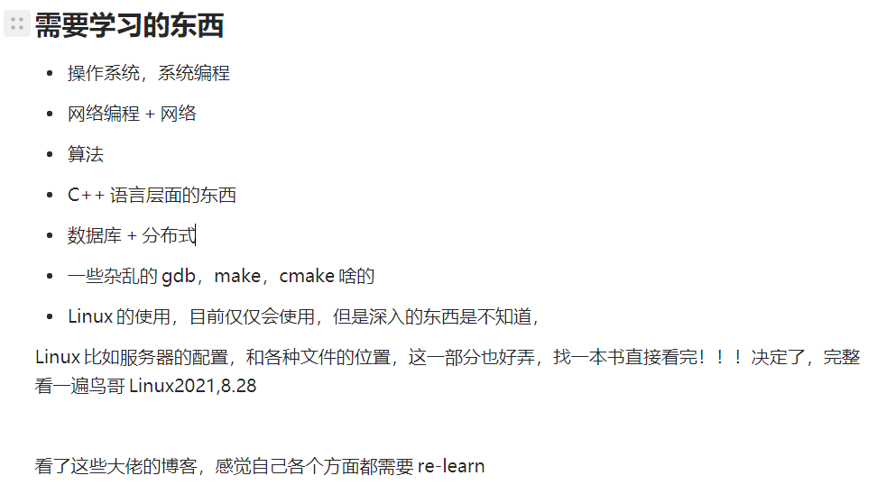

**2023/4/9目前看来确实这个计划帮了我很多**

抓紧时间啊，不能再去刷小视频了，你是觉得时间很充足吗？ 12/31 赶紧进入状态吧，求求了。不然真完蛋了。

至少得先把接下来的规划给搞好，关于复试的，关于工作的。这个不好搞认真点，考研养成的好习惯可不能丢弃。**对时间的珍惜，有效的计划。**     

## 过往       

现在来看应该住酒店的，住在寝室显然不好，早上起来太早了，早饭也没吃。酒店都订过了也没去，优柔寡断真是要命。   

**如何做决定，自己太优柔寡断，这个是之前这么多问题的根源。想的太多，考虑的太多。**       

也休息+疯玩了4天不能在这样下去了，再这样下去真的要废啦！！！正视自己的现状。**纠正过去的错误，找到今后正确的道路**，逃避无法解决问题，找出问题做出调整。         

回忆目的：过去有哪些值得保持的学习习惯，那些收获？ 以及对今后的启示？          今后再补充吧--12/30

自律，拼搏！！！         

* 如何做决定

  当初为何下了考研的决定？现在如果考不上怎么办？  对今后的一些重大决定的启示？ 当时决定考研可以说有一定的迷茫，想躲避，但考研过程真的是不喜欢。  这个决定的代价真的太大了。

* 目标与计划

  正视日积月累的作用，以及一个星期，一个月只要有坚定的目标&计划一定可以有很大的成果。**这一条可以说是目标&&计划的重要性，同时也要珍惜时间，一个月可以很快也可以很长。**              

  这一条算是最大的收获，过去的缺点就是过度计划，执行力度不够。要有一个长远的目标，切实可行的计划。月计划/周计划。  重要的是目标，计划。  **计划不应该过长，一个月/一个星期可以用来检验最好。**      

  时刻修正计划，不能空有计划，实践是检验认识真理性的标准。

* 一些学习习惯

  * **英语的学习是值得一直坚持的**，接下来需要接着学习英语的听说读。
  * 看视频的学习/有人指导的学习，**系统的学习**，长期的学习。不要碎片化的学习，效率太低。
  * 不能一看了之，需要自己动手实践。**实践的重要性/实践与认识。**  
  * 唯物辩证法的世界观与方法论，运用到日常的实践里面去。

* 惯性定理

  一切东西一定要提前，比如这次休整都养成坏习惯了。
  
* 焦虑得不到解决就会变为更大的焦虑，当感到非常焦虑的时候不妨慢下来梳理一下。

  保持适度的焦虑，焦虑的来源**想的太多，做的太少**，不管怎样行动起来就好得多。

## 复试

http://sse.hust.edu.cn/info/1034/4952.htm华科软件官网，复试占比40%

华科软件的复试，这个要准备吗？ 说实话上岸的概率不大，但是就不准备吗？先看一下复试要求把，反正肯定得做项目+写算法这个算是和工作的内容有重合可以先做这个。可能会进入复试但也是擦边分数，真的一点动力都没有。目前估分是340~350，进复试甚至都悬，这分数毫无优势可言。复试也是毫无优势可言。     **但是复试高个8分可以抹去30--40分的差距！！！**   试试吧，不应该放弃。    

总的来说复试还得有项目+算法+基础知识。找工作算是重合的先搞前两个，去写工作规划。

复试准备：

* 专业知识：40：算法，OS，数据库，软件工程

  专业知识，老师出题，学生作答

* 综合素质：40

  开放性的，问答，自我介绍

* 英语：20

## 调剂

这算是最后一步，最次的保证在本校。如何调剂？这个看一下。关键还是本校本专业吧。       

嗯，确实是走到了这里。

基本不行。

## 工作

2021年暑假写的东西。

快快找好方向，努力吧。

DDL就是今天2023/1/1，今天拿不定计划的话就别睡觉了。

不说一个完美的计划，但至少得支持一段时间进入状态。

零碎时间不应该刷视频！！！  而是看一些极客时间专栏。      

按照自己之前看的那么多，应该可以写一个路径！！！ 目前是先把水平恢复到之前写webserver的地步。

总体的规划：语言，算法，系统编程，网络编程。      目前先看书看视频，写算法。

寒冷不应该成为你不打代码的借口，真的没时间了少年。冷了就买个取暖器，时间是最宝贵的。      

目前的重心吧，争取把能力给提上去，制定好一个全面的计划。  这个是真的废了。    令人头大

真的是不知道从哪里入手了，代码不行，算法不行，直接看课程？先看几本书吧？应该看的，epoll自己都忘记了，还有一些syscall，网络编程忘的最多。

+++++++++++++

**分割线**        

1/17谈总体规划。

**总体的规划，春节前至少完成基本知识的学习，C++相关的看完。进入到项目阶段。  目前到春节10天可利用的可能也就是7~~8天。**      

算法慢慢的写吧，得抓紧时间学一下项目，没项目不行。基础/高级C++看完，C++语言搞熟然后写项目，算法重要但是不紧急。       

前端再说吧，以后肯定需要时间补的，但是目前没时间。

1/31：谈总体规划。       

这几天还行，从1/26开始到1/31， 5天看完了数据库连接池，数据库课程一般，聊天服务器一半。      

接下来看完这两个（过程中）要准备面试了，看一些面经/八股文。      准备简历，找一些合适的公司。      

公司目标薪资1w--2w（到手得有1w），保底的公司，冲一下的，稳一稳的。  先找几家练练！         

+++++++++++

* 环境的准备，这一块也是忘了。先打磨这一块进入状态。

  就准备一些目前急需的，时间实在是不充分，但是一些东西必须系统的再学一下。

  * git的再次系统学习，git的使用不够熟练，GitHub的使用也是

    学习资料：极客时间的&&廖老师的，总的来说还是得源于实践的需要。但是真的得过一遍。这次关键是掌握git&&GitHub的操作。工作导向

  * vscode的配置

    这个主要就是搭配make&&cmake&&git的配合，也是得实践还是用的太少了。cmake还是得读一下啊，一些cmake常用的得自己会写&&看懂，学会后使用一个cmake模板就行了。cmake这次看下教程，之前的学习muduo时候有点印象，先看一下。今晚算是有点收获关于bear&&cmake的。记录在muduo下面的cmake使用。

  * Linux一些常用的命令甚至都忘记了。

    这个倒是不急，可以慢慢想到了来补充。

* 算法

  这一块花个一个星期补一下吧，主要是再写一遍之前做过的题目。写的过程中对C++的使用得熟练。   

  这个也是究极头大，快点开始吧。1、acwing   2、leetcode  3、codetop  不想开始，还是没有进入状态。 

  还是得从这个开始进入状态。  这个得写，但是不能占用所有的时间。     **需要写，但是不能占用全部的时间**

  **总结：慢慢来，每天写7--8个左右。一直坚持几个月。**  这个就是贵在每日的坚持，每天不写完不许上床。

* C++基础，这部分也tm的是头大。

  这一块是相当的头大，C++语法方面可谓是。快速看下primer吧，有挺多都忘了。   这一块确实得补一下，忘得太多，但是primer没有并发。快速学一点之后开始连着看那个课程就好了。  

  看了基础的使用，开始写算法+看cppreference，开始康复阶段。

  ​      

   总体思路： **写算法看reference，看primer快速过一下，modernC++必看。**C++那些事，基本就是侯捷的课程，可以没事了看看这个温故下侯捷的课/或者看侯捷的一些章节。施磊的课也得看下，这个倒是不长。     

  

   

  **一些不常用的C++部分可以不看，目前主要是工作导向**，C++语法本就巨多，足够使用&些项目后先不要深究eg模板，多重继承，以后再补。        讲C++语法的课没必要听了，只需要看看书补充一下&Cplusthings看看，可以开始项目了

* 系统编程&网络编程

  常用的一些syscall，这一块先看linuxC这本书，深入的话就是apue。     

  这一块看韩，高性能，陈硕，unp。   

   UNP --《UNIX网络编程》前面8章及11，14，16，26。整个书只看 TCP/UDP      

  APUE -- 《UNIX环境高级编程》 重点章节：3,4,5,7,8,10,11,12。      

  网络编程也大多忘记，select/poll/epoll IO复用也忘记细节。  开始补至少也得看看书。    

  直接看UNP吧，高性能可以看一些章节，陈的必看，muduo最后写完项目再补充       

  **总结：**还是先看韩的，接下来高性能，接着UNP部分

* 项目

  项目方面就按照那个教程开始就行。  写项目之前得把前面这些弄好啊。wolai上面也就系统编程与网络编程

  有时间了可以看下，之前写的基本没啥用。    
  
  **总体思路：项目按照教程，在补充完所有的基础知识之后就要开始了。**         
  
  可以开始了，时间不够了，不会的需要慢慢补充吧！！！ 1/17
  
* 数据库

  这个慢慢来吧，先看基本的sql最后深入，什么15445目前就别想了。不要好高骛远，先学会运用，再去想着深入。**理论与实践**，一些mysqld设置方面的，需要积累。  重要，但是最后学习，先看下sql

+++++++++++++++++++

现在是1.9号，算是慢慢学了一个星期。大致有点学习方向了。总规划：上午写算法leetcode，下午康复训练。    

康复C++语言方面。**还是那句话，迷茫的时候先做起来，在忙的间隙去想怎么办。**      要有总体规划，什么吸取之前的教训，什么春招提前批别管，踏踏实实写代码，练技术。到时候春招抓紧时间！！！      

可能是看这语法方面的实在没啥意思，遇到不会的再看吧。可以开始项目了。  1/20

++++++++++++++++++

## 毕设

现在的主要矛盾不是毕设。当眼前很多事情的时候如何分析？**时间是最宝贵的资源，找出目前要做的事情，抓住主要矛盾。**       

**目前就是按照原定计划，刷算法学C++，看完那个教程，至少写到chatserver&线程池。 保证面试的项目，到学校之后再开始忙毕设。**  字节go的那个就算是补充一下知识，更不要废太大的精力。 保证平时看一下即可。    

**先完成春招再说**，把实力恢复下。 

## 二战

这个不曾想过，希望也用不到。

## self

**别人不会干扰你，你自己在浪费时间罢了。** 少看些小视频，多和家人沟通交流，怎么就不能和父母好好沟通？把你想说的说下，别人怎么可能呢不理解？ 比如母亲肯定不知道考研细节，你讲一下就不行？ 为什么不耐烦，到头来还不是搞不好关系？**自己缺少沟通，以后得重视交流**      在家学习肯定要处理好和家人的关系，别总是发脾气，妈妈确实懂得不多，别烦，别急，耐心做好。

自己的心理确实有问题，急躁没啥用，**工作/学习第一条处理好与周围环境的关系。**       

情绪没有平复不要做决定，别说狠话。

刷小视频的习惯必须改掉，太浪费时间。

**自己平时没有把握好时间罢了，什么都不怪** 

## 项目

想再写一个其实可以，但是webserver这个想想怎么来润色一下。   这个再看下muduo这本书吧+那个时候的课件。梳理一下，直接抄一个。         

webServer得润色一下，再看下实现。

不想将就着找工作，可是目前实力不太行。
