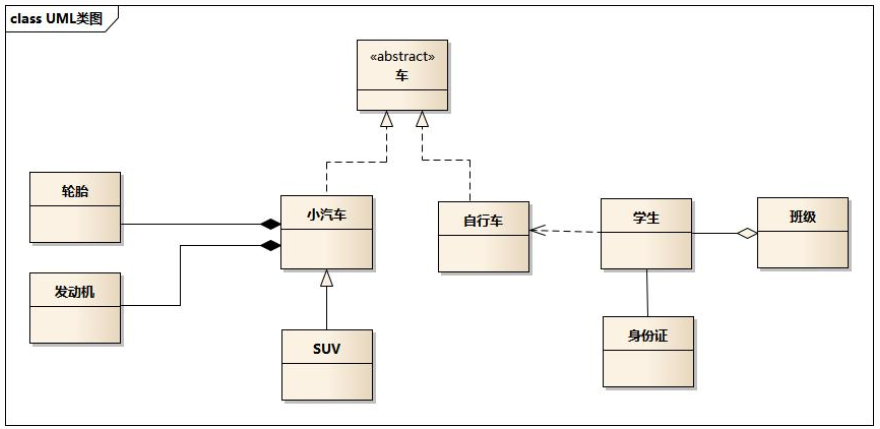

找一个合适的绘制UML的工具，目前draw.io使用起来感觉不是很舒服。画个线都麻烦！

画图不如直接写一些语句来生成！

# UML

UML还算是比较常用的，这个得会！

主要关注的就是：类的表示、关系的表示、时序的表示。

## 类的表示

这个很简单，就是分为，抽象类（接口）、普通类，这两种。

然后就是类里面的成员和方面，以及访问权限的表示（private还是public）。

## 类之间的关系

这里主要就是有六大关系，其实只要记住一个场景图即可！

六大关系分别是：实现（implement一个接口）、继承（泛化）、组合、聚合、关联、依赖。

其中实现、继承、组合都是很好理解的，而且C++里对象生存周期也是比较好控制的。

依赖与关联都是使用的箭头，而关联比依赖强一点使用的实线。

1. 关联关系（Association）： 关联关系描述了类之间的连接，表示它们之间可能存在的关联。这种关系可以是双向的，也可以是单向的。例如，考虑一个学校和学生之间的关系，学校和学生之间就可以建立一个关联关系。学校可以拥有多个学生，而学生可以属于一个学校。（就是一根线，箭头可要可不要）
2. 聚合关系（Aggregation）： 聚合关系表示类之间的整体与部分的关系。一个类可以由其他类的实例组成，但**这些实例可以独立存在。**例如，考虑一个图书馆和书籍之间的关系，图书馆包含多本书，但这些书可以独立于图书馆存在。（空心菱形）
3. 组合关系（Composition）： 组合关系也表示类之间的整体与部分的关系，但是**部分不能独立存在**。一个类的实例是另一个类的组成部分，并且它们的生命周期是相互依赖的。例如，一辆汽车由引擎、轮胎和座位等组成，这些部分无法独立于汽车存在。（实心菱形）
4. 继承关系（Inheritance）： 继承关系描述了一个类派生自另一个类的关系。派生类（子类）继承了基类（父类）的属性和方法，并可以扩展或修改它们。例如，考虑一个动物类和狗类之间的关系，狗类可以继承动物类的一些通用特征，如呼吸和移动方式，并且还可以添加特定于狗的属性和方法。
5. 实现关系（Implementation）： 实现关系用于描述一个类实现了一个接口的关系。接口定义了一组方法，类需要实现这些方法来履行接口的契约。例如，考虑一个电子设备接口和电视类之间的关系，电视类可以实现电子设备接口中定义的方法，以实现电子设备的行为。
6. 依赖关系（Dependency）： 依赖关系表示一个类使用另一个类的服务或功能，但它们之间的关系比较短暂，一个类的变化不会影响另一个类的结构。例如，考虑一个人类和手机类之间的关系，人类可能使用手机来发送短信或打电话，但人类的变化不会影响手机的构造或行为。

