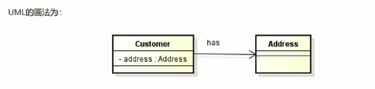
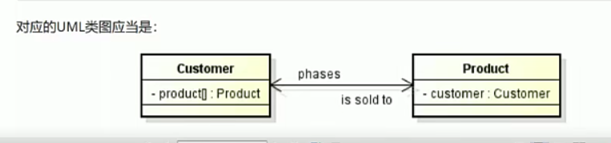
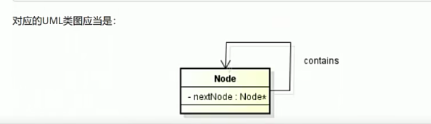
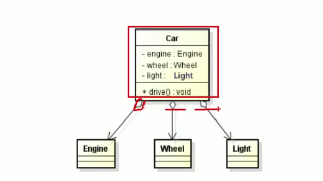
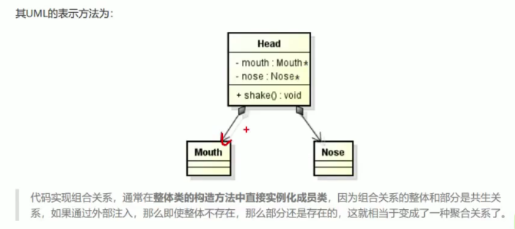

# 项目管理

## 项目的构建

### make

* 一条规则
* 两个函数
* 三个变量


```make
target: prerequisites
[table] command
# table键是必须的，可以有多个
```

依赖文件可以没有，如果不指定文件的话，第一个就是默认的目标文件。


在学习make之前，对于那些要生成target文件的cmd需要贼熟练。         

```make
test:test2
	@echo "test"   
	# 不会显示这条命令，但是会输出结果,so，make如何写注释？

test2:test3
	@echo "test2"

test3: test4
	@echo "target test3"

test4: 
	@echo "test4 结束套娃"

all: test
	@echo "make all"

clean:
	@echo "make clean"
```

想要查看生成某个目标所使用的命令：`make test4 -n` 就可以看到生成test4使用的命令。       


还是陈皓的那个写的好。


### UML类图

目前没有找到好的工具，重点是学习不是寻找资源。          

`UML Primer`

类名、属性、方法

#### 继承关系

`is a`        

* 继承关系：空心的箭头，子类不需要再重复写父类的
* 关联关系
* 组合与聚合：
* 依赖关系：


#### 关联关系

C++里面通常把一个类的对象作为另外一个类的成员变量。         

在一些工具里面关联关系没有→，就是一根线（工具的锅）

* 单向关联


```C++
class Address
{
};

class Cusstomer
{
    private:
    	Address addr;
};
```




* 双向关联：实线（双向→）

```C++
class Product
{
private:
    Customer customer;
};

class Customer
{
    private:
    	Product product[64];//顾客买的东西
}
```



* 自关联关系

```C++
class Node
{
    private:
    	Node * next;
};
```




#### 聚合关系

空心的菱形直线 （有的工具没有箭头）          


> 聚合（Aggregation）关系表示整体与部分的关系。在这种关系里面成员是整体对象的一部分，但是成员可以脱离整体对象独立存在。比如：汽车与轮胎、引擎、车灯。         

```C++
class Engine{};
class Wheel{};
class Light{};

class Car
{
    public:
	    Car(Engine* e,Whell* w,Light* l);
//    通过外部注入这些组件，即使car结束了，这些组件可以接着使用,
    
    private:
    	Engine* engine_;
    	Wheel* wheel_;
    	Light* light_;
};
```



菱形在整体的部分。         

在Car对象析构的时候组成部件不需要销毁，是否析构掉那些组成需要我们自己设计。


#### 组合关系

consist

和聚合一样表示的也是整体与局部的关系，只不过组合关系需要析构组成部件。         

我更愿意叫这个为`has a` ，聚合是`use a`        比如头与鼻子、嘴巴之间的关系。      

```C++
class Nose{};
class Mouse{};
class Head{
    private:
    	Nose n_;
    	MOuse m_;
    public:
    	Head()
        {
            n_=Nose();
            m_=Mouse();            
        }
};
```




#### 依赖关系

Dependence：箭头虚线

依赖关系是一种使用关系。可能在某个方法使用了一个其他对象。

带→的虚线，由依赖的一方指向被依赖的一方。        

* 将一个类的对象作为另一个类中方法的参数
* 在一个类的方法里将另一个类的随喜作为其成员
* 一个类使用了另一个类的方法

这个太多了，看得懂图就够了。


## 持续集成系统

嗯，目前没有用到，以后用的记录下。


## CMAKE


