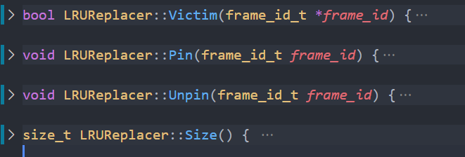
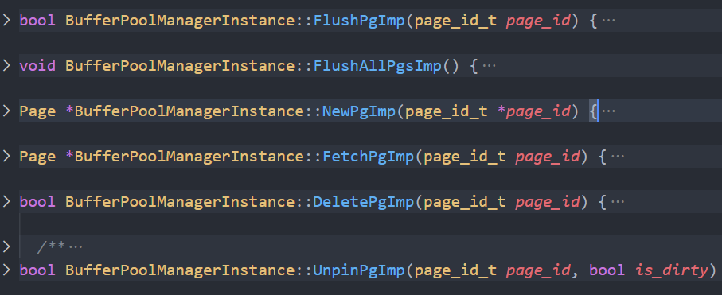
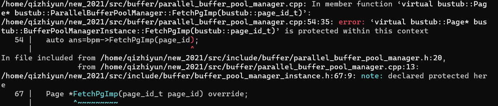

# 15445-2021

上一次写了两个lab，这次重新写一下。


果然是因为上次的搞坏了，这个是新的。2022/4/10

写20版本的


## lab00 

* 学习使用gtest自己编写测试样例
* 使用logger进行调试/不要使用cout
* 掌握食用步骤

```bash
# in build dir
make starter_test
./test/starter_test
```

看了下代码logger仅用于单线程debug调试，无法用于记录运行时的状态。

```C++
LOG_DEBUG("fetching page %d",page_id);
// default level  the logging level defaults to LOG_LEVEL_INFO
// 忘记日志等级分类了
static constexpr int LOG_LEVEL_OFF = 1000;
static constexpr int LOG_LEVEL_ERROR = 500;
static constexpr int LOG_LEVEL_WARN = 400;
static constexpr int LOG_LEVEL_INFO = 300;
static constexpr int LOG_LEVEL_DEBUG = 200;
static constexpr int LOG_LEVEL_TRACE = 100;
static constexpr int LOG_LEVEL_ALL = 0;
```


傻了，debug结果又是自己把矩阵的运算写错了；以及一维和二维的转化

```C++
int * arr=new int[12];
for(int i=0;i<3;i++){
    for(int j=0;j<4;j++){
        arr[i*4+j]=1;//全都是用的column，不会使用row
    }
}
```

emmm，发现总是犯得一样错误。


debug：test文件，使用文件名：行号作为断点。


## lab01

这次不能粗略的做一下，认真的看，看懂所有的源代码。


要求：      

On the other hand, you may need to add data members to these classes in order to correctly implement the required functionality. You can also add additional helper functions to these classes. The choice is yours.


我们把所有pin_count==0的全部加入lru，不为0的不加入。


事实证明，人永远都会掉以轻心；第一次做的时候还都考虑到了，第二次竟然没有考虑到。

### lru



### buffer pool manager

几个关键的结构：

* page_table:所有使用过的，包括pin_count==0||>0的page
* free_list:从来没有使用过的，以及使用后被删除的。
* replacer：放置所有分配过但是目前pinCount为0的page




### parallel buffer pool

遇到了一个bug，语言层面的问题。          

buffer_pool_manager/instance/parallel，父类使用了protected的方法，然后两个子类继承后，parallel如何使用另一个子类的方法呢？为啥都声明为protected？




```C++
bool ParallelBufferPoolManager::UnpinPgImp(page_id_t page_id, bool is_dirty) {
  // Unpin page_id from responsible BufferPoolManagerInstance
  auto bpm=reinterpret_cast<BufferPoolManagerInstance*>(GetBufferPoolManager(page_id));
  return bpm->UnpinPgImp(page_id,is_dirty);
  // return false;
}
//C++的oop真是恶心啊，tmd还有什么访问权限
```

最简单的解决之道就是加一个friend，可是这样好吗？


还有一个问题：为什么我们把函数成员声明为protected之后，Test还是可以访问到呢？


我也觉得CMU不会出这种language问题，但是我太菜了。需要一个没有太多规则，不要什么复杂的访问控制权限。可以几种精力把想法实现的语言只有go了吧。


