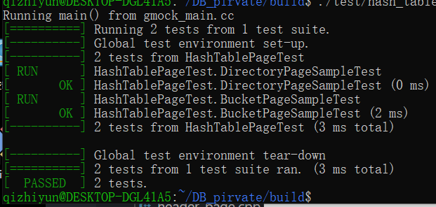

## CMU154445学习

**找到Andy的那个版本，跟下来即可**

听的课是2019 fall版本可看2020课件都是Andy的，关键是bustub的版本，找出2020的即可，2021是写extensibe hash。

其实可以直接做最新版本的，不要总是想着去找答案，看之前的版本。lab不跟课进行绑定！


**这种课本来就是很有挑战性的，不要急切，不要焦虑		--2023//4/22**

> 放弃可以有无数个借口，成功的方式仅此一种。 ——2021/11/23

**等待重新开始的一天。	--2023/4/23**


```bash
$ zip project1-submission.zip \
    src/include/buffer/lru_replacer.h \
    src/buffer/lru_replacer.cpp \
    src/include/buffer/buffer_pool_manager_instance.h \
    src/buffer/buffer_pool_manager_instance.cpp \
    src/include/buffer/parallel_buffer_pool_manager.h \
    src/buffer/parallel_buffer_pool_manager.cpp
    # zip的使用

$ unzip -l project0-submission.zip
#查看
```


**学习下gtest的使用，自己编写测试**


### 编码规范

记录下每次的代码规范

```bahs
multiple declarations in a single statement reduces readability;
一个声明一条语句

statement should be inside braces
{}是必须的哪怕仅仅一条语句，if(lru_list.empty())return false;

use auto when initializing with new to avoid duplicating the type name
在使用new的时候使用auto来避免重复?
eg: auto matrix0 = std::make_unique<RowMatrix<int>>(3, 3);

1、隐式的类型转换

2、invalid case style for member 'frame_nums
变量的命名：

3、use 'using' instead of 'typedef
 typedef typename std::list<frame_id_t>::iterator node_ptr;
 
4、
```


### 01primer

随便学习下gtest框架的使用。        

目的：掌握完成实验的姿势。             

```ba
make starter_test #编译这个文件
./test/starter_test
make check-tests  #  run ALL of the test cases.
```

我们的测试程序默认是关闭的，我们要去掉`DISABLED_`  prefix在我们的测试文件。     


比如primer的test在`test/prmer/staart_test.cpp`      修改后运行上面的命令。


primer里面的我已经去掉了。


*完成测试：*        


日志样式：          

```C++
LOG_INFO("# Pages: %d", num_pages);
LOG_DEBUG("Fetching page %d", page_id);
//分级的C语言风格
```

使用日志需要重新编译

```bash
mkdir build
cd build
cmake _DCMAKE_BUILD_TYPE=DBUG ..
make
```


**测试结果：**      

本地测试全部通过，但是gradescope的测试失败（编码不规范QwQ）          

没有遵守的规范，还有测评接口也变化了，GetElem变成了GetElement。


步骤：写完每个单元使用单元测试看一下结果（编译前去掉disabled前缀）

```bahs
make start_test
./test/start_test
```


### 一些名词解释

* latch与lock

  数据库里面，latch是类似于我们OS里面的mutex

* frame

  我们的bufferpool所使用的它的计数一般从0开始，通过这个（偏移）我们可以找到page对象。内存池的一个偏移，在bufferpool里面的page table可以看到


### Buffer pool manager


测评时间太长，修改下不测了。逻辑错误？目前还是没有找到。。。

接下来的实验全部都需要线程安全，但是对C++的线程还不是太熟练。。。。

```bahs
#失败的测试，明天干一下
test_BufferPoolManagerInstance_ConcurrencyTest
test_BufferPoolManagerInstance_HardTestA/B/C/D (__main__.TestProject1) (0.0/7.0)
test_BufferPoolManagerInstance_IntegratedTest (__main__.TestProject1) (0.0/4.0)
#并发错了还可以理解
test_BufferPoolManagerInstance_IsDirty (__main__.TestProject1) (0.0/2.0)
test_ParallelBufferPoolManager_ConcurrencyTest (__main__.TestProject1) (0.0/1.0)
test_ParallelBufferPoolManager_GetPoolSize (__main__.TestProject1) (0.0/3.0)
# parallel内存池没有使用RR?
test_ParallelBufferPoolManager_RoundRobinNewPage (__main__.TestProject1) (0.0/4.0)
```


*可以自己增加函数与数据成员，类不需要加入了*


磁盘管理器，管理我们的page layout，tuple layout。已经为我们写好了磁盘管理程序，每次需要某个文件的时候调用一下。     


没有看到我们课上说的page table在哪里。emmm，应该是需要我们自己实现的。

**page table的用途就是由我们的`page_id_t`找到我们需要的`page`对象。（page对象定义在page.h）**


#### lru replacer

* 学习一般的LRU实现
* 在我们的bufferpool里使用它


这个LRU就是为我们buffer pool提供一个写出要置换page的一个**策略**。

```bash
src/include/buffer/lru_replacer.h
src/buffer/lru_replacer.cpp
src/include/buffer/replacer.h
```


> The size of the `LRUReplacer` is the same as buffer pool since it contains placeholders for all of the framesin the `BufferPoolManager`. However, not all the frames are considered as in the `LRUReplacer`. The `LRUReplacer` is initialized to have no frame in it. Then, only the newly unpinned ones will be considered in the `LRUReplacer`

我们未使用的page（frame）才会被放入lru来替换掉，也就是说我们使用的pin的都不需要存在这里。unpin也就是在lru里面去掉这个`frame_id_t`


 

* Victim移除一个frame_id_t，可以看到参数是一个指针，我们要把他给传出去
* pin：表示有线程在引用当前的page，我们把它移除lru（不置换）
* unpin：加入lru（等待置换）


#### buffer pool manager instance


**目前通过了所有的测试，但是这里APi的设计有点不明确，再看下。找下临界区，保护一下。**


对于一个数据库文件来说，每一个页面都具有一个唯一的page id与一个数据库的页对应。

内存池的存在对数据库的上层来说应该是透明的。


bufferpool的三个关键结构：

* LRU
* page table：通过page id来对应我们bufferpool里面的frame。
* free list

freelist保存的是我们没有使用过的或则使用过后面被删除的页面（也可以说就是可以随便使用的），lru是当我们的bufferpool里面的空间不够了，提供一种内存置换的策略。


使用过的page全部都在bufferpool里面有记录。当一个页面的pin_count为0的时候我们把他加入lru管理等待置换。freelist为空的时候表示这个内存池里所有的页面都被引用过一遍了（不管他目前的pin count是多少）。


看一些代码：page相关的，diskmanager相关的。


重要的就是如何通过给定的`page_id`找到在我们bufferpool里面对应的`frame_id`，以及page table的作用。

这个frame id（一般就是0---poolsize）其实就是我们的偏移量，通过这个我们的可以找到pool里面的page对象。指针＋偏移`pages_+frame_id_t`。


每个bufferpool管理自己的pages。


**功能：**     

>  The `BufferPoolManagerInstance` is responsible for fetching database pages from the `DiskManager` and storing them in memory. The `BufferPoolManagerInstance` can also write dirty pages out to disk when it is either explicitly instructed to do so or when it needs to evict a page to make space for a new page.通过置换来获得大量的内存（类似于OS的虚拟内存）


* DiskManager来与磁盘打交道的

* page：一个数据库的页数据（所表示的对象）

  page对象就是容纳一个磁盘数据库页。与磁盘数据不是一对一的关系。page对象需要重用。page对象通过page_id来表示一个physical page。


> `BufferPoolManager` will reuse the same `Page` object to store data as it moves back and forth to disk.

需要一个对象池吧。


还是多读几遍吧，每一句话都很重要，不copy了。          

The `Page` object's identifer (`page_id`) keeps track of what physical page it contains; if a `Page` object does not contain a physical page, then its `page_id` must be set to `INVALID_PAGE_ID`.


*lru里面的frame_id_t与我们这里的page_id之间的区别是？*


bufferpool要管理的就是一个个page。


需要实现的文件:        

`src/include/buffer/buffer_pool_manager_instance.h`         

`src/buffer/buffer_pool_manager_instance.cpp`


需要实现的：     

- `FetchPageImpl(page_id)`：

  这个要获取的是我们的数据库里面已经存在的page对应的pageid，fetch的时候空闲链表可以有的话自接从磁盘读取（diskmanager）我们的page_id对应的文件。如果不为空通过lru置换，然后通过diskmanager来获取这个page的数据。一句话，这个要涉及换入与换出。（lru换出的时候涉及到table的改变了啊）

- `NewPageImpl(page_id)`

  创建一个新的page，这个page本来在我们的数据库是不存在的。这里面使用了我们的内存池页面id分配算法。emmm，但是目前不知道，它的保存。我们的pageid都是按序的，所有这个新加也不会打乱。我们的文件还是连续的。

- `UnpinPageImpl(page_id, is_dirty)`

- `FlushPageImpl(page_id)`

- `DeletePageImpl(page_id)`

  使用dealloc来取消一个pageid，但是这个如何去影响我们数据库文件呢？应该不需要删除？没这个pageid确实是不会读到这个page，但是目前也没有从磁盘删除啊。*这个我目前写的有点问题觉得，看看测试程序这个函数的目的*   需要判断一下是不是valid id吗？ 

- `FlushAllPagesImpl()`       


lru里面的pin表示在lru管理的页面里面我们有线程使用它了，我们不再使用lru去等待置换它。        

bufferpool里面的pin表示有线程使用，我们不要从bufferpool里面移除它。


#### parallel buffer pool


通过测试，接下来的话去读一下C++并发编程实战（看书之前写实战建议，写一些线程池，阻塞队列，生产者-消费者）


```C++
BufferPoolManager* target_buffer=GetBufferPoolManager(page_id);
BufferPoolManagerInstance* target_buffer=
    static_cast<BufferPoolManagerInstance*>(GetBufferPoolManager(page_id));
/*
我们在指针的转型的时候建议使用这种方式，我们把编译选项定的强一点点，然后通过规范的写法，写出跟好的代码
但是第一个语句，那么些竟然转型失败（调用虚函数失败）
*/
```


一个内存池VS多个内存池，不仅仅是效率的提升，而且减少了多个线程对锁的等待。

文件：       

(`src/include/buffer/parallel_buffer_pool_manager.h`)           

(`src/buffer/parallel_buffer_pool_manager.cpp`)


把我们每个page的请求分散到每个单独的bufferpool。这里的做法也很简单就是直接取模运算。


- `ParallelBufferPoolManager(num_instances, pool_size, disk_manager, log_manager)`

- `~ParallelBufferPoolManager()`

- `GetPoolSize()`

- `GetBufferPoolManager(page_id)`

  这个API设计的有点问题。

- `FetchPgImp(page_id)`

- `UnpinPgImp(page_id, is_dirty)`

- `FlushPgImp(page_id)`

- `NewPgImp(page_id)`

  使用round bin算法，还不错竟然一次过了。

- `DeletePgImp(page_id)`

- `FlushAllPagesImpl()`


### hash index

使用index的优点：           

这里就不再赘述了，课程主要讲了tree index，但是设计思想是通用的。


如何构建index，以tree index为例子，最好的方法就是relation排序后我们之下而上的构建B plus tree；但是对于一般的文件，大概就应该想平常我们构建B树那样通过插入来构建。B树的一个节点一般就是我们一个页的大小，最好的方案是内存与SSD这些访问非常快的介质，我们选用较小的node，但是对于磁盘我们要减少磁盘IO就需要提高一个node大小。


叶节点我们可以存储key对应的tuple，也可以存储这个tuple的record id。对于leaf node存储记录tuple还是存储recordID我们不做区分，仅仅是空间与事件的tradeoff，这种tradeoff在我们的hash索引也存在，还有一种就是hash文件组织。**我们使用hash index指代hahs文件组织或者散列索引。**也就是说我们不需要纠结于hash key对应的value是什么


这个lab要实现的第一次听说、、、extendible hash。       

hasher，hash1冲突、静态hash、动态hash、

#### page layout

我们获取page对象并使用的步奏，page对象里面有4096的data区域，这是我们转化为其他对象所需要的比如dir page，bucket page，page对象大于4096的区域存储的就是我们page对象的元数据。


所有的页面都继承自page class，BufferPool是page的友元，但是page的派生类与bufferpool的关系？


完成两个页面布局，支持extendible hash模式。

```bash
src/include/storage/page/hash_table_directory_page.h
src/storage/page/hash_table_directory_page.cpp

src/include/storage/page/hash_table_bucket_page.h
src/storage/page/hash_table_bucket_page.cpp
```


#### directory page

> The table contains a directory page that stores all the metadata for the table and buckets.

完成page layout以及dir的增查改删


Directory Page: - GetGlobalDepth - IncrGlobalDepth - SetLocalDepth - SetBucketPageId - GetBucketPageId

```c++
  auto directory_page =
      reinterpret_cast<HashTableDirectoryPage *>(bpm->NewPage(&directory_page_id, nullptr)->GetData());
```

直接把一个page*转化为一个dir page，可以通过这个dir page使用page对象的函数吗，比如读写锁？

一个自己留的坑点：bufferpool在unpin的时候没有直接写入。

```c++
  auto test=reinterpret_cast<Page*>(directory_page);
  test->GetPageId();
//大概是这样
```

这个测试就是教我们如何从内存池一次分配一个page，我们使用newpage获取一个page*然后可以转化为我们想要的page类型，比如这里就是我们需要的dir类型，我们的page类型仅仅使用的是page对象的前4096的数据区域。

#### bucket page

这一部分我们实现对单个bucket的增查改删。          

split一个bucket的时候需要的辅助函数，只有full的时候我们才会去split一个bucket。

* KeyAt
* ValueAt
* RemoveAt


这里就需要来存放我们hash对应的value了，这里的API设计有问题，extendible hash根本不需要，这个标记IsOccupied - IsReadable。

- `occupied_` : The ith bit of `occupied_` is 1 if the ith index of `array_` has ever been occupied.
- `readable_` : The ith bit of `readable_` is 1 if the ith index of `array_` holds a readable value.
- `array_` : The array that holds the key-value pairs.

可能意图是我们在存储一个tuple的时候，优先存储在没有被使用过的slot，所以有了occupied（一个slot只要曾经有过值我们就标记一下，等到全部被占用过了我们使用readable来分配那些曾经存在但是被删除的slot）


Bucket Page: - Insert - Remove - IsOccupied - IsReadable - KeyAt - ValueAt

```C++
//不定长数组如何使用，柔性数组
int arr[0];
//我们也称为0长数组，使用的栈上对象（当心爆栈）
struct line{
    int length;
    char data[0];//虽然是一个指针常量，但是这个并不占用空间。
};
struct line extendible=(struct line*)malloc(sizeof(line)+10);
extendible->length=10;
//data在这里是一个指针常量，仅仅就是标识length后面的地址本身不计入大小。

struct line2{
    int length;
    char *data;//在编译后line2为sizeof(int)+sizeof(char*)
}
```


emmm，这里的做法我加了一个bitmap的辅助函数，看一下效率吧，其实不使用这个也行。


**关于在const成员函数调用非const的函数**const的成员函数一定也要调用const的函数，不然报错。




总算是debug完成了，几个难以调试的point吧

* 没有看比较器的源码，导致在判断的时候以为相等返回的是1其实是0
* const成员函数问题吧，这个怪C++基础不牢固，通过这次debug有了深刻理解
* 最难调试的算是一个数位溢出比较吧，char: `0b10000000`与整数比较的话是一个负数，太难注意


**打日志非常的重要！！！**，我们应该在代码的执行过程中比较重要的点，打日志，方便我们进行调试。


*bustub日志的使用：*         

```C++
LOG_INFO("# pages: %d",num_pages);
LOG_DEBUG("Fetching page %d",page_id);
// level
LOG_LEVEL_INFO;//default level
//可用的log level
LOG_INFO();
LOG_WARN();
LOG_ERROR();
//选用这三个就足够了，这个log信息打印到了stdout
```


完成了hash table的布局，支持磁盘存取了。

#### hash table的实现

Your hash table must support both unique and non-unique keys.         


When inserting into your hash index, you will want to use the **least-significant bits** for indexing into the directory. Of course, it is possible to use the most-significant bits correctly, but using the least-significant bits makes the directory expansion operation much simpler.


to take a read-lock on a bucket page you must `reinterpret_cast<Page *>` to a page pointer, and call the `RLatch` method from `page.h`.

我们的确定pair的value是可以使用==比较的，key的比较使用比较器        


这一次我们需要自己从bufferpool里面fetch page与unpinpage。

```C++
//供我们从bufferpool里面获取page的辅助函数
KeyToDirectoryIndex();
KeyToPageId();
FetchDirPage();
FetchBucketPage();
```

需要完成的：

* bucket page的split与merge
* dir page的growing与Shrinking

- `src/include/container/hash/extendible_probe_hash_table.h`
- `src/container/hash/extendible_probe_hash_table.cpp`


