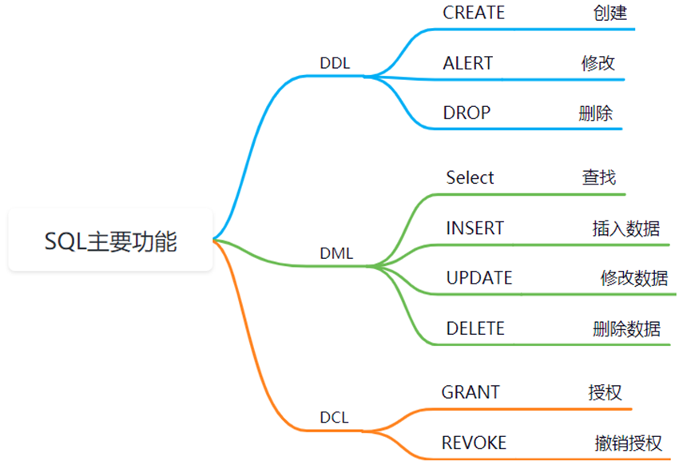
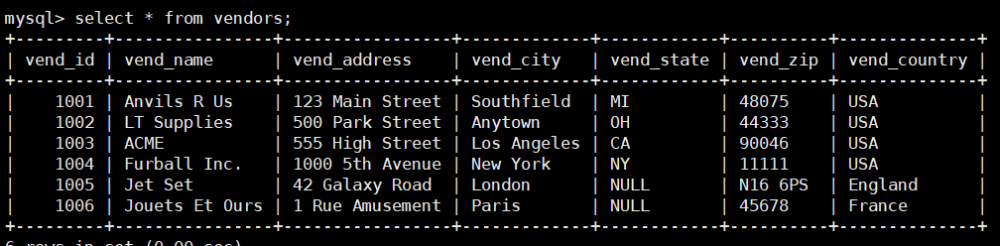

## MySQL的使用

### 配置MySQL记录

拿到一个服务器后如何配置MySQL开发环境？MySQL的线上配置问题？遇到问题如何排查？

根据不同的开发语言安装不同的客户端开发SDK，MySQL本质是一个C/S架构的网络服务器。服务器叫做mysqld，运行在3306端口，客户端有很多只要实现了MySQL协议即可，最常用的就是Linux下的mysql prompt。

查看MySQL的配置文件，允许通过远程访问MySQL服务器也就是不仅仅是`listen(127.0.0.1:3306)`，然后一般还要通过打开防火墙的3306端口允许流量进入（这个容易忘记）。完成后使用`netstat -alntp | grep 3306`应该看到mysqld。

之后就要创建一个新的mysql用户，MySQL是将所有的系统用户信息记录在`mysql.user`表下的。默认root是不能通过远程登录的，我们可以为新建的用户授予权限。

### 数据库配置

* 如何添加用户？[link](https://www.jianshu.com/p/d7b9c468f20d)

```bash
create user 'qzyDB'@'%' IDENTIFIED BY 'helloQzy' ;
// grant privileges
GRANT ALL ON *.* TO 'qzyDB'@'%';

flush privileges;
//DCL的使用
```

下载好mysql后使用root登录mysql然后设置用户+授予权限即可使用。

会一些基础的配置就行，DML（增查改删）一定得会写。

https://blog.51cto.com/codinggorit/3754275     常用命令。

https://go.dev/doc/tutorial/database-access  好tutorial，介绍了mysql使用。

还有一些什么日志，主从，复制，读写分离，数据库中间件配置用的时候再说吧。

### 服务器那些事

无法使用ssh登录服务器：

* ping 一下看能不能ping通
* 看看端口是否开放
* 最后发现MySQL可以连接，但是ssh还是登不上
* 查看防火墙，昨天开启了防火墙QAQ `ufw disable`

**ubuntu ufw防火墙**

https://developer.aliyun.com/article/570633

看这篇文章吧，找时间在看一下Linux运维方面的书。

ufw简化了iptables的管理，

就是这玩意有时是防止我们登录；


### 连接mysql

终究还是不会？**不是不会而是自己选择了麻烦的方式**，不想安装MySQLServer，应该可以使用啊。不使用和老师一样的配置，自己就得折腾环境。
最终也搞出来了，就是在这种C/S架构下的访问server，我们连接/访问这些服务器就相当于实现了一个相应的客户端，这就需要我们遵守相应的协议。需要使用一些开发库，mysql的libmysqlclient，redis的hiredis。


~~c++真费劲，使用一个数据库都费劲。不如go一行搞定，而且就一个包。可以自己写个C++的MysqlORM~~

自己不熟悉罢了，Linux下安装最好的方式就是通过apt因为可以自动管理依赖，其次就是自己通过源码安装。**这里不清楚的地方主要是不知道C/C++在连接MySQL的时候需要哪个开发库，也就是最终要链接什么lib。**


```bash
apt show libmysqlclient21 
#猜测这个是连接mysql所需要的库
apt show libmysqlcpp
#目前来看这个貌似更对,没有使用上面的那个

#最后的实践，其实不用管某个包有什么依赖，apt会自己管理依赖
#这个也不需要，libmysql-dev依赖于这个，会自动处理依赖
sudo apt-get install libmysqlclient21 
sudo apt-get install libmysql-dev
sudo apt-get install mysql-common

#查看库的位置
mysql_config --cflags --libs

# 学到的一些指令
# 系统内的头文件一般都在/usr/include
#查看系统安装的库
ldconfig -p | grep mysql

#这个地方的应该都是mysql应用相关的，不是某个库，所以安装一个client，他肯定需要连接数据库啊，
#下载一个客户端即可mysql command client？  不行再下点库
apt show mysql-
apt show libmysql # 这会显示和mysql sdk相关的


#现在来看https://dev.mysql.com/doc/index-connectors.html
#使用libmysqlcppconn-dev是专门给cpp的，有时间自己实现一个不一样的，libmysqlclient是
#给C语言用的，先使用这个C语言的
apt-get install libmysqlclient-dev  #自动处理依赖
```

https://www.jianshu.com/p/8229bf719163 看一下链接，链接库。      C++使用

https://blog.csdn.net/weixin_44788162/article/details/117070668  


### 数据库使用学习篇章

主键、候选键、外键。外键基本不用了。

join：连接的前提是有联系吧主键和外键？不是的，*主键与外键这些都是数据库的完整性约束。*

join就是多表联合查询，分为`inner join, left outer join, right outer join`，只要两个表之间有关系也就是可以使用on作为连接关系。
`select * from user inner join userfriends on user.id=userfriend.uid`.

还有一个比较重要的就是MySQL是大小写不敏感的，命令字段使用大小写一样`SELECT or select`。

`select * from customers where cust_country="uSa";`，但是这个是出乎意料的，竟然连数据库表内的值也不区分大小写（但是这个值是可以配置的大小写敏感）。

还有一个就是什么时候需要为字符串添加引号的问题，命令字段，表的属性/列字段都不需要加上引号；而自己写的需要加上引号，比如：别名`select cust_id "ID"`  字符串值比较`where cust_country="USA"`。

#### sql使用




条件where判断：where是行级别过滤，挑选出所有符合要求的记录/行。

| **查 询 条 件**  | **谓  词**                                    |
| :--------------- | --------------------------------------------- |
| 比较(for num)    | =, >, <, >=, <=, !=, <>, !>, !<; NOT+前面这些 |
| 确定范围         | BETWEEN AND, NOT BETWEEN AND                  |
| 确定集合         | IN ，NOT IN                                   |
| 字符匹配，通配符 | LIKE ，NOT LIKE，用于模糊查询%与_             |
| 空值             | IS NULL ，IS NOT NULL                         |
| 逻辑运算         | AND ，OR ，NOT                                |

```mysq
select * from table
where NOT cust_id >100;看not的位置

select * from customers
where cust_id (not) between num1 and num2; //这里的not位置倒是灵活

select cust_email from customers where cust_email like 'ylee%';
```

字符串也可以比较大小。      在判断逻辑的时候where可以加上括号来避免困扰。

* distinct不是聚集函数

* count，应该是聚集函数==》什么是聚集函数

  ```my
  select DISTINCT cust_name'rename' from customers;
  //需要大写，可以为我们的列改名
  
  select cust_id 'is_null'
  from customers
  where cust_email is NULL;
  // 涉及NULL要是有is ，is not
  ```

  

* 单表查询

  * ordered by字句

  * 聚集函数：select所挑选出的所有的列进行的操作。

    可以配合where，但是where子句里不能使用聚集函数，了解为什么需要聚集函数就知道了。

  * group by字句

    细化聚集函数的作用对象，默认的话聚集函数作用于整个查询结果。

    如果对查询结果分组后，聚集函数将作用于各个组。      

    分组的条件：按照指定的那一列的值（相等的在一组）

* 聚集函数

  * count

  * distinct

  * average：num type

  * sum： num type

  * max

  * min

    关于查询带不带引号来表示，看我们的数据在定义的时候的类型。数字的话不可以，字符串必须，列名是不需要带的。聚集函数配合group by，

  ```mysq
  select COUNT(DISTINCT(cust_country))'unique_country' from customers;
  # 可嵌套与rename（rename的字符串需要引号）
  
  select max(cust_zip) from customers;      
  
  select avg(cust_zip) from customers where cust_zip > 44444;
  
  select max(cust_zip) from customers group by cust_country;
  
  # 样例：
  select col1'rename', col2,col3  选择若干列
  from table1, table2;            表
  where condition					条件，元组
  group by col					分组
  having condition				对分组进行筛选
  order by col;                   排序
  ```


* 几个常用的show命令

  ```Mysq
  show tables;
  show databases;
  show columns from table_name;
  // help show  查看all infos
  //忘记具体的时候就使用help select这种形式。
  show create table table_name;
  desc table_name;
  ```

* order by

  ```mysql
  select prod_name
  from products 
  where cond
  order by prod_name，col2，col3(DESC);
  // DESC 降序
  ```


```mysql
select prod_name , prod_price 
from products
where vend_id in (1001,1003)
order by prod_name desc
limit 4;
```


* mysql里面是有RegEx

  * 基本字符匹配

  ```mysql
  1、select * from products where prod_name regexp '1000';
  ```


```mysql
select 		 要返回的列或表达式
from		 tablename
where		 行级过滤
group by	 分组说明·
having		 组级别过滤
order by	 输出排序的顺序
limit        要检索的行数
```


#### 连接操作

join操作默认的是把所有相等的属性全部比较一下。join的两个表一般是有联系的，这也是关系数据库的特征（通过分表减少冗余）跟两张表有没有主外键关系无关，理解上就当作两个表做一下笛卡尔积然后挑选符合条件的。

连接又分为：内，左外，右外。


**之前记录的都是垃圾，现在整理一下，其实这一块还是那个mysql课件写的好，连接与集合表示**

```sql
select count(*) 
from vendors inner join products
on vendors.vend_id = products.vend_id;
# inner join一定要给出连接条件
```


#### 计算字段column

sql非常的灵活，关系里面的属性查找的时候不要加引号，在属性后面使用as或者直接引号就可以起别名。



```mysql
select Concat(vend_id,'+',vend_name)'id+name' from vendors;
//演示了拼接字段与起别名 ，拼接就是把结果出现在一个列里面

select Concat(vend_id,'+',vend_name)'id+name' vend_address from vendors;
// 拼接后相当于一个列，其他列可以接着写

select vend_address as addr from vendors;
//起别名标准使用的是as，不过我们直接也可以

select prod_id, quantity, item_price, 
	quantity*item_price AS all_money from orderitems;
//计算  支持加减乘除
```


#### 汇总数据，聚集函数

聚集函数是对列进行的操作，对select出来的符合要求的列数据进行聚集操作。

当select有分组的时候，这个就是将聚集函数用到每个组的数据上面，而不是所有select出的数据。

* count

* distinct

* average：num type

* sum： num type

* max

* min

#### 分组数据

* select语句中的每个列都需要在group by里面给出，**由什么分组，就选择什么**
* 如果分组列中具有NULL值，则NULL将作为一个分组返回。如果列中有多行NULL值，它们将分为一组。
* GROUP BY子句必须出现在WHERE子句之后，ORDER BY子句之前。

默认情况下聚集函数的作用对象是整个表，分组后会作用于每个组。


where的筛选作用于整个表（筛选行），筛选后分组，然后对每个组使用聚集函数。having是筛选分组。


#### 子查询

mysql prompt的帮助：要么去官网，或者使用`help show`  `help select`


### 这个文件基本上瞎记录
