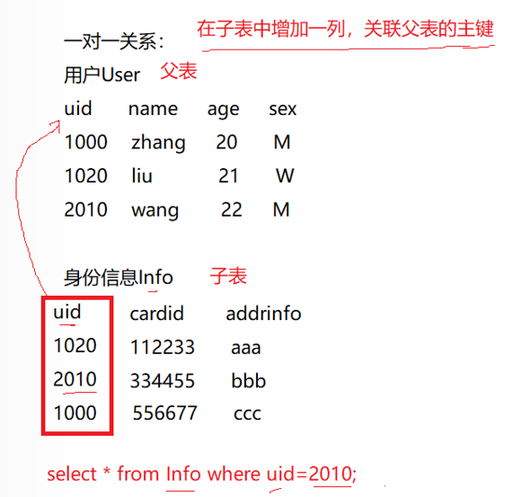
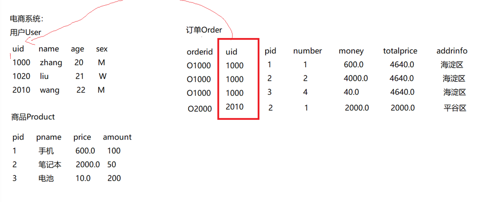
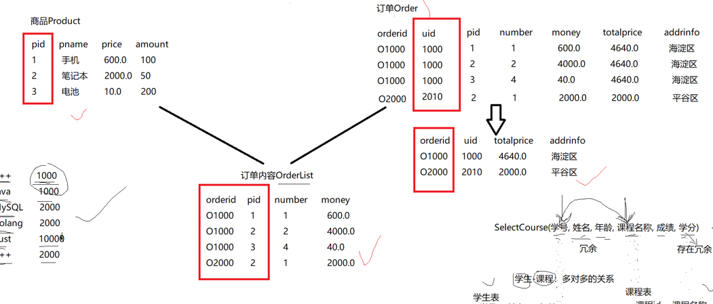
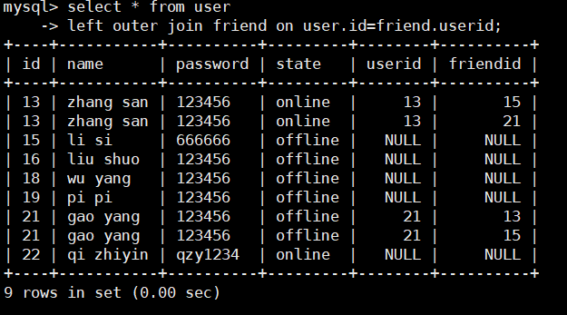
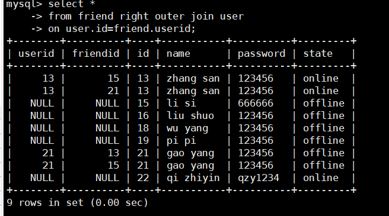
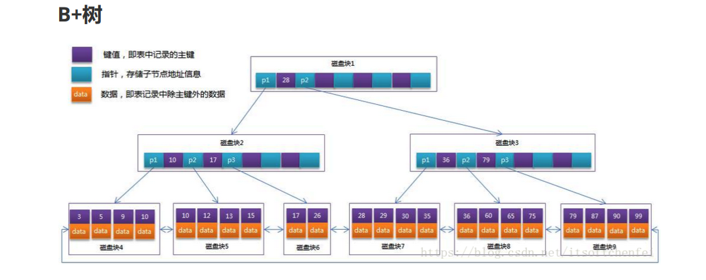

**这里作为对那个pdf的补充，和自己的记录，照抄就不要了**          

一开始就看到这个课程就好了！！！   后面还有创建用户/授权           

还得再看看！MySQL实战，得看看！  MVCC，日志这方面不是很懂！

## 基础知识

~~Windows安装mysql好麻烦，一直找不到修改安装路径。   MySQL installer的使用，先添加后安装？~~

不要在Windows折腾环境，直接部署云端。


**一些常用的命令·**

```bash
service mysql restart      
create database dbname;
use dbname;

desc tablename;
desc tablename/G;# 描述一个表
```


linux下的MySQL配置目录：     

1、/var/lib/mysql数据文件      

2、/etc/mysql/mysql.conf.d/mysqld.cnff配置文件     这个在那个pdf写的有

### MySQL完整性约束

完整性约束对于每个插入的记录都会检查，可以看作是一个约束条件。      

其他几个约束都常用，但是那个外键约束一般后台开发不使用，不能说插入一个数据还要看下其他表的约束。      

外键可能会降低CRUD的速度。      

### 关系型数据库表的设计 

课程：表的设计原则      


一个实体一张表，有关系的需要连接一下。


关系型数据库就是利用表的连接，将**大表拆分成小表**来减少数据冗余。      这个确实不咋会设计（设计范式里的内容）。      

主要记一些帮助理解的。

**一对一的表**         



**一对多&&多对多**       

应用场景一个电商系统，三种表。  User、Product、Order。     

用户--商品：没有关系，不需要连接              

用户--订单：一对多 ，如何产生关联？子表增加一列关联父表 ，比如一个用户多个订单，订单增加一列

商品--订单：多对多      




上面的订单--商品是多对多的关系，但是各自一张表出现了数据冗余。        


经修改后：新建了订单内容，修改了订单表。  订单内容里面orderid+pid可作为索引/联合主键。        



### 关系型数据库范式

* 第一范式：列不可再分，不符合第一范式不算关系型数据库
* 第二范式：非主属性完全依赖于主属性，主要对联合主键而言。也就是其他属性依赖于联合主键不能仅仅依赖一个
* 第三范式：属性不能依赖于非主属性，比如，员工表里的：工作与工作的描述，工作描述依赖于工作。
* BCNF：表里只有一个候选键，比如员工表里面邮箱。（有点怪啊，一般第三范式即可）


不拆分，每个key的所有数据放在一行这不就成了k--v数据库。     所以需要拆分减少冗余。关系型MySQL主要是需要落盘，很在意磁盘IO。          

**关键是减少了数据冗余，其他都是附带的。**      


将表拆分减少了冗余（隐含的减少了冲突），但是在将多个表联合查询的时候肯定有性能的损耗。一般关系型数据库用到第三范式即可。       


**pdf里面的第一范式里面的不符合第二范式。 第二范式里面给他拆分了。同样第二范式里面的例子不符合第三范式**   


第一范式：每一列不可再分。这个把Employeeaddress再细分一下干啥？确实能减少冗余，比如几个员工的地址一样。  同时也方便以后的查找，比如查找某个city的员工。


第二范式：非主属性（非主键）完全依赖于主关键字，如果不是完全依赖于主键应该拆分成新的实体。      

主键是联合主键的时候，要同时依赖于两个主键。依赖于的意思就是其他的属性都和联合主键相关，不能说仅仅和联合主键中的的一个 相关。   


第三范式：属性不依赖与其他的非主属性。  也就是所有的属性由主属性决定，其他的非主属性之间不能有依赖关系，比如：job&&job description。       


BCNF（BC）范式：


第四范式：     


**面试？**  


晚上回顾一下，下午开始另一个项目的学习。


## sql语句

基本sql语句的书写，单表查询/多表联合查询。     

### DDL

数据定义语言，这些语句定义了不同的数据库、表、列、索引等数据库对象的定义。常用的语句关键字主要包括 create/创建、drop/删除、alter/修改等  。


关键看这个命令的操作对象时数据库/表/列/索引。  他不会对数据进行CRUD，而是去修改库/表/列/索引的结构。           

```sql
create database dbname;
drop database dbname;

CREATE TABLE orderitems
(
  order_num  int          NOT NULL ,
  order_item int          NOT NULL ,
  prod_id    char(10)     NOT NULL ,
  quantity   int          NOT NULL ,
  item_price decimal(8,2) NOT NULL ,
  PRIMARY KEY (order_num, order_item) #联合主键の写法，单个可以写主键后面
) ENGINE=InnoDB;
desc tablename;

show create table user;# 查看创建user时候使用的完整sql语句
drop table orderitems;
```

### DML

数据库表的CRUD，操作的对象是数据库/表里面的数据insert/update/delete。

select是最多的，单表/多表，带in的子查询。select还有很多子句。

**select**       

MySQL存入的数据应该是大小写不敏感的，自己写的非关键字/表名/列名 字符串需要加引号。       


使用limit进行分页查询的时候不要直接使用offset，最好能够利用索引。比如数据库存储的一页为10000条数据

limit的优化也主要是，尽可能地利用索引，减少回表的开销。

```sql
select * from t_user where id>10000 limit 10;//这个使用了索引效率高
select * from t_user limit 10000,10;//这个效率低
```


```sql
# union合并查询，取两个查询的并集
select name,age,sex from user where age>=21 
union all/distinct
select name,age,sex from user where sex="M";
# 这个查询和使用or有什么区别？使用or的话应该是比使用union慢的
#union就是两次select合并，使用索引快，而使用or对索引的判断多

#从字面上面来看是用不到索引的；但是sql优化后就可以使用了
select * from user where age in(20,21);


#分页查询？
select * from user limit 0,3;
select * from user limit 3;
select * from user limit offset,lines;#从偏移offset行数开始 查找lines行

select * from user where age=20;
#age的col没有索引，如何加速？会加速，如果没有limit会遍历整张表；加了limit查到一定就结束
#limit其实会进行优化，但是使用explain看不出
select * from user where age=20 limit 1;
#经过sql优化，也就是顺序找到第一个就停止，但是使用explain并看不出来


#explain的使用，索引会用到
select * from user where name="zhangsan";#获取这个查询使用的索引，比较的次数
explain select * from user where name="zhangsan";#name是unique索引
#explain字段解释：rows表示查找的行数，key/possible_keys表示索引
#主键会默认创建主键索引，unique会创建唯一键索引，查这两个都快
```


总的select 关键字总结

```sql
select 		 要返回的列或表达式
from		 tablename
where		 行级过滤
group by	 分组说明
having		 组级别过滤
order by	 输出排序的顺序
limit        要检索的行数
```

**order by**一个小小的order by竟然也会影响效率，order by可能牵扯到外排序。 而且效率还会和你写的sql语句相关，eg `select * from user order by name` versus `select name from user order by name`假设name上面具有索引，当使用第一个的时候可能会使用外排序，而使用第二个会直接使用索引（这一块以后会讲解）。  


**group by**这个的使用得熟悉常用于统计，比如：     

1、统计各个年龄的人数有多少`select age,count(id) from user group by age`，由什么分组就显示什么。select里面的聚合函数对每个分组使用的。    

2、需要过滤的话，先使用where的行级别过滤。       

3、`select 缴费网点，缴费日期，sum(营业额) from table group by (缴费网点，日期)` 每个缴费网点每日的营业额       

4、最终的话每个分组只有一行数据，聚集函数对分组使用（先分组，对组内数据进行聚集函数）


### 连接查询

最常用的就是`inner join. . . on` `left outer join. . . on ` `right outer join. . . on`此外的除了自连接外都不经常使用。不显式使用join的连接查找，这个也得学学！

**多表的联合查询还是不太清楚，原理是什么？两张，三张表联合的时候表的书写顺序有什么限制吗？**

两张以上的表是如何进行连接查询的？应该是不麻烦的就是先两张连接之后再和第三张进行连接不就行了。


**内连接**          

比如这个场景，学生&课程是通过 考试结果连接到一块的，**三张表连接的时候先写 from exame，因为exame是中间表**，三表的连接还是不熟练！

**从顾客，订单，订单列表 里面取出购买过商品的用户的信息，订单号，商品信息**

```sql
select c.cust_id, c.cust_name, o.order_num, oi.prod_id
from orders o
inner join customers c on o.cust_id=c.cust_id
inner join orderitems oi on o.order_num=oi.order_num;
```


两种表联合查询：mysql会自己分出大表/小标，然后小表进行全表的扫描（大表注意索引）

~~连接操作时如何连接的？inner join使用的施磊画的并集啥意思？已理解~~

并集就是两张表有连接关系的才会查出来。 比如`inner join on c.uid=a.uid`     两张表共有的部分。    

不会存在空的情况，而外连接会存在空的情况，

```sql
#查找uid=1，cid=2的成绩，并输出该学生的信息
#涉及到两张表 exam/student
#先分开写就是：涉及到的两张表&两张表里面需要的数据
select a.uid,a.name,a.age,a.sex from student a
where a.uid=1;

select c.score from exame c
where c.uid=1 and c.cid=2;

#使用内连接连接起来，显然连接的条件是 on  uid
select a.uid,a.name,a.age,a.sex,c.score from student a
inner join exame c on a.uid=c.uid #使用inner join从那个图上看是要公共部分
where c.uid=1 and c.cid=2;
#MySQL如何进行连接的？理解这个有助于更好利用索引
#首先区分出 大表/小表  小表永远整表扫描（为何不使用索引？他讲的不一定对），
#然后从student小表里面取出所有的uid=1，然后拿着这些uid
#去 exam大表里面进行搜索。

#查找uid=1，cid=2的成绩c.score，并输出该学生的信息（uid name...)和该课程的信息
#涉及三张表
select a.uid,a.name,a.age,a.sex,b.cid,b.cname,b.credit,c.score
from exame c
inner join student a on c.uid=a.uid #exame连接student的条件uid
inner join course b  on c.cid=b.cid #按照cid连接
where c.uid=1 and c.cid=2;

#查找cid=2，并且这门课成绩大于90的成绩；并输出学生/课程 信息
#涉及到三张表,关键是看这三张表是如何进行连接的
select a.uid,a.name,a.age,a.sex,b.cid,b.cname,b.credit,c.score
from exame c 
inner join student a on c.uid=a.uid #exame连接student的条件uid
inner join course b  on c.cid=b.cid #按照cid连接
where c.cid=2 and c.score>90.0

# 输出选了cid=2并且成绩>=90的课程的数量，需要分组使用聚集函数；并输出该课程的信息
#涉及两张表，聚集函数用到分组上，having是为了筛选分组
select b.cid,b.cname,b.credit,count(*)cnt
from exame c   
inner join course b on c.cid=b.cid #连接条件
where c.score>=90 #先使用行级筛选
group by c.cid #使用分组，按照cid
having c.cid=2;#进行分组过滤，仅需要cid=2的课程；先按照cid分组，再筛选符合的分组

#查找所有成绩大于90的课程，输出每个课程符合大于90的数量；并输出课程的信息
#涉及两张表，exame需要进行行筛选，分组，聚集函数；并用cid输出课程信息
select b.cid,b.cname,b.credit,count(*)cnt
from exame c
inner join course b on c.cid=b.cid
where c.score>90
group by c.cid
order by cnt desc;


#讲解4，和自身的临时表进行inner join
select * from t_user limit 1500000,10;#耗时0.31秒
select id from t_user limit 1500000,10;#耗时0.22，select字段越少，时间越短

#和临时表进行inner join
select a.id,a.email,a.password from t_user a
inner join (select id from t_user limit 1500000,10) b on a.id=b.id;#time 0.22
```

**外连接**           

*外连接里面的表分左右，内连接分大小。*      

外连接分为左右。     

左连接：左边的数据全部保留，右边的表friend里面没有相应的id（对应的连接条件on）时候用null表示


外连接还是挺好想的，连接查询7课程外连接退化为内连接没咋看懂。   

```sql
#左外连接，保存左边的表的所有数据，左边所有的字段都要显示
select * 
from user u
left outer join friend f on u.id=f.userid;

# 右外连接，现在看来也很好理解；保留右边表的所有数据。
# 先对右边的表进行整表搜索，
select * 
from friend f
right outer join user u on u.id=f.userid;

# 查询所有没有参加考试的学生
select * from student 
where uid not in(
    select distinct uid from exame
);
#带in的子查询，产生中间表，并且not in对索引不友好
# 使用左连接同样的作用
select * from student 
left outer join exame on student.uid=exame.uid
where exame.score is null;
```






## MySQL存储引擎

主要就是讲解InnoDB/MyISAM/Memory/   

mysql数据库文件存放地址/var/lib/mysql        

面试问道 谈谈存储引擎：从文件名的后缀，延伸到InnoDB和MyISAM之间索引的区别。      

问到 不同存储引擎的区别？ **注意深度，引申到自己熟悉的方向 比如**：锁/索引B-索引/hash索引       


什么是存储引擎？ 规定了数据的存储方式，表的结构、数据、索引。 

MyISAM：索引文件与数据文件分离，MYD与MYI，默认会为主键/唯一键创建索引，当采用MyISAM作为存储引擎的时候，如果无法创建索引当然就只有一个MYD文件，这样每次都是整表扫描。

InnoDB：只有一个idb文件，没有索引是无法存放数据的，不指定主键的话会创建一个默认的。当然这个默认的主键不会起到加快查找的效果，仅仅是作为一个聚簇索引来存放数据。

## 索引

MySQL索引漫画很好。面试重点。索引就是具体的数据结构，用来加速表的搜索。     索引分多种。对具体的数据创建索引，数据改变索引自然也会改变。

### 索引分类

**主要分为：聚簇/非聚簇；主键/辅助**

物理上（真实存储的）：聚集索引/非聚集索引   是真是存储在数据库文件里面的比如InnoDB的.idb文件与MYI文件。

> 物理索引是存储在磁盘上的实际索引结构。逻辑索引是对物理索引的引用。在创建主键、辅助键、外键或唯一约束时，数据库服务器通过为约束创建逻辑索引来确保参照完整性。然后，数据库服务器开始查找是否已存在满足约束的物理索引。如果已存在满足约束的物理索引，则数据库服务器会将逻辑索引指向该物理索引。如果不存在这样的物理索引，则数据库服务器会创建新的物理索引，然后再将逻辑索引指向它。

主键索引：使用Primary Key修饰的字段会自动创建索引(MyISAM, InnoDB)  ；MyISAM不一定有主键==>不一定有索引，但是InnoDB索引&数据是一块存放没有主键字段生成id。主键是创建表的时候指定的，对有主键的表会自动地创建主键索引。

辅助索引是与表的非主键列相关联的索引。辅助索引的目的是为了加快查询操作的速度，它可以加快查找表中数据的速度，而不必扫描整个表。辅助索引可以是唯一索引或非唯一索引。如果您创建了一个唯一索引，则 MySQL 将确保在索引列中的每个值都是唯一的。辅助索引当然可以重复，主键索引当然不会重复。

### 索引的创建

* 哪些情况需要创建索引
* 可以对索引进行哪些优化
* 使用索引有哪些注意事项？


索引创建过程中当然需要进行排序。（基于BBST的索引）        


对某个字段/列加索引，在按照该列进行搜索的时候一定会使用到吗？  不一定，得看MySQL的优化结果/select选择的列，使用索引需要读取索引文件**磁盘IO**；当结果的数据量很大的时候根本不需要先进行索引，直接进行整表搜索即可。        **在思考数据库相关的问题的时候，主要思考磁盘IO，这是MySQL的性能瓶颈**    

```sql
create index nameidx on student(name);

drop index nameidx on student;
```

对字符串列进行创建索引可以指定按照字符串的多少长度进行创建；不需要按照整个字符串长度创建。   


索引字段涉及类型强转、mysql函数调用、表达式计算等，索引就用不上了  

```sql
select * from t_user where password=1000000;
#这里password有索引，但是这个并没有使用索引；因为password是char类型，而100000是数字
#面试时候可以当作自己的经验
```

​    **添加索引的场景**     **索引的优化**       

### 索引执行过程explain


### 索引的底层实现DS

**主要理解MyISAM和InnoDB**          B/B+树的搜索效率logn，和AVL相比并不会提高在内存搜的效率，只不过减少了磁盘的IO，如果存储AVL节点可能导致树过高。         


MySQL采用B+树作为索引的底层数据结构，**主键索引/辅助（二级）索引都是使用B+树。**     


看课之前：感觉聚集索引使用B+树比较好，而辅助索引（想想是啥）使用B-树比较好。 是这样吗？（可行，但是结合B-树的缺陷感觉还是都使用B+树比较好）           

++++++++++

**这一块有点乱，捋一下** （以下是错误的想法）        

* 那个漫画上说聚集索引的数据在叶子节点==》实现为B+树
* ~~但是我感觉B-树的聚集索引也可以啊，比如InnoDB默认的肯定是B-树。~~
* 默认创建的索引是聚集索引吗？主键索引:基于B+的聚集索引？
* ~~还是说只要索引key节点对应的data是完整的数据，而不是数据的磁盘地址，这就叫做聚集索引？~~

还是得系统看书！！！      


~~对主键创建聚集索引？其他健上创建的大多数辅助索引。~~           

~~对主键创建的不一定是聚集索引，eg： innoDB我们知道它的数据文件是和索引放在一块==>数据是放在索引树上面的，索引节点的data域存放数据本身。~~              

而MyISAM的数据库文件里面，数据/索引是分别存放的，这个可能使用的B+，~~也可能使用B-树实现：索引节点的data域存放数据在磁盘的地址。~~         全是错误想法。    

+++++++++++++


**之前的解答**        

**大大的疑问？**既然MySQL索引底层选择B+树作为索引那么InnoDB是索引+数据一个文件如何实现？ B+树的叶子节点才会有数据。       

**Answer：** 之前想错了。     

对于InnoDB确实是数据&索引放在一个文件；但是数据库的**一个文件可不是一个磁盘块**，一个数据库文件可以有很多磁盘块。 这么多的磁盘块我们可以一部分放索引，一部分放叶子节点里面的数据。 这当然可以实现一个B+树索引，索引节点不存放data仅作为索引，所有的数据放在同一个文件里面的其他地方（叶子节点）           

对于MyISAM来说：数据&索引在两个文件，*其实你别管他几个文件，反正都是要存放B+树的索引节点(磁盘块)*，一个文件放置索引一个文件放置数据。     **别管几个文件，B+树节点存放的是磁盘块而不是文件个数**       

B+树每个非叶节点仅存key（键值/索引值），数据都放在叶子节点。叶节点存储了所有的key（索引值）和对应的值，当然键值会重复一次。





### InonoDB/聚集索引

`productnotes.MYD  productnotes.MYI  products.ibd  vendors.ibd`

可以看出不同的存储引擎，在数据文件的组织上面也不一样。Innodb是一个表一个文件即可，因为采用的是聚簇索引；而MyISAM采用的是非聚簇索引，也就是叶子节点存放的是数据的地址。


*聚集索引/非聚集索引的分类是按照==》B+树的叶子节点存放的是数据/地址 分类的。*

而不是按照主键/辅助索引的不同来区分聚集/非聚集的。        

从存储文件可以看出来，innodb数据文件&索引文件存在一块==》聚集索引。

**InnoDB都是聚集索引，MyISAM都是非聚集。**B+树索引       

* 主键索引：在表创建之初就存在的，
* 辅助索引，为了辅助查找而在其他分主键列创建的索引

主键索引不允许重复，辅助索引可以重复。InnoDB一定有主键索引，而辅助索引的叶子存放的是主键值，设计到回表。

### MyISAM/非聚集索引

在 MySQL 中，MyISAM 存储引擎的表是允许没有主键的。这意味着您可以创建一个 MyISAM 表并不指定任何主键，在没有指定主键的情况下，如果您在表中创建了唯一索引，MySQL 将会使用该索引来代替主键，确保表中数据的唯一性。但是，如果表既没有主键也没有唯一索引，那么 MySQL 将不会自动为表创建索引，这可能会导致查询性能下降。

MyISAM 存储引擎在存储表数据时会将数据和索引分别保存在两个文件中。数据文件的文件扩展名为`.MYD`，索引文件的文件扩展名为`.MYI`。如果 MyISAM 表没有任何索引，MySQL 只能对整个数据文件`MYD`进行扫描来执行任何查询操作。

* 主键索引：MYI文件可能不存在
* 辅助索引

采用MyISAM作用存储引擎的数据库表的这两种索引基本没啥区别，只不过主键索引不重复，辅助索引可重复。当然MyISAM可能也不存在主键索引。

### Memory哈希索引

15445里的extensible hash固然好，但是MySQL的memory存储引擎使用的hash使用的是普通的hash。     

memory是基于内存的存储引擎，也就是普通的hashMap的优缺点。       当然要是自己掌握的好了可以谈谈extensible hash

* hash函数
* hash冲突&冲突的解决
* hash的优缺点


*至此索引算是看完了，其他的细节面试补充*，索引所到底就是一个存储在磁盘的数据结构B+树。    

### sql语句耗时

   

**当被问到：SQL和索引的优化问题如何切入？**       

* 使用explain来看下单条sql的执行，看用到了哪些索引，是否用到了耗时的操做

  但是如果有几千条sql呢？  不能一条条的测试吧！ 

  *有没有办法获取到哪些/条sql的执行耗时最长？然后专门使用explain分析他。*

* 使用慢查询日志 适合sql非常多，挑选出超时的sql语句

* 使用profiles，`show profiles`查看每一条sql的执行时间

```sql
show variable_name like "slow_query%";#查看慢查询相关的设置

set global slow_query_log=ON;#全局的设置

show variables like "long%";# 超过long_query_time的sql会被记录

set long_queery_time=1;#单位是秒，局部的设置，设置单条sql语句执行可以接受的时间

然后执行sql，再去查看慢查询日志文件获取那一条sql超时

# show profiles 的使用，适合查看少数的几条sql
show variables like "profiling";
set profiling ="ON";
show profiles;# 每天sql花费的时间
```


## 事务transaction

* atomic：原子性，事务是一组sql语句，all or nothing
* consistency：一致性，主要是对数据库的数据来说，比如转账系统，必须保持总数不变
* isolation：隔离性，体现了事物的并发能力，事务并发不隔离会出现什么？
* durability：持久性，保证数据的落盘。redo log/bin log，这个也是不太懂，突出的就是一个宕机可恢复


**事务/隔离级别/日志这一块得再看看**==》隔离级的实现还是不太懂，特别是**可重复读和已提交读。**


偏向于理论，**重点掌握sql/存储引擎/索引/范式设计/表设计**		

```sql
select @@autocommit;# 默认是1，使用事务的时候需要关闭。事务要手动提交commit，失败了回滚
```

**隔离性Isolate**：体现了数据库事务的并发程度，是保证不同事务并发过程中的数据安全问题。。      

**事物的durability持久性：**对数据库数据的修改是持久的，commit一个事务之后用户就不管了（看到是已经commit了）；这时候数据还在内存缓冲里面dbms负责落盘。*在这个落盘的过程中，*如果发生故障eg：停电/宕机要保证服务重启之后能够成功落盘。   **使用的redo log来保证事物的持久性。**       

ACD：由MySQL的redo log和undo log机制实现的；  

 

隔离性：由MySQL事务的锁机制实现的。**锁+MVCC**               


下面主要写了隔离性的一些东西。

### 事务并发/隔离性存在的问题             

谈一谈事物的隔离性？           

1、隔离性概念  2、事务不隔离会产生的问题  3、不同的隔离级别


事务不经过隔离，在事务的并发过程中会导致的后果。      

* 脏读：完全不能接受。不能使用一个尚未提交事务的中间数据，因为你不知道那个事务会不会rollback。
* 不可重复读：能否接受看具体业务，一般来说不可重复读是理所当然。

* 虚读/幻读：事务读取两次，得到的数据量不同。能否接受看具体业务。这两种看起来都不算是问题。


不可重复读和幻读，感觉区分度不大？**都是同一个事务内部，两次读取到的数据不一样。但一个是数据不一致，一个是数据数量不同**


 举的例子都是两个事务，事务B进行两次可不叫一个事务，题目的意思是 事务B内部进行读取两次。事务是多条sql。 begin；  rollback；  commit；            


### 隔离级别      

不同的隔离级别如何实现？肯定有锁，MySQL有哪些锁？看下一章节MySQL锁机制         

未提交读/串行读：基本不用原理也简单；关键是提交读/重复读的实现！**锁+MVCC**==》什么是MVCC


可重复读隔离级别可以解决部分幻读问题。     

* TRANSACTION_READ_UNCOMMITTED ，未提交读。不提交中间结果就会被读取。

   未提交读。一个事务不提交就可以被另一个事务读取。  脏读都无法解决。

* TRANSACTION_READ_COMMITTED，提交读。提交之后就会被其他事务读取

  一个事务提交之后该事务做的修改才能被看到。   解决了脏读。

* TRANSACTION_READ_REPEATABLE_READ，可重复读。  

  一个事务内部可以重复读取`select * from user where id=24`，而不受其他事务的影响，保证读取的数据和一开始进入事务相同。            可重复读级别可解决部分幻读，解决幻读使用串行化读取（会阻塞线程）
  
* 目前来看可重复读级别可以解决部分幻读，~~尤其在MySQL8.0，在隔离级别为可重复读里面进行导致幻读的操作会阻塞~~（之前的想法有错误，这一块看看小林博客即可，阻塞是因为两个事务同时进行了当前读的更新）。   并没有完全解决幻读，在可重复读级别下。

```sql
#mysql默认的隔离级别是可重复读
init data: name="lao wang" id=24;

# transaction A
begin;
update user set name="liu laowang" where id=24;
commit;

# 事务B，在A未提交就进入事务（并发才有意义，A和B不并发没啥考虑隔离性的意义）
begin;
select * from user where id=24; # name="lao wang";
//做业务使用的init data
a few mins later...

// 此时事务A commit了，若隔离级别在提交读/重复读
select * from user where id=24;
# 隔离级别为提交读，此时读取到提交后的数据liu laowang
# 若隔离级别为可重复读，此时读取到的为init data，也就是事务B进来时看到的data。
```

选用哪种隔离级别看具体业务，但是脏读一定要解决。     


```sql
#在隔离界别可重复读下出现的幻读
#transaction A
begin;
insert into user(name,password,state) values("temp","123456"."online");
//此时执行事务B
commit；

#transaction B
begin:
//进行快照读
select * from user;
//开始做业务
//事务A提交
update ... #这个操作后事务b可看到A的插入，导致的增多。
//update会进行当前读，所有会看到，
commit；
```

在可重复读隔离级别下出现阻塞的原因：两个事务（都没有提交），都对**同一行**进行了当前读。幻读是两个事务，一个提交后另一个进行当前读。


### 隔离级别的实现

这个问题放过自己了，反正实现就是MVCC，剩下的面试再说吧。等有时间系统学习一下

这个跳过了，有时间就看看博客+极客时间。


**MySQL的隔离级别里面已提交读和可重复读是如何实现的？**

您好，这是Bing。我可以帮您解答这个问题。😊

[MySQL的隔离级别里面已提交读和可重复读是两种不同的事务隔离级别，它们都可以避免脏读，但是可重复读还可以避免不可重复读](https://cloud.tencent.com/developer/article/1811584)[1](https://cloud.tencent.com/developer/article/1811584)[2](https://zhuanlan.zhihu.com/p/166152616)[3](https://developer.aliyun.com/article/743691)。

[已提交读是指事务只能读取到已经提交的数据，如果其他事务对数据进行了修改并且提交了，那么当前事务再次读取数据时会发现数据发生了变化](https://cloud.tencent.com/developer/article/1811584)[1](https://cloud.tencent.com/developer/article/1811584)[2](https://zhuanlan.zhihu.com/p/166152616)[3](https://developer.aliyun.com/article/743691)。

[可重复读是指事务在同一个快照中多次读取同一份数据，即使其他事务对数据进行了修改并且提交了，当前事务也不会受到影响](https://cloud.tencent.com/developer/article/1811584)[1](https://cloud.tencent.com/developer/article/1811584)[2](https://zhuanlan.zhihu.com/p/166152616)[3](https://developer.aliyun.com/article/743691)。

[MySQL的已提交读和可重复读是通过**多版本并发控制（MVCC）**来实现的](https://zhuanlan.zhihu.com/p/166152616)[2](https://zhuanlan.zhihu.com/p/166152616)。MVCC的核心思想是为每行数据添加两个隐藏字段：创建版本号和删除版本号，用来记录该行数据何时被创建和删除。同时每个事务也有一个唯一的版本号，用来标识该事务开始时刻的数据库状态。当一个事务要访问一行数据时，会根据以下规则判断该行数据是否对该事务可见：

- 如果该行数据的创建版本号大于该事务的版本号，说明该行数据在该事务开始之后才被创建，因此对该事务不可见。
- 如果该行数据的删除版本号不为空，并且小于或等于该事务的版本号，说明该行数据在该事务开始之前或期间已经被删除，因此对该事务不可见。
- 如果以上两个条件都不满足，则说明该行数据对该事务可见。

[根据这个规则，在已提交读下，每次查询都会获取一个新的版本号，并根据这个版本号判断哪些行对当前查询可见；而在可重复读下，在第一次查询时就会获取一个固定的版本号，并根据这个版本号判断哪些行对整个事务期间所有查询都可见](https://zhuanlan.zhihu.com/p/166152616)[2](https://zhuanlan.zhihu.com/p/166152616)。

除此之外，在InnoDB存储引擎中还有一个**ReadView**机制来优化MVCC[2](https://zhuanlan.zhihu.com/p/166152616)。ReadView是一个结构体，用来保存当前活跃（未提交）和非活跃（已提交）的所有事务列表以及最小、最大、当前三个全局唯一递增值（trx_id）。当一个只读或者非锁定型只写（autocommit=1）语句执行时，在语句开始前就会生成一个ReadView，并将其绑定到当前线程上；当一个需要锁定型写操作（autocommit=0）语句执行时，在第一条语句执行前就会生成一个ReadView，并将其绑定到当前线程上直到整个语句结束。ReadView中保存了以下信息：

- creator_trx_id：创建ReadView时所属线程所在的trx_id
- low_limit_no：创建ReadView时最大trx_id+1
- up_limit_id：创建ReadView时最小trx_id
- low_limit_id：low_limit_no - 1
- current_trx_id：low_limit_no - 1
- trx_ids：活跃（未提交）trx_id列表

根据这些信息，在判断某一行是否对某一查询或者某一整体语句块是否可见时有以下规则：

- 如果某一行记录没有trx_id，则说明该行记录是在所有活跃事务之前创建的，对所有事务都可见。
- 如果某一行记录有trx_id，且trx_id小于up_limit_id，则说明该行记录是在当前ReadView创建之前被提交的，对当前ReadView可见。
- 如果某一行记录有trx_id，且trx_id等于creator_trx_id，则说明该行记录是当前ReadView所属线程自己修改的，对当前ReadView可见。
- 如果某一行记录有trx_id，且trx_id大于low_limit_id，则说明该行记录是在当前ReadView创建之后被创建或修改的，对当前ReadView不可见。
- 如果某一行记录有trx_id，且trx_id在up_limit_id和low_limit_id之间，则需要判断该trx_id是否在活跃（未提交）trx_ids列表中。如果在，则说明该行记录是由其他未提交事务创建或修改的，对当前ReadView不可见；如果不在，则说明该行记录是由其他已提交事务创建或修改的，对当前ReadView可见。

通过这种方式，在已提交读下每次查询都会生成一个新的ReadView，并根据这个ReadView判断哪些数据对当前查询可见；而在可重复读下第一次查询时就会生成一个固定的ReadView，并根据这个ReadView判断哪些数据对整个事务期间所有查询都可见。

以上就是MySQL的隔离级别里面已提交读和可重复读是如何实现的。希望能够帮助您理解MySQL的事务隔离机制。👍


**谈谈MVCC**     

好的，我可以讲一讲MVCC。😊

[MVCC是**多版本并发控制**的缩写，是一种并发控制的方法，一般在数据库管理系统中，实现对数据库的并发访问](https://zhuanlan.zhihu.com/p/66791480)[1](https://zhuanlan.zhihu.com/p/66791480)[2](https://en.wikipedia.org/wiki/Multiversion_concurrency_control)[。MVCC的基本思想是为每个数据项维护多个版本，每个版本都有一个时间戳或者事务ID来标识其创建和失效的时间。当一个事务要读取一个数据项时，它会根据自己的时间戳或者事务ID选择一个合适的版本来读取；当一个事务要修改一个数据项时，它会创建一个新的版本，并且不影响其他版本。这样就可以实现非锁定型读操作，提高数据库的并发性能](https://zhuanlan.zhihu.com/p/66791480)[1](https://zhuanlan.zhihu.com/p/66791480)[2](https://en.wikipedia.org/wiki/Multiversion_concurrency_control)。

[不同的数据库管理系统有不同的实现方式来支持MVCC。例如，在MySQL中，InnoDB存储引擎使用了上面提到的隐藏字段和ReadView机制来实现MVCC](https://en.wikipedia.org/wiki/Multiversion_concurrency_control)[2](https://en.wikipedia.org/wiki/Multiversion_concurrency_control)[；而在PostgreSQL中，每个元组（行）都有两个额外字段：xmin和xmax，用来记录该元组被创建和删除（或更新）时所属事务的ID，并且通过快照机制来判断某个元组是否对某个事务可见](https://www.mvcc.net/)[3](https://www.mvcc.net/)。

以上就是关于MVCC的简单介绍。希望能够帮助您了解这种并发控制方法。👍


### 事务相关的命令

```sql
select @@autocommit;
set autocommit=0; 
# 使用一个事务需要取消自动提交吗？对单条有点影响，用begin；的事务没啥
# 所以设置为1即可，不用修改
# ==》之前写的错了，都需要该！ 不然何来事务这一说单条语句直接commit了，rollback都做不到！

begin;
set autocommit=0;#事务里面必须设置，还是设置吧，凌乱了，一会好，一会不好的
rollback;
commit;
```


## MySQL锁机制

面试：事务==》事务特性==》隔离性===》隔离性实现。==》锁+MVCC。       

实现事物的隔离自然要使用锁！


### 串行化读取的实现-间隙锁

从串行化解决的事情出发，看看间隙锁的作用。产生幻读的情况都会阻塞。 完全运用读写锁，只是添加了加锁的策略。


### MVCC+undo

MVCC实现了已提交读和可重复读两种隔离级别。      重新看博客之：提交读与重复读的实现。    

**已提交读+可重复读的实现不太懂**

undo log，什么快照读，什么当前读。undo log是行级别的？


++++++++++

不太懂，还是没仔细看文档，挺好理解的。https://pdai.tech/md/db/sql-mysql/sql-mysql-mvcc.html 看这个链接。 不是一进入一个事务就直接加锁，而是看执行的sql语句类型，每次执行生成一个快照？（已提交读是的）


* 已提交读，解决脏读：MVCC+udlog课程2。

* 可重复读，解决了不可重复读：这两种隔离级别的实现就是拍快照的时机不同。一个是每次执行sql都拍，一个是事务第一次select时候拍一次。MVCC+udlog课程3.    

  可是为什么这种情况下出现了幻读呢？不是事务一开始就有快照吗？可重复读隔离下出现幻读：事务一插入数据然后commit；事务二进行了更新update事务1插入的数据，然后再次select发现满足条件的数量不一样。不知道为什么！  可重复读隔离级别下为啥出现幻读？由于update进行的是当前读？==》当前事务所做的修改自己可见？ 算了不纠结了。

**课程看到MVCC+undo log**，后面的先不看了。接着看！！！         

总的来说还是事务+日志这一块不熟悉!        

事务：ACID的实现，再看看吧

+++++++++++++++++++

## 日志

这一块先放放？ 不面试大厂会用到吗？

### redo log重做日志

实现事物的持久性==》redo log。        

### undo log 回滚日志

事物的原子性。一致性==》undo log      

隔离性的MVCC也使用到了

## 集群

这也就是从单机MySQL到多个MySQL实例的部署，服务器高可用方案。

一般也就是，主从复制，读写分离。集群部署，容灾相关。

这里的话redis，mysql这些都差不多，都是通过复制来进行容灾与高可用。

### 复制


### 读写分离

MySQL中间件mycat，对于mysqld而言我们的应用服务器也相当于mysqld的客户端。

有专门用来管理mysql读写分离的中间件，对mysql客户端而言透明使用，不用关心这个sql语句是读还是写。

mycat相当于对我们的mysqld集群进行了反向代理。


## 面试问题

### MyISAM

**什么情况下myisam更快，为什么？**      

以下是一些可能导致 MyISAM 速度更快的原因：

1. MyISAM 使用表级锁定，这意味着在读取或修改数据时，只有一个客户端可以访问整个表。相比之下，InnoDB 存储引擎使用行级锁定，这可能会导致更多的锁定和更频繁的锁定操作，从而降低了性能。
2. MyISAM 支持全文本索引，这使得它在搜索和处理文本数据时更快。
3. MyISAM 存储引擎对于简单的查询和插入操作优化得很好，特别是对于只读数据表，它可以更快地扫描整个表格以提供结果。

然而，MyISAM 也有一些缺点，例如在并发读写的情况下性能下降、容易出现数据损坏等。因此，在选择使用存储引擎时，需要考虑具体的应用场景和需求。


### Innodb

他们的区别是：1、锁 2、事务 3、索引：聚集/非聚集 4、性能

innodb支持事务，行级锁，支持外键。      

myisam不支持事务，只支持表级锁。

1. 锁定机制：InnoDB使用行级锁定，而MyISAM使用表级锁定。这意味着在InnoDB中，只有访问特定行的事务会被锁定，而在MyISAM中，访问整个表的事务都会被锁定。因此，当有多个事务同时访问同一表时，InnoDB比MyISAM更适合处理高并发。
2. 外键支持：InnoDB支持外键，而MyISAM不支持。外键是一种用于维护表之间关系的约束，因此InnoDB更适合用于具有复杂数据模型的应用程序。
3. 事务支持：InnoDB支持事务，而MyISAM不支持。事务是一种用于确保数据库操作的原子性、一致性、隔离性和持久性的机制。因此，如果需要对数据进行严格的事务控制，应该选择InnoDB。
4. 性能：MyISAM比InnoDB更快，特别是在只有少量的写操作和大量的读操作时。但是，在并发写入操作的情况下，InnoDB的性能可能更好，因为它使用行级锁定而不是表级锁定。