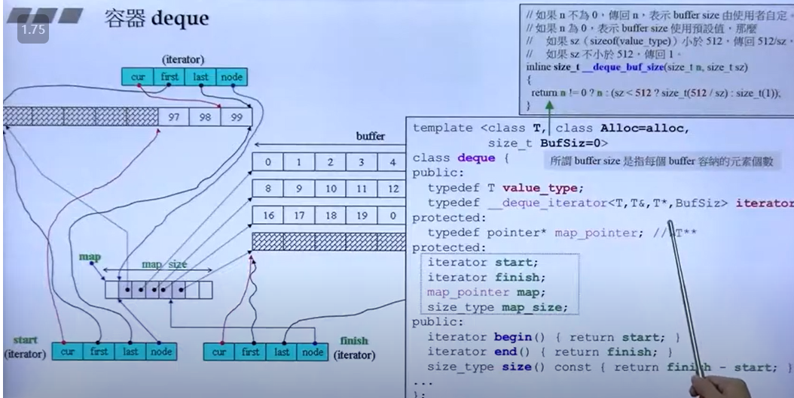
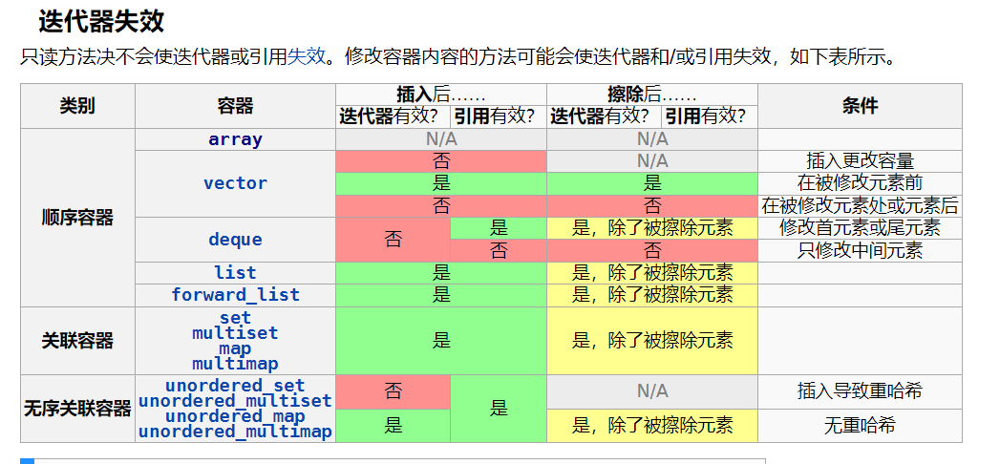

* 回答问题前先思考一会，整理一下思路。
* 对于简单问题，找回回答的角度/层次
* 电话面试注意和面试官交互，视频面试一下画图
* 你还有什么问题？
  * 新人的培养流程，部门的主要工作？
  * 您认为我在哪些方面还存在着不足，能否提出一些宝贵的经验！（回答好了再说）
  * 再补充


再让我选的话，all in客户端。


### 字节对齐

**为什么需要字节对齐：**

结论，为了优化内存访问，避免额外的内存访问开销。

我们知道计算机读取物理内存是按照cache line的大小读取的。（物理内存被分为`物理块号：块内偏移`）每次读取的刚好是一整个cache line，如果不使用字节对齐可能会导致读一个数据需要进行两次内存访问。（比如一块数据刚好被放置在两个不同的物理块/cache line）。       

**字节对齐的规则：**     

* 结构体变量的首地址能够被其对齐字节数大小所整除。
* 结构体每个成员相对结构体首地址的偏移都是成员大小的整数倍，如不满足，对前一个成员填充字节以满足。
* 结构体的总大小为结构体最大成员大小的整数倍，如不满足，最后填充字节以满足。


### 模板实例化

**Q1什么是实例化：**       

C++模板实例化是指从一个函数模板或类模板中创建一个具体的函数或一个具体的类。C++模板实例化可以是隐式的（编译器生成的）或显式的（用户提供的）。隐式实例化发生在编译器需要使用模板定义时，例如调用函数模板或定义类模板对象。显式实例化发生在用户使用template关键字和具体类型来指定要生成的模板。

**Q2：为什么在不同的文件里面实例化了相同的模板，不会导致重定义这样的错误**        

不同的文件里面实例化了相同的模板，不会导致重定义的错误，是因为模板只有在被使用时才会实例化，而且编译器会自动消除重复的实例。如果你想避免多个文件中实例化相同模板的额外开销，你可以使用显式实例化和extern关键字来控制实例化的位置和次数。你也可以使用函数模板特化来针对特定类型提供不同的函数定义，并且可以用inline，extern或者static来修饰特化函数，以避免链接错误。

```C++
// 假设有一个类模板 MyStack
template <class T, int size>
class MyStack {
  // ...
};

// 显式实例化 MyStack<int, 6> 类
template class MyStack<int, 6>;

// 显式实例化 MyStack<int, 6> 的构造函数
template MyStack<int, 6>::MyStack(void);

//使用extern
// 假设有一个函数模板 fun
template <typename T>
void fun(T) {
  // ...
}

// 声明一个外部模板 fun<int>
extern template void fun<int>(int);

// 调用 fun<int> 不会在本文件中生成代码
fun(42);
```

**Q3：多个文件中实例化相同的模板会有额外开销吗？**        

C/C++的编译规则，都是以一个文件作为一个单位。各个文件会被编译为一个可重定位文件，之后再被链接，所有应该有链接。

多个文件中实例化相同的模板会有额外开销，因为编译器会为每个文件生成相同的模板代码，这会增加编译时间和目标文件的大小。你可以使用显式实例化和extern关键字来控制实例化的位置和次数，以避免这种开销。

可以这样理解：就是不同的文件可以实例化同一个模板类，但是这并不会带来链接的重定义错误因为编译器会消除重复，不过各个文件的编译时间和目标文件的大小却会增加。

**Q4:那么对于链接生成的可执行文件呢？**       

如果在多个源文件中实例化了相同的模板，最终链接生成的可执行文件的大小可能会受到影响。

每个源文件都会包含模板的实例化代码，并在编译时将其编译为目标文件。当这些目标文件链接在一起时，链接器会检测到多个相同的模板实例化，但只会选择一个实例化作为可执行文件中的符号。

如果多个源文件中实例化的模板代码相同，则在最终可执行文件中只包含一个实例化的代码，因此不会影响可执行文件的大小。但是，如果不同的源文件实例化的模板代码不完全相同，则最终的可执行文件大小可能会受到影响，因为每个不同的实例化代码都需要包含在可执行文件中。

为了避免这种情况，可以将模板的定义和实现放在单独的头文件中，并在需要使用模板的源文件中包含该头文件。这样可以确保在多个源文件中实例化的模板代码完全相同，从而避免可执行文件大小的影响。

### 哪些函数不能为虚

虚函数组要是为了实现晚绑定/运行时的多态调用。它的实现也就是vptr和vtable。

要思考哪些不能为虚函数的话就在这里面思考：

* 编译期就得确定的不能为虚函数：比如构造，constexper（修饰的函数）
* 还有不是成员函数的不存在多态，比如friend

但是inline可以是虚函数，因为inline仅仅是给编译器的一个建议。


C++在访问虚函数时候，如果不是通过指针调用就不会产生多态，也就是不会查虚函数表吧？

> 不完全正确。在C++中，只有通过指针或引用调用虚函数才会产生多态。即使使用对象名称（而不是指针或引用）调用虚函数，**仍然会查找虚函数表**，并且多态性仍然会应用。这是因为**在C++中，即使使用对象名称调用虚函数，编译器也会隐式地将其转换为指向该对象的指针，然后通过指针调用虚函数。**
>
>   
>
> 如果在C++中访问虚函数时没有使用指针，则不会发生多态性，但是编译器仍然会查找虚函数表以便动态绑定到正确的函数实现。因此，即使是通过对象调用虚函数，编译器也需要查找虚函数表。

### 原子类型实现

采用CAS原子指令实现的原子类型。

如何实现自旋锁。

多线程只会：`thread mutex bq threadpool condition_variable`       


### 为什么模板类的声明&定义不能分开

~~这就要说到模板的实例化时机，只有在第一次使用模板的时候才会进行实例化。~~

~~如果进行分离编译，也就是把模板类的实现编译为`.o`文件一般编译阶段就会报错。~~

测试代码里面可以分离编译，可以通过编译阶段，也就是把模板类分离编译生成`.o`文件。

但是链接阶段会发生错误！**面试时候详细说出为什么错误会发生在链接阶段！**     

但是对于为什么模板可以被成功编译我就很纳闷！

**answer：** 

将模板的声明与定义分开，使用到模板类的文件实例化的时候仅仅能够得到一个声明，所以在编译该文件的时候

最终反映到`.o`文件就是引用了一个外部的符号，这个符号的解析要交给链接阶段获取。

然而这个模板的定义/实现文件并没有对这个模板进行实例化；自然链接器也就找不到这个符号。


归根结底就是C/C++的分离编译是，将各个模块编译为单独的`.o`文件，最终再由链接器进行符号的决议。


~~突然也理解了，什么叫做模板的膨胀，可能会导致很多的实例化对象。~~

模板不会影响性能，只会实例化一份！

### pimple使用

C++的pimpl（pointer to implementation）使用的好处是可以隐藏类的实现细节，使得类的用户无需关心其具体实现，这样可以降低代码的耦合度，提高代码的可维护性和可扩展性。       

只知道减少头文件依赖，和减少编译时间。原理是使用前置声明，来隐藏细节。具体没有使用过。


### 异常的使用

什么是noexcept，为什么需要noexcept关键字。


### thread为什么需要join？

目前线程的实现方式还是内核级线程，是由内核负责调度的，特别是Linux下的进程又叫做LWP（轻量级进程）。

还是不熟练啊，Linux线程的实现！类比僵尸进程对资源的浪费。

>Failure  to  join with a thread that is joinable (i.e., one that is not detached), produces a "zombie thread".
>
>Avoid doing this, since each zombie thread consumes some system resources, and when enough zombie threads have  accumulated, it will no longer be possible to create new threads (or processes).

僵尸进程与僵尸线程：需要处理避免浪费系统资源。        

竟然忘了啥是僵尸进程，

### string

字符串也可以称之为容器吧

### this指针的作用

一个类的每个对象有自己的成员变量，但是共享同一套成员方法。在成员方法里面访问的是谁的成员变量这就是靠this指针来区分的。我们在调用非静态成员方法的时候实际上都会把这个对象的地址也就是this作为第一个参数传进去。


### 四种cast转换

* 可以说只是更加安全了，提供安全检查的转换

```C++
static_cast<>();提供编译器认为安全的类型转换
reinterpret_cast<>();类似于C的强制转换，按照转换的目的bitwise解读
const_cast<>();
dynamic_cast<>();主要用在继承体系里面，可以支持RTTI类型识别的上下转换
```

* const_cast<>();

  去除常量属性，但是带有安全检查；const_cast<这里面必须是指针或者引用类型>

  ```C++
  //1、安全检查
  const int a=10;
  double *p1=(double*)&a; //ok in C
  double *p2=const_cast<double*>(&a);//error
  int *p3=(int*)&a;//C语言的去除const方法
  int *p4=const_cast<int*>(&a);//C++去除const属性
  int b=const_cast<int>(a);//error转换后的必须是指针或者引用：const int* -> int*
  ```

* static_cast<type>(expression)，用的最多，编译时期的类型转换

  提供编译器认为安全的eg：int--> char  子类到基类；编译器认为不安全的/无联系的就直接否决了。

  ```C++
  int a=10;
  double *b=static_cast<double*>(&a);//error
  ```

* dynamic_cast<type>(expression)，RTTI的类型转换

  若转换成功就转换，否则返回nullptr,支持RTTI检查的转换，比如基类指针--》子类

  ```C++
  struct Base{
      virtual void func()=0;
  };
  struct Derive:Base{
  	virtual void func(){
          cout<<"Derive::func"<<endl;
      }  
  };
  struct Derive2:Base{
  	virtual void func(){
          cout<<"Derive2::func"<<endl;
      }  
      virtual func2(){
          cout<<"Derive2::func2"<<endl;
      }
  };
  void show(Base* pb){
      //dynamic_cast会运用RTTI检查pb是不是一个Derive2，如果是就转化，不是的话返回nullptr
      Derive2* pd2=dynamic_cast<Derive2*>(pb);
      if(pd2!=nullptr){
          pd2->func2();
      }else{
          pd->func();
      }
  }
  ```

  

### new/malloc/delete 内存管理专题

**new/operator new/placement new**       

* new和delete都是C++的表达式不可以被重载
* 可通过重载operator new来实现不同的内存分配规则，当然不要重载全局的`::operator new()`
* placement new简言之就是定位new（在固定位置上构造对象）：保持一块内存，反复构造析构，这样可以省略中间的多次分配内存。

```C++
//编译器眼中的一次new expression调用Foo* pfoo=new Foo();//
// 1、申请内存 2、构造 3、返回
Foo* p;
void* raw=operator new(sizeof(Foo));
p=new(raw)Foo(); //placement new，operator new的一种形式就地构造
return p;
```


*在allocator之前只能通过上面把开辟和构造分开？所以容器一般使用allocator？*      

看一下之前看的侯捷内存管理+primer placement new。一会就看，内存管理方面的：

* new与malloc区别
* array new为什么需要delete []


**new/malloc失败**

- malloc只是分配内存，不调用构造函数。如果分配失败，它会返回一个空指针，所以你需要检查它的返回值。
- new不仅分配内存，还调用构造函数。如果分配失败，它会抛出一个异常，所以你需要使用try-catch语句来处理异常。
- 如果你想让new像malloc一样返回一个空指针而不抛出异常，你可以使用nothrow修饰符来调用new。


### 容器的空间配置器allocator

这个没有使用过，但是要会说！      

空间配置器allocator：给容器使用，

1、主要把容器的内存开辟和对象的构造分开。（new一个对象=开辟+构造）     

2、把对象析构与内存回收分开。

### static关键字的作用之elf&链接

**静态变量的初始化时机**      

C/C++里面**静态局部变量的初始化时机**是在第一次执行到变量定义的地方。从编译链接的角度看，局部静态变量也会被编译为符号，但是它们的作用域和存储位置与全局静态变量不同。局部静态变量存储在程序的数据段中，而不是栈上，所以它们不会在函数结束时被销毁，而是在程序终止时被销毁。

之前理解错误了，静态局部变量的初始化时机在第一次执行时候。他确实会被编译为符号，但是存储区域是只能是bss段，因为只有第一次使用时候才会初始化。

`.data`存放的是全局的（包括全局静态），初始化为非0的数据。

`.bss`存放的是全局初始化为0和局部静态的。

++++++++++++++++++

1、从面向过程       

static可以修饰 全局变量，函数；经过static修饰之后就从全局可见变成了当前文件可见！这是因为在elf文件的符号表里面这两个符号由global修饰变为了local修饰！

经过static修饰的局部变量，就从一个栈上数据变成了一个.bss段的变量，这就保证了这个变量不会随着栈的自动回收而析构，而且只会被初始化一次（在第一次使用时候）。     


2、面向对象

static修饰的成员变量/方法不归具体的对象所有，静态成员方法第一个参数不再是this指针，这意味着static修饰的只能访问类的静态成员（即使对象可以通过.staticFunc()来调用也不推荐这样用）！


### 继承

常用的一种类之间的关系。还有组合，聚合这些关系。

1、 实现代码的复用   

2、 通过基类声明虚函数，来进行多态


### 继承多态

也称之为动态 多态，运行时的多态，通过RTTI。


overload versus override：重载&覆盖

简述：一个方法多个状态，基类提供虚函数子类进行override（覆盖/覆写）。多态的实现？虚函数表&&虚指针。

### 菱形继承与解决

多继承导致的对象内存布局上的冲突，比如这里无法直接使用`Child.age`；

一般不要写这样的有歧义的东西，多继承往往就和Java那样作为一个接口不要有成员变量。

解决办法：虚继承，这完全就是瞎继承。

```C++
class GrandFather{
    int age;
};
class Father1:public GrandFather{}
class Father2:public GrandFather{}
class Child:public Father1,public Father2{}
```

++++++++++++++

C++面试常见的多继承和菱形继承问题是指在使用多个父类来派生一个子类时，**可能会导致子类中存在重复的成员或歧义的调用**。例如，如果有两个父类A和B，它们都继承自一个祖先类C，并且有一个子类D同时继承自A和B，那么D就会从C中继承两份相同的成员。这就形成了一个菱形的继承结构，也叫做菱形问题。

为了解决这个问题，C++提供了虚拟继承（virtual inheritance）的机制，可以让子类只从最近的共同祖先中继承一份成员。虚拟继承需要在派生类声明时使用关键字virtual来修饰基类。例如：

C++只会初始化它的直接基类

```C++
class C {
public:
  int x;
};

class A : virtual public C {
public:
  int y;
};

class B : virtual public C {
public:
  int z;
};

class D : public A, public B {
public:
  int w;
};
```


### 纯虚函数-虚函数表

纯虚函数一般作为一个接口类，无法进行实例化（可以有指针）。        

虚函数表在编译时候生成；运行时加载到rodata段，这也是C++的零成本抽象的原理

### 多重继承和虚函数

这真是只有面试才会用到。

[如果父类都有虚函数，那么多重继承的对象的内存布局会比较复杂，因为它需要包含多个虚函数表（vtable）和虚基类指针（vptr）来实现动态绑定](https://stackoverflow.com/questions/11603198/virtual-tables-and-memory-layout-in-multiple-virtual-inheritance)[1](https://stackoverflow.com/questions/11603198/virtual-tables-and-memory-layout-in-multiple-virtual-inheritance)[2](https://stackoverflow.com/questions/30870096/c-virtual-inheritance-memory-layout)[。具体的内存布局取决于编译器的实现，但一般来说，每个子类对象都会有一个或多个vptr指向它所继承的父类的vtable](https://stackoverflow.com/questions/11603198/virtual-tables-and-memory-layout-in-multiple-virtual-inheritance)[1](https://stackoverflow.com/questions/11603198/virtual-tables-and-memory-layout-in-multiple-virtual-inheritance)[3](https://stackoverflow.com/questions/48243011/c-inheritance-and-virtual-functions)[。而每个vtable中都会存储对应的虚函数地址](https://stackoverflow.com/questions/48243011/c-inheritance-and-virtual-functions)[3](https://stackoverflow.com/questions/48243011/c-inheritance-and-virtual-functions)。

```C++
class A {
public:
  virtual void f();
};

class B {
public:
  virtual void g();
};

class C : public A, public B {
public:
  virtual void f();
  virtual void g();
};
```

那么一个C类型的对象在内存中可能会有这样的布局：

| vptr1  | vptr2  | C data |
| :----- | :----- | :----- |
| A::f() | B::g() | …      |


### map之红黑树

性质：根叶黑，不红红，黑路同。

待插入节点都是作为红色插入，若出现冲突就进行调整。性质决定了平衡条件比AVL松很多（一般而言就是二倍）


可能需要补充吧，

具体的插入删除还真不会！


有一点就是map的迭代器失效情况，确实几乎不会失效（不要想什么红黑树的重平衡）。

### deque底层原理

```C++
deque<int> deq;
deq.push_back(1);
deq.push_front();
deq.pop_back();
deq.pop_front();
deq.front();deq.back();//查看
```

双端队列的底层：和vector不一样，这个不是完全连续的，而是分段连续。每一段称为一个buffer，而管理每一个buffer需要一个管理中心。

管理中心map也称之为`T**`类型，也就是可以看为二维数组。      每个map元素是`T*`类型，也就是一个数组。

map的整加和vector一样，能否直接用vector实现deque？应该可以，也就是`vcctor<vector<int>>`，这样增长起来挺方便的。      

和vector一样，insert是不太方便的，但是deque可以选择往前移动/往后移动==》deque的插入可能会导致全部的迭代器失效。

简而言之就是一个二维数组：




### C++如何调用C的函数接口--extern c

还是有点模糊！

```C++
#ifdef __cplusclpus
extern "c"
{
#endif
    int sum(int,int);
#ifdef __cplusclpus
}
#endif

//可以看出来，在C++编译器下会有extern c
```

总的来说就是为了在C++代码中调用**C库**，在链接阶段时候调用。（为什么调用C?C语言大宝藏）

extern "C" 是 C++ 中的一个关键字，用于指示编译器按照 C 语言的方式进行函数名的命名和符号的链接。在 C++ 中，函数名会根据参数类型和数量进行重载，因此会在编译时生成不同的符号名==》链接阶段找不到符号定义！需要extern C声明一下。


### C++类的初始化列表

区分那个initialization_list，这个是说类的成员变量的初始化方式！        

**指定对象成员变量的初始化方式，**如果你放到构造函数里面执行那个时候成员变量都创建好了（用的默认构造）

* const成员的初始化
* 引用类型成员的初始化
* 显式调用基类的构造/其他构造

### 进程地址空间分配

进程的text/data/bss段注意和elf文件的进行区分！  elf文件就是进行说明，而进程的是对应的段通过mmap进行映射到用户进程空间的。


### 容器

容器的底层原理！还是看侯捷？  没啥时间吧！

* 顺序容器：array，vector，deque，list，forward_list。

  array是固定长度的数组，vector是动态数组。固定长度当然不可以插入/删除。

* 容器适配器：queue/stack/priority_queue

* 关联（有序&无序）


### 迭代器失效

迭代器失效的具体情况要看各个容器的底层数据结构，反正就是要注意迭代器的更新。

* 顺序容器：

  array固定长度不会失效；vector的需要看具体情况，如果插入导致扩容全部失效，其他的情况修改位置处的后面失效。 deque的几乎是全部失效，因为deq的底层存储。 list/forward_list不会失效。

* 顺序关联容器

  除了被删除的元素之外的不会失效

* 无序容器

  如果插入没有导致reHash的产生那么不会失效。





### C++修饰符总结!!!重要

from：故人帝梦

```C++
inline virtual void func()const volatile & noexcept final override try{
    
}
//&和&&修饰表名只能被左值/右值调用

//final既可以修饰函数==》表示不能再override，
//也可以使用final继承
class A{};
class B final:public A{};//不允许继承B了
//final的位置位于类名后面，表示禁止继承

class C final{};//表名C不可被继承
```

### C++空类大小为1？

C语言里面没有对象/类的概念。C++需要调用成员函数，而成员函数第一个参数为this指针来区分不同的对象。

因为类的方法是共有的，需要对象来区分是谁调用了方法。


目前没有看到答案，问下面试官。

chatgpt：这是C++语法本身的规定，因为C++有类的这个概念，需要通过对象来调用方法，而方法的第一个参数就是this（对象地址），自己感觉可以这么写。


### 初始化/未初始全局变量

`.bss`所储存的变量：

静态局部（因为只有第一次时候才会初始化，所以存在bss），全局的初始化为0和没有初始化的数据。


`.data` 存储全局的初始化为非0的数据。


### 堆&栈

堆内存远远大于栈内存。

堆内存需要手动申请与回收，不然会照成内存泄漏。

栈内存（函数运行栈帧）的开辟是随着函数的运行自动回收的。 ebp/esp

栈是从高地址到低地址


### 构造函数非虚

构造函数不能为虚函数：编译不通过。


并且，把构造函数声明为虚也没有任何意义，虚函数主要是为了实现运行时的多态调用。而构造函数是进行对象的构造，在编译阶段肯定是知道具体的对象的。


### 构造/析构抛出异常

不允许！

构造抛异常对象还没有创建完成析构函数无法调用导致资源泄漏。（当然使用智能指针就不会泄漏，因为出栈帧就会释放）


析构最后一行抛出还行，若在中间会导致后面的语句无法执行==》内存泄漏。


综上：不抛出好一些。

### 宏定义&inline

* 编译方面：一个预处理，一个编译阶段（~~inline不能搭配虚函数~~）
* 调试方面：debug模式下inline函数和普通的函数一样不会内联展开，而define替换后可能不好调试
* inline只能修饰函数；而#deind可修饰代码段，常量（进行的是字符串替换）


### 手写资源管理的类

主要就是使用了copy-and-swap idiom，这样写的好处！

- 简化了代码，只需要一个赋值运算符就可以同时处理拷贝和移动赋值。
- 避免了**自赋值和内存泄漏**等问题，因为交换操作不会失败或抛出异常。（主要避免了operator=的烦心事！）
- 提高了性能，因为移动构造函数通常比拷贝构造函数更快，并且交换操作也比复制操作更快。
- 这样，无论我们是用另一个对象或者一个临时对象来赋值给`MyArr`对象，都会调用相应的构造函数和交换函数，实现正确和高效的赋值操作。

```C++
//考虑类的三五法则，拷贝构造，拷贝赋值，移动构造，移动赋值，析构函数
// 使用copy-and-swap来简化
class MyArr {
  public:
    MyArr();
    MyArr(int size) : MyArr() {
        _size = size; // 其实不建议，只是想用一下调用其他构造
        _base = new int[size]; // woc,array new都不熟了
    }
    MyArr(const MyArr &other) : MyArr(other._size) {
        copy(other._base, other._base + _size, _base);
    }
    void swap(MyArr &other) {
        std::swap(_size, other._size);
        std::swap(_base, other._base);
    }
    MyArr(MyArr &&other) : MyArr() { this->swap(other); }
    // copy-and-swap兼顾移动&&拷贝赋值，效率确实好，但是分析？
    MyArr &operator=(MyArr other) {
        this->swap(other);
        return *this;
    }
    ~MyArr() { delete[] _base; }

  private:
    int _size;
    int *_base;
};
MyArr::MyArr() : _size(0), _base(nullptr) {
}
```

### 手写字符串

具体就是带资源管理的类的具体应用。

需要注意的就是C字符串都是默认以`'\0'`结尾的，使用sizeof会打印出包括结尾字符串的长度。

然而cstring里面的`strlen(char* )`·返回的长度是不带结尾字符串的。

但是我们使用char数组保存的时候一定要保存结尾字符串。

```C++
class MyStr{
public:
    MyStr(const char* str=""){
        // C的字符串都是以'\0'结尾，但是strlen返回不包括
        len=strlen(str);
        //len+1，来保留结尾字符串
        m_str=new char[len+1];
        // stl都是左闭右开区间，stl的copy好用
        copy(str,str+len+1,m_str);
    }
    MyStr(const MyStr& str){
        len=str.len;
        m_str=new char[len+1];
        copy(str.m_str,str.m_str+len+1,m_str);
    }
    ~MyStr(){
        delete m_str;
    }
    void swap(MyStr& str){
        std::swap(m_str,str.m_str);
        std::swap(len,str.len);
    }
    MyStr(MyStr&& str):MyStr(){
        this->swap(str);
    }
    MyStr& operator=(MyStr str){
        this->swap(str);
        return *this;
    }
    const char* c_str(){
        return m_str;
    }
    ssize_t size(){
        return len;
    }
private:
    char * m_str;
    ssize_t len;
};
```

### 3个线程轮流打印1、2、3

最简单的思路直接使用信号量，然而使用锁+条件变量也行。

使用信号量小题大做，条件变量+flag

* 三个线程轮流打印1，2，3
* 三个线程循环打印1，2，3

```C++
// 原子类型变量的初始化方法，不能直接使用flag=1
//当然这个多此一举
atomic_int flag(1);
mutex mtx;
condition_variable turn;

void print1(){
    unique_lock<mutex> lk(mtx);
    while(flag!=1){
        turn.wait(lk);
    }
    cout<<"print 1"<<endl;
    flag=2;
    turn.notify_all();
}

void print2(){
    unique_lock<mutex> lk(mtx);
    while(flag!=2){
        turn.wait(lk);
    }
    cout<<"print 2"<<endl;
    flag=3;
    turn.notify_all();
}

void print3(){
    unique_lock<mutex> lk(mtx);
    while(flag!=3){
        turn.wait(lk);
    }
    cout<<"print 3"<<endl;
    flag=1;
}
```


### 手写自旋锁spin-lock

自旋锁正如其名如果不能获得锁就原地打转`while循环·`，是一种基于忙等的线程同步机制。       

而mutex是会进行阻塞，自旋锁适合与大量的线程，但是每个线程只会短时间持有锁。

```C++
//自旋锁的实现；test and set指令
#include<atomic>

class SpinLock{
  private:
    atomic_flag flag;
  public:
    SpinLock():flag(ATOMIC_FLAG_INIT){}
    void lock(){
        flag.test_and_set();
    }
    void unlock(){
        flag.clear();
    }
};
```


### 手写生产者-消费者

生产者--消费者也就是阻塞队列的实现。

* 无界的阻塞队列：一个mutex+condition即可
* 有界的：一个mutex+两个condition，直接使用deque，

```C++
//无界的实现，主要就是一个condition。get/put的书写，
template<typename T>
class BlockingQueue{
public:
    explicit BlockingQueue(){}//default is ok
    BlockingQueue(const BlockingQueue&)=delete;//还是需要清楚什么时候会自动生成
    T get(){
        unique_lock<mutex> lk(_mutex);
        while(deq.empty()){
            not_empty.wait(lk);
        }
        T obj=deq.front();
        deq.pop_front();
        return obj;
    }

    void put(const T& obj){
        lock_guard<mutex> lk(_mutex);
        deq.push_back(obj);
        not_empty.notify_one();
    }
    void put(T&& obj){
        lock_guard<mutex> lk(_mutex);
        // 右值引用还是左值，需要move成右值
        deq.push_back(std::move(obj));
        not_empty.notify_one();
    }
    size_t size(){
        lock_guard<mutex> lk(_mutex);
        return deq.size();
    }
private:
    mutex _mutex;
    condition_variable not_empty;
    deque<T> deq;
};
```


### 手写线程池

~~面试手撕的话来个简单的，直接无界阻塞队列+多个线程即可。（错了不能直接两个组件，需要写在一块）~~

这个倒也不算难实现起来，但是有点bug。

关键是runInThread的设计，这个设计很常用，把类的方法作为线程执行体传递给thread，这样的好处就是线程可以直接使用类的资源。

```C++
thread th(std::bind(&ThreadPool::runInThread,this));
//也就是把这个任务放在线程里面执行
```

**version1:**    面试后写的话可以直接写这个简单的。

这个版本存在的一些问题：

* 直接写死了Task，确实应该写死，不然任务队列怎么保存？

* 对用户使用起来不方便，用户传入的task也被写死，即使用户可以通过bind来适配一下

  各个倒是好修改，直接使用让addTask使用variadic template（可变参模板）

  ```C++
  void fun1(int a,int b);
  //for user;
  pool.addTask(bind(fun1,para1,para2));
  
  //variadic template
  //...的位置记不清了
  template<typename Func,typename...Args>
  void addTask(Func&& func,Args&&(args)...){
      Task task=bind(std::forward<Func>(func),std::forward<Args...>(args)...);
      //这个挺好改的
  }
  ```

* 最后一个问题，用户只能放入一个没有返回值的函数，但是需要返回值呢？

  解决办法也是有的`future packed_tack`，标准库为我们想好了。

  因为标准库的thread就是没有返回值的，但是提供了future和packed_task。

  packed_task也是一个函数对象，可以给`std::function`赋值（只要是可调用的，function都可以接收）

  晚上重构下这个线程池！

```C++
// 反正大部分都是生产者--消费者模型；
using Task=function<void()>;
class ThreadPool{
  public:
    explict ThreadPool(int n):numThreads(n),running(false){
        
    }
    //没考虑啥左右值
    void addTask(Task t);
    void start();
    ~ThreadPool();
  private:
    bool running;
    int numThreads;
    deque<Task> deq;
    mutex _mutex;
    condition_variable not_empty;
    vector<unique_ptr<thread>> pool;
    //就不写getTask了，直接这里面获取+运行
    void runInThread();
};
void ThreadPool::addTask(Task t){
    unique_lock<mutex> lk(_mutex);
    deq.push_back(t);
    not_empty.notify_one();
}
void ThreadPool::start(){
    running=true;
    for(int i=0;i<numThreads;i++){
        pool.push_back(make_unique<thread>(
            std::bind(&ThreadPool::runInThread,this)
        ));
    }
}

//各个线程的执行体，也就是充当消费者的角色！
void runInThread(){
    while(running){
        unique_lock<mutex> lk(_mutex);
        //这个判断很精妙，既防止了意外唤醒，又保证不被阻塞
        while(deq.empty()&&running){
            not_empty.wait(lk);
        }
        Task t;
        if(!deq.empty()){
            t=deq.front();
            deq.pop_front();
        }
        if(t){
            t();
        }
    }
}

//析构线程池，并join所有的线程
ThreadPool::~ThreadPool(){
    running=false;
    //唤醒所有阻塞线程，因为getTask一般是要做防止意外唤醒的；所有上面配合running flag很精妙
    //
    not_empty.notify_all();
    for(auto &&i:pool){
        i->join();
    }
}
```


### 手写单例

C++目前实现单例的三种做法：

* double check
* 局部静态成员，仅限于C++11
* C++11的once_flag来保证只调用一次

```C++
//局部静态成员
class Singleton
{
public:
    static Singleton* instance();
private:
    Singleton();
};
Singleton* Singleton::instance(){
    static Singleton instance;//可调用私有函数&&线程安全
    return &instance;
}
Singleton::Singleton(){
    cout<<"init a instance"<<endl;
}
```


```C++
//使用once_flag来保证
//once_flag是call_once的辅助类，目前cpp新增的几乎全为对象比如thread::id
static std::once_flag flag;//本文件的全局once_flag

//如何使用once_flag实现单例，多线程调用的话如何保证？
//这个貌似不能线程安全，确实只调用一次，但是调用过程中进程切换不就返回未初始化数据
```


### 手写LRU

**最近最少使用**         

```C++
class LRUCache{
  private:
    using Node=pair<int,int>;
    list<Node> continer;  //必须存在pair，为了put时候删除时候能够找到table里面对应的
    using Ptr=list<Node>::iterator;
    unordered_map<int,Ptr> tables; //key和所在list的位置
};
```


### 手写trie树

```C++
class Trie{
  public:
    Trie():
    	son(vector<vector<int>>(1e5,vector<int>(26,0))),
    	end(vector<int>(1e5,false)),
    	index(0){}
    void insert(const string& str){
        int p=0;
        for(char c:str){
            int u=c-'a';
            if(son[p][u]==0){
                //不存在就创建节点
                son[p][u]=++index;
            }
            p=son[p][u];
        }
        end[p]=true;
    }
    bool search(const string&str){
        int p=0;
        for(char c:str){
            int u=c-'a';
            if(son[p][u]==0){
                return false;
            }
            p=son[p][u];
        }
        return end[p];
    }
    
  private:
    vector<vector<int>> son;
    vector<bool> end;
    int index;
};
```


### 实现智能指针

待实现


### 解析数据包

```C++
// 头占1字节，消息类型占1字节，属性占4字节，
// 字节包体长度占4字节，剩下包体数据内容总长度是前面的字段
// 这个倒是没啥难度，一个个解析出来转化为字符串即可。
string func(const char* buffer,int len){
    if(len<10){
        // 数据不完整
        return "";
    }
    // buffer是指针，转化为其他类型指针，然后解引用
    uint8_t m_head=*(uint8_t*)buffer;
    uint8_t m_type=*(uint8_t*)(buffer+1);
    uint32_t m_attr=*(uint32_t*)(buffer+2);
    uint32_t m_len=*(uint32_t*)(buffer+6);

    if(len<m_len+10){
        // 验证数据长度
    }

    const char* body_ptr=buffer+10;
    string res;
    res+=char(m_head);
    res+=(char)(m_type);
    res+=string((char*)(&m_attr),sizeof(m_attr));
    // 
    // 
    res+=string(body_ptr,m_len);
    return res;
}
```

### C语言实现多态

主要就是模拟实现：封装/继承/多态。

**动多态**       

可以说动态的多态就是定义了一组接口，而C语言不支持结构体里面存放方法。

我们先声明一下函数指针，让基类的成员只有函数指针（也可以说这个是定义接口）。（封装）

然后C语言呢也无法使用继承，但是我们可以使用组合，通过组合子类的第一个成员还是基类。（继承）

C语言中没有多态这个概念，所以需要在创建对象时手动设置每个对象对应的函数指针。（多态）

关键就是C不支持封装，结构体不能存放方法。通过组合，倒是可以一定程度的弥补继承和多态。比如使用go里面的那种语法糖。

```C++
using func=void(*)();//声明一个函数指针,或者使用typedef
typedef struct Animal{
    func say;
}Animal;
typedef struct Cat{
    Animal base;
    char* name;
}Cat;
typedef struct Dog{
    Animal base;
    char* name;
}Dog;

//不支持将方法写入struct，只有在外面定义后将函数指针指向
void cat_say(){
    cout<<" "<<endl;
}
Cat* newCat(char* name){
    Cat* ans=(Cat*)malloc(sizeof Cat);
    ans->say=cat_say;
}
```

- C语言中没有类和虚函数这些概念，所以需要用结构体和函数指针来模拟。
- C语言中没有继承这个概念，所以需要把基类（父类）作为子类结构体的第一个成员来实现。
- C语言中没有多态这个概念，所以需要在创建对象时手动设置每个对象对应的函数指针。
- C语言中没有动态内存分配这个概念，所以需要用malloc函数来分配内存空间给对象。
- C语言中没有类型检查这个概念，所以需要用强制类型转换来保证正确性。


**静多态**    

函数重载与模板

可以使用宏来模拟。


### C++实现go-defer

一个很直接的方法就是直接利用RAII，构造一个对象（这个对象的生命和需要defer调用的一样）把你想传入的defer执行的方法传入。

```C++
class Defer{
public:
    Defer(function<void()>f):f_(f){}
    ~Defer(){
        f_();
    }
private:
    std::function<void()> f_;
};

//usage:
int fd=open("xxx",O_NONBLOCK);
Defer defer([fd](){
    close(fd);
});
```

