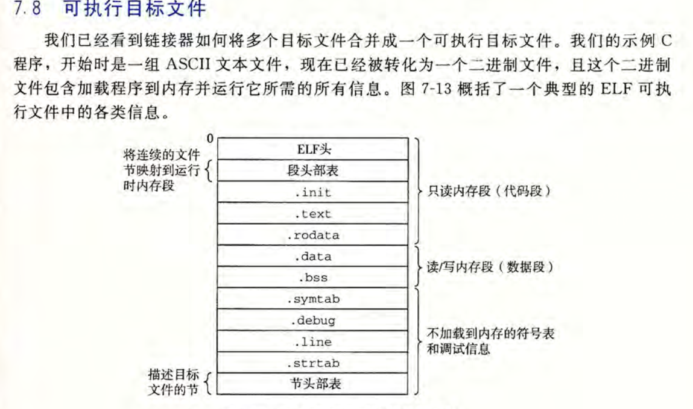

这些面试可能的问题，不会的直接问chatgpt！！！

### mmap详解

*可先看csapp部分的内存映射内容再补充*       

mmap是一种进程间通信的手段，适合于没有血缘关系的进程？      

**mmap使用**        

* 内存映射文件，用来读取大文件减少拷贝，为何减少查看零拷贝

  *// 打开一个文件，直接使用mmap进行映射文件内容到进程地址空间，而不用传统的read！！！*

  *// 节约了read读取文件内容到内核缓冲，然后再使用cpu把内核缓冲读取到应用层缓冲*

  直接将虚拟内存技术与文件读写结合。

  


### 虚拟内存+内存映射文件

虚拟内存相关的知识已经很清楚了（from 考研）。

虚拟地址空间，虚拟内存；进程的虚拟地址空间，系统使用虚拟内存。      

其实这也是内存映射内容。*内存映射的概念来源于一个聪明的发现：如果虚拟内存系统可以集成到传统的文件系
统中， 那么就能提供一种简单而高效的把程序和数据加载到内存中的方法。*       

南大OS课中实现自己的程序加载器，直接mmap文件到进程相应的地方，源于csapp的exec实现。


### 进程地址空间相关

*经典的X86体系下，LinuxOS 32系统的程序内存布局*            

注意程序的进程地址空间布局与elf的区别，elf文件同样有text/data/bss段（也许叫做section比较好），但这只是为了指示程序的生成。         

从这里也可以看出动态连接的好处，通过页面的映射功能，使得内存中仅仅存在一份即可被所有程序共享。

但是这里面的技术是什么？看下编译链接--动态链接！！！


### 进程间通信IPC

最好都了解一些

* 共享内存mmap：这个如何使用？不知道如何作为没有血缘关系的进程通信。
* 信号：父子进程间的通信sigchild，kill
* 信号量
* socket：最喜欢的方式，好处很多
* unix_socket：考过
* 消息队列：

### 零拷贝

https://juejin.cn/post/6995519558475841550#comment         首先得知道不使用零拷贝有哪些消耗！


**一次传统的读取/发送：**     

```C++
//不使用优化，一次常规的读写
int n=read(fd,buf,len);
int n=write(socketfd,buf,len);
//如果文件内容没有读进内核缓冲，知道要花费多少吗？
//最多需要花费四次拷贝，
```

1. 从磁盘读取文件到内核缓冲区，使用DMA
2. cpu负责将文件内容从内核缓冲区读取到用户的应用层缓冲（用户空间）
3. cpu再次负责将应用层缓冲区拿到的数据，写入内核的socket发送缓冲区
4. 从通过DMA把数据发送到外设。


**优化1：mmap+write**      

能不能直接把文件数据读取到用户空间？==》使用mmap

```C++
//优化1：使用mmap+write
char* buf=mmap(0, len, PROT_READ, MAP_PRIVATE, fd, 0);//直接映射文件到虚拟内存（进程空间）
int n=write(socket,buf,len);//写文件到socketfd，
```

**优化2：sendfile：**     


直接在两个fd直接传递信息，不需要把数据读取到用户空间然后再由用户发送。

` ssize_t sendfile(int out_fd, int in_fd, off_t *offset, size_t count);`        

> sendfile()  copies data between one file descriptor and another.  
>
>Because this copying is done within the kernel, s
>
>endfile() is more efficient than the combination of read(2) and write(2), 
>
>which would require  transferring data to and from user space. 
>
>用户/内核的切换涉及上下文的切换，比较耗时。

### 静态链接&&动态链接

补一下，csapp的编译链接！       

链接分为：静态&&动态。

>基本原理：运行的时候才进行链接，但是链接阶段为什么不报错？如何分清哪个是动态库？
>
>1. 程序在运行时需要调用共享库中的函数或符号时，首先会在程序中查找这个函数或符号的地址。--符号表
>2. 如果程序中没有找到这个函数或符号的地址，那么程序就会在动态链接库中查找。
>3. 如果在动态链接库中找到了这个函数或符号的地址，那么程序就会将其加载到内存中，并将其链接到程序中，使得程序可以调用这个函数或符号。
>4. 如果在动态链接库中没有找到这个函数或符号的地址，那么程序就会报错并终止运行。

* 静态链接和动态链接有什么不同，有个动态链接库，其中有个全局变量，那一个进程对这个全局变量的改变其他进程可见吗？ 

  >ChatGPT也是瞎写，还是自己看吧。
  >
  >静态链接和动态链接的主要区别在于链接时刻和链接方式。静态链接是在编译时将所有的目标文件和库文件链接成一个单独的可执行文件，而动态链接是在程序运行时将程序和共享库链接起来。
  >
  >对于动态链接库中的全局变量，如果它被多个进程同时使用，那么每个进程都会在自己的地址空间中创建一个全局变量的副本，这些副本是相互独立的，一个进程对这个全局变量的修改不会影响其他进程中的副本。
  >
  >动态库中的全局变量，在被其他进程使用时，会拷贝一份，所以多个进程使用同一个动态库中的全局变量也不会相互影响。也不会改变动态库中该变量的值。类似于fork的COW技术。


程序的编译链接原理，动态链接确实不懂。        

**目标文件分类**      

都是elf文件格式

* 可重定位文件：一般的.o文件，需要进一步在链接阶段进行符号的解析，为不确定地址的符号确定地址
* 可执行文件：所有的符号都是有定义的？使用loader加载执行即可
* 共享目标文件：一种特殊类型的可重定位目标文件，可以在加载或者运行时被动态地加载进内存并链接  

#### 可重定位目标文件          

为什么叫重定位文件：因为符号的地址不确定，需要进行符号解析然后重定位地址信息。      

一般来说所有的`.o`文件都是可重定位的elf文件。查看这些二进制文件常用的工具：readelf/objdump/nm。         

这里的叫法很好，elf的每一个部分叫做section/节。（自我修养里面叫做段）        

`.text .data .bss`这些都有，对于可重定位的文件

* .symtab: —个符号表，它存放在程序中定义和引用的函数和全局变量的信息。  符号信息
* .rel.text和.rel.data 需要重定位的符号的信息。未定义的符号一般地址就是瞎写，符号修饰为undefine
* static变量位于data/bss段，只不过修饰为local


对于所有的可重定位目标文件是如何进行符号解析的？也就是如何链接为可执行的？静态链接下的工作很简单可以理解为拼积木，连接器把所有的文件的相同的section拼在一块，找出自己想要的，为符号生成最终的虚拟地址。（csapp符号解析）         


#### 可执行目标文件

可以看出，可执行文件没有rel.text这些位置不确定section。注意，这里出现了段，也就是指示加载器可以把属性相同的section放入同一个段。     

这也是为啥我们的进程地址空间一般就是`.text .data .bss`这些段。加载器就把这些mmap进行内存，然后设置pc（程序的入口点）即可。



#### 可执行文件的加载

这里仅仅做了简要介绍！在后面第 8 章和第 9 章中遇到这些概念时，我 们将重新回到 加载的
问题上，并逐渐向你揭开它的神秘面纱。  ==》之前看的太浅显。

这里讲了加载器的工作。     

加载器只要按照文档把，相应的段加载到地址空间即可。

main函数执行前的工作：

```C++
//加载程序后加载器跳转__start开始（程序的入口）
_start() ==> _libc_start_main() ==> main();
//_start 函数调用系统启动函数_libc_start_main()完成环境的初始化
//当然main函数执行之前还会完成用户自定义的构造属性函数__(construct)__
```


#### 动态链接库

静态库存在的两个大的缺点：

* 每个程序都需要拷贝一份用到的静态库，相当于拼积木
*   库文件修改时候自己的程序也需要重新编译

动态库运行时才会进行链接，动态库中的全局变量呢？

原理还是不懂，看看面经问题吧还是。     

不看了

### 虚拟内存

虚拟内存/虚拟地址空间。           

**各个部分看到的地址：**       

* cpu：当前进程虚拟地址
* 进程虚拟地址空间
* MMU负责将虚拟==》物理
* 内存/cache看到的都是物理地址，物理内存的读取一次一个cache line


为什么需要虚拟内存？        

**一个系统的表述：**      

因为我们的进程都是运行在虚拟地址空间的，这就使得系统内同时运行多个进程。

由于系统要运行多个进程，那么各个进程分配的内存总和可能会大于真正的物理内存。

所以操作系统就提供了虚拟内存/请求分页这种**内存管理的方式**，通过不断地将内存换入换出（swap分区）来给出

系统内存空间够用的假象。

在虚拟内存下进程的页表项`是否在内存|外存位置|内存位置|页目录|页号|页内偏移`。


为什么使用虚拟地址？    

虚拟地址实际上是操作系统为应用程序提供的一个统一的内存访问接口，

这样做的好处是所有的应用程序只需要面向虚拟地址进行编写，而不用考虑实际的物理地址的使用
情况  。

不同进程使用的虚拟地址彼此隔离。一个进程中的代码无法更改正在由另一进程使用的物理内存  。


### 物理内存4g，malloc8g

这个问题需要考虑三个前置条件：

* OS是32位还是64位

  32位最多4G虚拟内存，64位随意128T

* 申请完8g需要进行读写操作吗

  不进行读写的话随便，读写的话接着看swap

* OS有没有swap机制

  因为进行读写虚拟内存就需要看物理内存够不够了。如果没有swap机制，没法读写这8g，如果物理内存+swap的大小足够的话还行。

malloc只是分配虚拟内存很快，并不会申请任何的物理内存，仅仅是修改下进程的地址空间（页表）。

当第一次访问申请的内存时候就会产生缺页中断（当然请求的是一页）。

当对所申请的所有虚拟内存都进行读写的话，因为这个时候要分配物理内存，需要看swap


### fork

* fork前后内存是否变化

  > 在调用fork系统调用时，操作系统会创建一个新的进程，这个新的进程是原进程的副本，但是仍然需要为子进程创建一些数据结果比如PCB来表示这个进程，以及进程返回的pid也不同。
  >
  > 因此，fork之后，系统内存的总占用会增加。但是，这些新增的内存空间通常是通过写时复制（Copy-On-Write，COW）技术实现的。也就是说，新的进程不会真正地复制父进程的所有数据，而是在需要修改这些数据时才会复制，因此在fork之后，父进程和子进程之间共享大部分内存，直到有一个进程需要修改数据时，才会进行实际的复制操作。（也就是说共享父进程的地址空间）
  >
  > 因此，fork之后，系统的内存占用会增加，但是增加的数量通常很小，并且随着子进程的运行，子进程所使用的内存会逐渐增加，而父进程的内存使用情况保持不变。

* fork的cow

  > 当父进程调用fork创建子进程时，操作系统会将父进程的地址空间中的页面标记为只读（父子进程的页表指向相同的物理页面），这些页面包括父进程代码、数据和堆栈等。此时，子进程与父进程共享这些只读页面，即它们共享同一块物理内存，但是子进程不能修改这些页面。如果子进程尝试修改任何一个只读页面，就会产生一个缺页中断（Page Fault），操作系统会为这个页面分配一个新的物理页面，并将父进程的内容复制到这个新的页面中，从而使子进程能够修改这个页面。
  >
  > 因为子进程只有在需要修改页面时才会分配新的内存，所以COW技术能够显著减少内存使用。当父进程和子进程共享页面时，它们实际上共享同一块物理内存，这样就避免了父进程在fork操作后进行大量的内存复制，从而节省了时间和内存资源。
