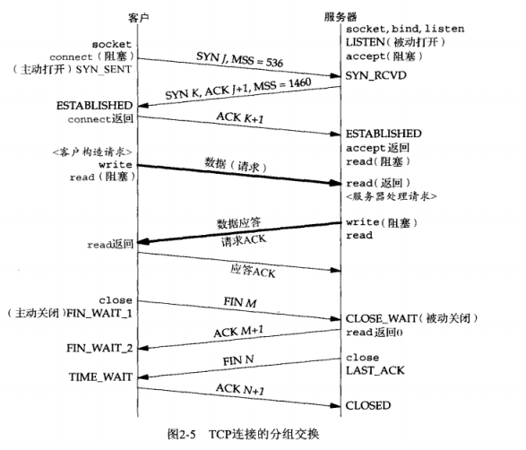

先学http+TCP

直接让ChatGPT回答这些八股非常好！

网络方面的东西太多了！

### HTTP相关

请求行/状态行；首部；crlf；消息体。

#### HTTP各个版本

- HTTP/1.1: 发布于1999年，是HTTP协议的第一个被广泛使用的版本，它解决了HTTP/1.0中存在的一些问题，比如：

  总的来说：持久化连接，管线化请求，一些缓存控制。

  * 支持持久连接，减少了每次请求和响应时的TCP连接建立和关闭所带来的开销。

  - 支持管线化，使得客户端可以在同一个连接上同时发送多个请求，提高了传输效率。但是会对头阻塞
  - 引入了一些缓存控制机制，减少了对服务器的请求，提高了网络性能。

  缺点：http头部巨大且重复，不支持服务器主动推送消息，采用文本传输效率比较低。不支持主动的话只能浏览器轮询。对头阻塞，这里的对头阻塞是因为http服务器无法处理。

- HTTP/2: 发布于2015年，它在HTTP/1.1的基础上进行了一系列的优化，解决了HTTP/1.1中存在的一些瓶颈问题，主要包括：

  总的来说：头部压缩机制，采用二进制帧而不是文本传输，支持服务器主动推送，一个TCP连接可以并发支持多个http请求与回应。

  - 引入了二进制协议，将请求和响应数据分割成二进制帧，提高了传输效率和可靠性。
  - 支持多路复用，使得在同一个TCP连接上可以**并发**发送多个请求和响应，降低了延迟和提高了性能。
  - 关于如何支持多了复用，看看小林
  - 引入了头部压缩机制，减少了请求和响应头部的大小，提高了网络性能。

  缺点：http2暴露了TCP的一些缺陷！**对头阻塞**，因为传输层是基于TCP要保证消息的按序完整，但是呢http2又是采用的基于tcp的并发http请求，可能导致已经到达的也没办法处理。**TCP/TLS握手延迟**。**状态切换**的重新建立连接（在移动端切换网络很常见）

- HTTP/3: 发布于2020年，是HTTP协议的最新版本，**它使用了QUIC协议作为扩展传输协议，解决了TCP存在的一些问题**，主要包括：

  - **支持连接迁移，使得客户端可以在网络切换时无缝地切换连接。**

    由于TCP是需要连接的，当四元组变化时候（比如切换网络）就会导致重新三次握手+四次TLS握手！

    而UDP不需要连接连接，四元组再变也没事！

  - 支持0-RTT握手，可以在没有建立完全握手的情况下发送数据，减少了延迟。

  其他不懂，就说一个状态迁移即可。（问原理了就说不会）

#### 加密基础

数据安全，我们的项目直接使用的明文json传输，存在数据安全问题

对称加密/非对称加密==》引出话题。

对称加密，加密方/解密方对等，用的相同的密钥，效率高，不够安全问题在于如何安全分发密钥。eg：DES，AES       

非对称加密rsa加密算法：分为公钥&私钥，eg在配置github的时候放在GitHub的公钥。问题1：可以互相通信吗？==》可以但是不安全。       公钥加密，私钥解开好理解；可是私钥加密，公钥可以解开？==》不可以。     

就没有纯纯使用非对称加密的情况，都是配合使用。==》复习指路https          

解决办法就是使用混合加密，非对称用来交换对称加密所用的密钥。         

哈希函数比如MD5可以用作加密算法吗？服务器可以将密码hash来保存进数据库，但是hash无法加解密。为了防止拖库一般都需要使用加盐操作（加一个自定义字符串）来作为hash结果。 hash当然就会有hash冲突，而且一个密码对应的hash是一定的。

#### https的加密

**还是不会讲解https的加密过程**     

简述https的加密过程：          

>当一个客户端（例如 Web 浏览器）试图连接到一个使用 HTTPS 协议的服务器时，以下是 HTTPS 加密过程的概述：
>
>1. 客户端向服务器发送一个加密连接请求，请求中包括支持的加密算法(对称)和 SSL/TLS 版本。
>2. 服务器向客户端返回一个数字证书，该证书包括服务器的公钥和其他信息。
>3. 客户端使用证书验证服务器的身份和合法性，以确保正在连接到的是期望的服务器，而不是中间人攻击者。
>4. 如果服务器的证书有效，客户端使用服务器的公钥加密一个随机数，并将其发送回服务器。
>5. 服务器使用其私钥解密客户端发送的随机数，并使用该随机数生成一个共享密钥（对称加密使用）。
>6. 客户端和服务器都使用共享密钥进行加密和解密数据的操作，这样，任何窃听或中间人攻击都无法轻易地窃取或篡改数据。
>
>通过这个加密过程，HTTPS 能够保护客户端和服务器之间的通信，并确保数据的隐私和完整性。


**简述TLS握手过程：**         

tls四次握手要确定之后加密所用的密钥和加密算法。

>HTTPS是HTTP+SSL/TLS的组合，它在TCP三次握手之后，使用TLS协议进行四次握手，以确定双方的加密算法和密钥等信息。TLS四次握手的过程如下：
>
>1. 客户端向服务器发送Client Hello消息，包含客户端支持的加密套件、随机数、会话ID等。（随机数1）
>2. 服务器向客户端发送Server Hello消息，包含服务器选择的加密套件、随机数、会话ID等。然后发送Certificate消息，包含服务器的证书和公钥。最后发送Server Key Exchange消息，包含用于生成对称密钥的参数。（随机数2）
>3. 客户端验证服务器的证书和公钥，并使用它们加密一个预主密钥（Pre-Master Secret），然后发送Client Key Exchange消息给服务器。接着发送Change Cipher Spec消息，通知服务器后面的消息都将使用协商出来的对称密钥进行加密。最后发送Encrypted Handshake Message消息，用于验证协商的对称密钥是否一致。（公钥加密的随机数3）
>4. 服务器使用私钥解密预主密钥，并根据参数生成对称密钥。然后发送Change Cipher Spec消息，通知客户端后面的消息都将使用协商出来的对称密钥进行加密。最后发送Encrypted Handshake Message消息，用于验证协商的对称密钥是否一致。
>
>总之就是采用非对称加密的方式来交换对称加密过程所使用的密钥，混合加密。


### 输入url发生了什么

**超高频考点**      这个总是感觉答不好

简要说明：      

浏览器输入URL（进行解析url，域名，端口，文件）==》进行DNS查询（本地host文件无的话）==》三次握手简历tcp连接==》

浏览器发送http请求==》服务器解析请求&返回资源==》浏览器进行资源的解析==》请求完成四次挥手关闭连接

详细说明：       

1. DNS相关的内容：主机与本地dns递归，本地dns与其他的迭代查询
2. http的相关信息，若使用https那么握手信息是什么时候完成的
3. 三次握手详解，为什么三次？http的话可以第三次握手发送http请求，那么https呢？
4. 四次挥手详解，为什么四次？

要详细说明吗，拿到IP后的arp，路由也可以说。


### 三次握手/四次挥手

今晚上把TCP这部分的面试题看看！看下牛客，今晚的任务吧！太没有效率了。      

小林都写了。

* 第一次握手丢失怎么办

  简答

* 第二次握手丢失？

  双方都要重传，重传一定次数，这个难分析。但是显然客户端先超时

* 第三次握手丢了怎么办

  应该会分析：此时客户端以为连接已建立，而服务器没有建立。 

  服务器认为没有收到SYN+ACK，会重传，客户端如何响应呢？

  如何客户端认为建立了连接直接发信息呢？这个没问题，因为一般第三次握手会携带信息，三次握手丢失了服务器会重传SYN+ACK，客户端也会重传。

* 三次挥手丢失怎么办？

  服务器没有收到第四次挥手就会超时重传。

* 第四次挥手丢了怎么办

  第四次挥手后客户端进入time_wait由于客户端不是直接进入closed状态，服务器会再次发送FIN，客户端再次发送ACK，重新计时！

**TCP包丢失就是会重传，但是到底重传哪一个，问到时候具体分析即可，一般单ACK不重传，不是重传前一个就是本个包，慢慢分析即可**  

* TIME_WAIT与2MSL

  主动关闭的一方，最后进入time_wait状态，这个状态会持续2msl时间然后进入closed状态。

  * 为什么需要time_wait，而不直接进入closed状态？

    - 优雅的关闭TCP连接，也就是尽量保证被动关闭的一端收到它自己发出去的FIN报文的ACK确认报文；

      *完成四次挥手的需要，如果直接进入closed无法保证对方正确收到ACK报文！*  向一个已关闭的socket发送报文会返回RST。

    - 处理延迟的重复报文，这主要是为了避免前后两个使用相同四元组的连接中的前一个连接的报文干扰后一个连接

      防止历史连接中的数据，被后面相同四元组的连接错误的接收；

      在time_wait状态的时候并没有释放端口这些资源。处理延迟的报文这就需要保持一段时间而这段时间就是2msl。

  * time_wait过多的危害？

    - 第一是占用系统资源，比如文件描述符、内存资源、CPU 资源、线程资源等；
    - 第二是占用端口资源，端口资源也是有限的，一般可以开启的端口为 `32768～61000`，也可以通过

  

  为什么需要等待2msl？2msl是网络报文的最长存活时间。

**直接看小林吧，自己记录一些总结**      

*建立连接的SYN，与释放连接的FIN仅仅消耗一个序列号，不携带数据。SYN&&FIN*       

什么三次/四次过程中状态的改变：



**先讲一下三次握手：**          

三次握手是保证网站安全的建立连接所需要的最小握手次数，三次握手过程。

* 客户端：SYN=1，seq=a 
* 服务器：SYN=1，ACK=1，seq=b，ack=a+1
* 客户端：ACK=1，seq=a+1，ack=b+1

三次握手的**首要原因是为了防止旧的重复连接初始化造成混乱。** 

其次三次握手才能完成协商窗口和初始序列号。

```c++
//client
int socketfd=socket();
int n=connect();
//server:
int listenfd=socket();
 	bind();
	listen(listenfd,backlog);//表示可以开始监听了，接受客户端的SYN报文，
                             //负责建立连接，放入backlog队列
	accept();//accept仅仅是从已连接socket里面拿出来一个fd，accept可读表示三次完成
```


### FIN VS RST

>https://ipwithease.com/tcp-fin-vs-rst-packets/
>
>这篇文章主要讲了TCP协议中FIN和RST包的作用和区别。
>
>在TCP协议中，当一方想要关闭连接时，它会发送一个FIN（finish）包来表示它已经发送完了所有数据并希望关闭连接。接收到FIN包的另一方会发送一个ACK（acknowledgement）包作为确认，并在它自己的数据发送完后也发送一个FIN包来关闭连接。
>
>另外，当TCP连接出现异常情况时，如连接中断或收到错误的数据等，一方可能会发送一个RST（reset）包来中断连接。接收到RST包的另一方会立即关闭连接，不会再进行数据传输。
>
>本文还介绍了一些使用FIN和RST包的实际场景，比如使用RST包来防止TCP SYN洪水攻击等。==>没啥用
>
>最后，文章提到了一些重要的注意事项，例如在正常关闭连接时应该使用FIN包而不是RST包，因为RST包可能会被一些防火墙视为恶意攻击而被阻止。

### 面经题目

* DNS、DNS劫持、get和post区别、TCP和UDP区别、三次握手为什么不是2或4、四次挥手
* TCP和UDP区别以及各自使用场景，UDP不可靠的话那为什么咱们现在视频这么流畅，是依靠
  什么  


### 服务器编程中的网络细节

* sigpipe信号与rst报文
* 不优雅断开连接，导致服务器收到rst，进而有sigpipe信号，向已经关闭的socket发送信息导致产生sigpipe信息。


### 全连接/半连接修改

* 查看半连接队列

  `cat /proc/sys/net/ipv4/tcp_max_syn_backlog`

  服务器第一次收到握手信息放入半连接，握手完成放入全连接

* 全连接队列是完成三次握手的连接数量

  listen时候传入的backlog参数可以。


### UDP

tcp是面向连接的，可靠的，基于字节流的传输层协议。

tcp：滑动窗口，超时重传。对每个字节的编号+确认。


udp是不需要连接的，不可靠的，基于报文的传输层协议。


**UDP如何支持可靠传输？**  

为什么要基于UDP的可靠？看TCP的问题：

- TCP 建立连接的延迟；
- TCP 存在队头阻塞问题；
- 网络迁移需要重新建立 TCP 连接；

UDP 是一个简单、不可靠的传输协议，而且是 UDP 包之间是无序的，也没有依赖关系。

而且，UDP 是不需要连接的，也就不需要握手和挥手的过程，所以天然的就比 TCP 快。

这样的话要保证消息的可靠传输就需要应用层来实现：类似 TCP 的连接管理、拥塞窗口、流量控制的网络特性，相当于将不可靠传输的 UDP 协议变成“可靠”的了。


**为什么不使用TCP？直接举个例子。**     

比如http3协议就采用的udp作为传输层协议并在应用层实现了`QUIC协议`来改进http2协议，我们知道http2采用了头部压缩，二进制传输，服务器推送，同一个tcp连接并发支持多个http请求&回应。可是http2唯一美中不足的就是采用了tcp作为传输层，这样就导致了HTTP2的几个缺陷（应用层协议效率很高，当前网络的弊端在传输层）

- 队头阻塞；因为多个请求并发复用tcp
- TCP 与 TLS 的握手时延迟；
- 网络迁移需要重新连接；这两个是一样的，特别是现在切换网络很常见。

tcp连接四元组，只要发送变化就要重新建立连接。


### IP

IP的分片保证只分一次，而且会在接收端完成组装，传输层是感受不到自己发的数据被分片了。


### TCP之连接管理

在计算机网络中，不同层次传输的数据有不同的术语。下面是一些常见的术语：

1. 物理层：比特（Bit）
2. 数据链路层：帧（Frame）
3. 网络层：数据包（Packet）或数据报（Datagram）
4. 传输层：报文段（Segment）
5. 应用层：消息（Message）

三次握手/四次挥手及其状态转移。

### TCP的可靠传输

chatgpt真是八股帮手！

> TCP使用多种机制来保证可靠传输：
>
> 1. 建立连接：在数据传输之前，发送方和接收方必须建立TCP连接。这个过程涉及到一些“握手”操作，以确保双方都愿意通信，并且都可以支持TCP协议。
> 2. 序列号和确认号：发送方把每个数据包都编号，接收方在收到每个数据包后都会发送一个确认包，确认包的确认号是收到的数据包的序列号加1。如果发送方没有收到确认包，它会重发数据包。
> 3. 滑动窗口：为了防止网络拥塞和其他因素导致数据包丢失，TCP使用滑动窗口机制来控制数据包的发送和接收。发送方和接收方都会维护一个窗口，用于控制可以发送和接收的数据包数量。通过调整窗口大小，TCP可以适应不同的网络状况。
> 4. 超时重传：如果发送方在规定时间内没有收到确认包，就会认为数据包丢失了，并重新发送该数据包。发送方会不断地重发丢失的数据包，直到接收到确认包。
> 5. 流量控制：TCP使用流量控制机制来控制发送方发送数据的速率，以避免接收方被淹没。发送方会根据接收方的反馈信息，调整发送数据的速率。

### TCP基于字节流


### cookie session token

终于理解token了，这个契机还是再使用open AI的API Key时候。

cookie-session主要是服务器端实现的，解决的问题主要就是服务器的无状态限制；一般我们也可以把cookie叫做session ID，这个主要就是为了存储用户在本次session期间的信息。一般使用cookie也可以保证是用户在和服务器进行操作。

而token与API Key就是一个用来验证请求服务器资源的客户端合法性的一个东西，这个在和服务器交流时候并不需要让服务器保持一个**有状态**也就是不需要维持一个会话，因为我们可能仅仅想请求资源罢了。而且这个请求资源也不一定是用户，可能是一些脚本。

但是token和api key的区别其实不大。

> from gpt:
>
> Cookie和Session是服务器端实现的，解决的问题主要就是服务器的无状态限制；一般我们也可以把cookie叫做session ID，这个主要就是为了存储用户在本次session期间的信息。一般使用cookie也可以保证是用户在和服务器进行操作。
>
> 而Token与API Key则是客户端实现的。Token是一种用于验证客户端请求的身份验证方式，它通常包含了一些元数据，比如过期时间等等。API Key则是一种用于验证客户端请求的身份验证方式，它通常包含了一些元数据，比如过期时间等等。如果您需要更多细节，请告诉我。
