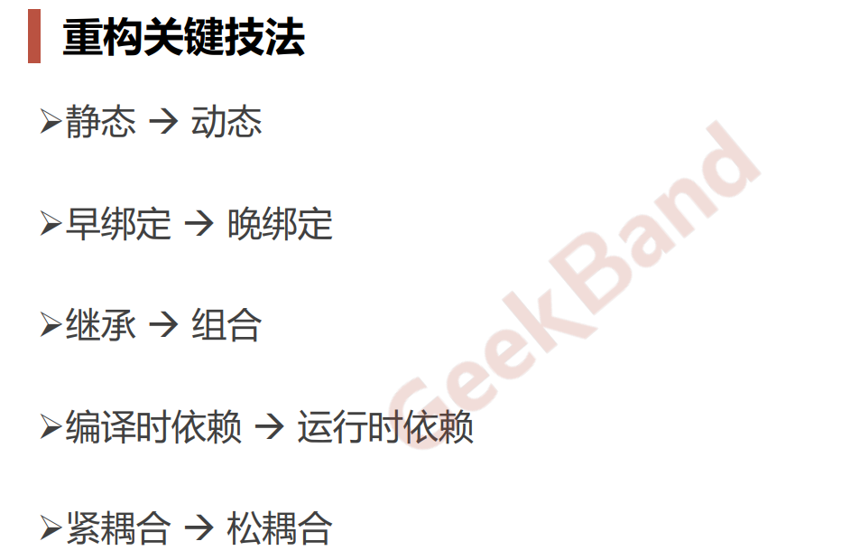
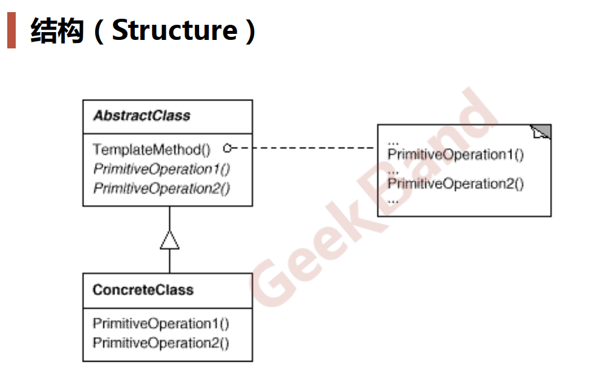
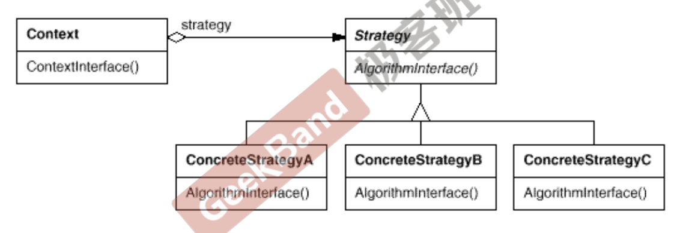
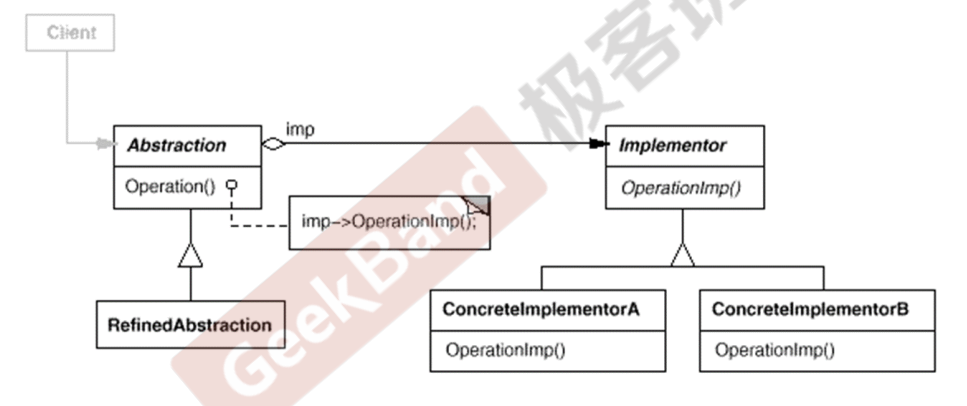
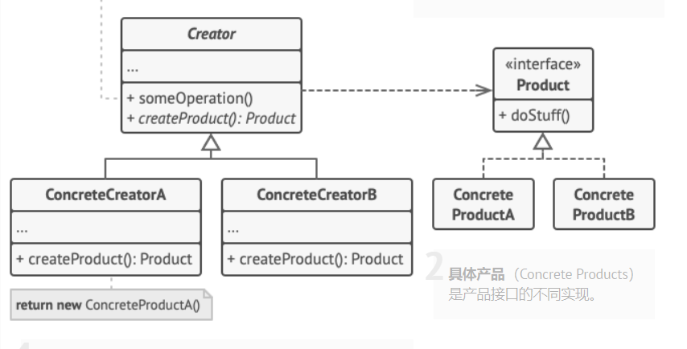

# 设计模式

23种设计模式，按照GOF从目的可以分为三类。

* 创建型模式：提供创建对象的机制， 能够提升已有代码的灵活性和可复用性。
  * 单例
  * 工厂
  * 抽象工厂
* 结构型模式：如何将对象和类组装成较大的结构， 并同时保持结构的灵活和高效。
* 行为型模式：对象间的高效沟通和职责委派。


从范围：       

* 类模式：侧重于继承，OOP
* 对象模式：侧重于组合，基于对象


在设计模式里面我们所追求的复用不是源文件的复用，而是编译后的二进制文件的复用局部不要影响整体。（晚绑定）




**面向对象的设计原则：**           

* 依赖倒置原则

* 开放封闭原则：对扩展开放，对改变封闭

* 单一职责原则：不要使用多继承

* LisKov替换原则

* 接口隔离原则：

* 优先使用对象的组合，而不是类的继承？继承：白箱；组合：黑箱

  公开继承（public）是一种白箱复用：它表示：“B复用A的功能，并且B可以了解A的内部细节”。

  “黑箱复用”的实现方法是：如果B类想复用A类的功能，不是从A类派生，而是将A类的对象，声明成为B类的成员数据。

  * 类继承通常为“白箱复用”，对象组合通常为“黑箱复用” 。
  * 继承在某种程度上破坏了封装性，子类父类耦合度高。
  *  而对象组合则只要求**被组合的对象具有良好定义的接口，耦合度低。  **

* 封装变化点

* 针对接口编程，而不是针对实现编程。

## 组件协作模式


### template method



### strategy

**策略模式**是一种行为设计模式， 它能让你定义一系列算法， 并将每种算法分别放入独立的类中， 以使算法的对象能够相互替换。UML有点问题。



这个模式其实类似于template method。也就是一个替换。


### Observer 

这个就是典型的事件通知      

**观察者模式**是一种行为设计模式， 允许你定义一种订阅机制， 可在对象事件发生时通知多个 “观察” 该对象的其他对象。线程安全的Observer如何写。      

* publisher发布者/Subject
* Subscriber订阅者/Observer

这里面存在的线程安全问题：      

1、Subject通知的时候如何得知Observer对象还存在？智能指针，           

2、被观察的Observer对象析构的时候如何通知？（弱回调）


这个需要看一下那本书（之前学的时候看的网站），以前写的忘记了。


## 单一职责模式

### Decorator

**装饰模式**是一种结构型设计模式， 允许你通过将对象放入包含行为的特殊封装对象中来为原对象绑定新的行为。


这里的代码是按照类OOP的方法完成的，但是目前这个模式可以改为使用function+bind。

不知道哪个方法比较好。（嗯，目前bind有点麻烦）


decorator类在接口上面表示为is-a的继承关系，但是在实现的时候又表现为has-a的组合关系。


### Bridge

**桥接模式**是一种结构型设计模式， 可将一个大类或一系列紧密相关的类拆分为**抽象和实现**两个独立的层次结构， 从而能在开发时分别使用。


*抽象部分* （也被称为*接口*） 是一些实体的高阶控制层。 该层自身不完成任何具体的工作， 它需要将工作委派给*实现部分*层 （也被称为*平台*）。





## 对象创建模式

### Factory method

**工厂方法模式**是一种创建型设计模式， 其在父类中提供一个创建对象的方法（virtual method）， 允许子类决定实例化对象的类型。




### abstract factory

**抽象工厂模式**是一种创建型设计模式， 它能创建**一系列相关的**对象， 而无需指定其具体类。


这个暂时没有看懂。


### 原型模式prototype

**原型模式**是一种创建型设计模式， 使你能够复制已有对象， 而又无需使代码依赖它们所属的类。


emmm，这个暂时也没有看懂啊。


### builder生成器模式

**生成器模式**是一种创建型设计模式， 使你能够分步骤创建复杂对象。 该模式允许你使用相同的创建代码生成不同类型和形式的对象。


C++构造函数里面是不可以调用虚函数的？具有继承层次的类的构造：先构造父类，再构造子类；析构：先析构子类，再析构父类。（半成品里面不能自身多态）


把复杂的构建（构造函数）抽离出来。

怎么感觉这几个构建型模式里面factory method是最实用的？先记着以后遇到再说吧。


## 对象性能模式

### 单例模式singleton

线程安全的单例模式。         

**单例模式**是一种创建型设计模式， 让你能够保证一个类只有一个实例， 并提供一个访问该实例的全局节点。


这个倒是可能会考到，如何实现。

* noncopyable的，没有拷贝构造/assign operator
* 使用call_once实现简单一些
* 泛型+静态

之前会的现在也不会了，muduo实现了线程安全的单例模式采用call_once，实现起来很简单

```C++
//没有考虑单例的释放，但是实际使用中单例不需要释放
template<typename T>
class Singleton{
  private:
    static T* value_;
    static once_flag once_;
    static void init(){
        value_=new T();
    }
    
  public:
    Singleton()=delete;
    ~Singleton()=delete;
    T& instance(){
        call_once(once_,&Singleton::init);
        return *value_;
    }
};

template <typename T>
T* Singleton<T>::value_=nullptr;
template <typename T>
once_flag Singleton<T>::once_;

//使用
Foo& foo1=Singleton<Foo>::instance();
Foo& foo2=Singleton<Foo>::instance();
```


### 享元模式flyweight

**享元模式**是一种结构型设计模式， 它摒弃了在每个对象中保存所有数据的方式， 通过共享多个对象所共有的相同状态， 让你能在有限的内存容量中载入更多对象。


这个我也感觉没什么必要啊


## 接口隔离模式


### facade门面/外观模式

**外观模式**是一种结构型设计模式， 能为程序库、 框架或其他复杂类提供一个简单的接口。


感觉就是加了一层的样子。

https://refactoringguru.cn/design-patterns/facade/cpp/example


没必要添加代码了，很简单就是任务委派。


### proxy代理模式

**代理模式**是一种结构型设计模式， 让你能够提供对象的替代品或其占位符。 代理控制着对于原对象的访问， 并允许在将请求提交给对象前后进行一些处理。


增加一层间接非常的常见。


还是感觉用处不大，遇到了再说吧。


### adaptor适配器模式

C++的stl就有很多的adaptor：queue/stack


**适配器模式**是一种结构型设计模式， 它能使接口不兼容的对象能够相互合作。


实例就是使用一个deque来实现stack/queue这两种结构。复用现有的结构。


最近的几种模式就是在设计的时候知道可以这样干就好了。


### mediator中介者模式

**中介者模式**是一种行为设计模式， 能让你减少对象之间混乱无序的依赖关系。 该模式会限制对象之间的直接交互， 迫使它们通过一个中介者对象进行合作。


## 状态变化模式


### state状态模式

**状态模式**是一种行为设计模式， 让你能在一个对象的内部状态变化时改变其行为， 使其看上去就像改变了自身所属的类一样。


### memento备忘录模式

**备忘录模式**是一种行为设计模式， 允许在不暴露对象实现细节的情况下保存和恢复对象之前的状态。


## 数据结构模式


### composite组合模式

**组合模式**是一种结构型设计模式， 你可以使用它将对象组合成树状结构， 并且能像使用独立对象一样使用它们。


设计模式暂时先看到这里


单例/工厂感觉自己还是可以hold住的。
